Purpose: Create consensus peak sets
===================================

To be conservative in our peak calls and be sure that we're dealing with replicatable peaks in the following analyses, here will will create a consensus peak .bed file for each DNA binding protein by taking only those peaks which overlap in all replicate experiments.

The resulting peaks will consist of peaks which overlapped by at least on base pair in each replicate and will use the `GenomicRanges::reduce` function to merge the peaks by taking the outer boundaries of overlapping peaks. This strategy may widen some peaks, but will ensure that each peak in the resulting peak set has evidence in all experiments performed for that DNA binding protein.

``` r
# For details on this function (create_concensus_peaks), see util/intersect_functions.R
# In this process we also filter to only the peaks on canonical chromosomes (e.g, non chr contigs).
consensus_peaks <- create_consensus_peaks(broadpeakfilepath = "/Shares/rinn_class/data/k562_chip/results/bwa/mergedLibrary/macs/broadPeak")
```

Number of peaks threshold
-------------------------

Since we want to study robust DNA binding proteins in K562 cells, we will implement a cutoff for the minimum number of peaks a DBP must have in order to be considered in the following analyses.

First, we need to filter out those DBPs that don't have any peaks common in replicates.

``` r
# This data frame will be the start of what we build into peak_occurence_df
# Plotting distributions of number of peaks that concur between replicates (note many @ 0)
num_peaks_df <- data.frame("dbp" = names(consensus_peaks),
                           "num_peaks" = sapply(consensus_peaks, length))

# Plotting the number of consensus peaks per DBP.
g <- ggplot(num_peaks_df, aes(x = num_peaks))
g + geom_histogram(bins = 70) +
  xlab("Number of consensus peaks") +
  ylab("Count") +
  ggtitle("Distribution of number of consensus peaks")
```

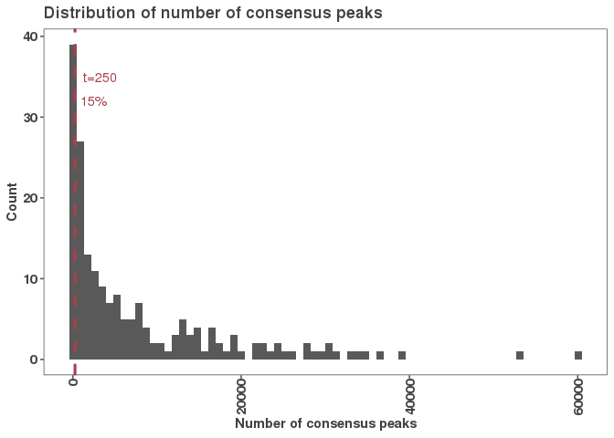

``` r
ggsave("figures/consensus_peaks_histogram.pdf")
```

    ## Saving 7 x 5 in image

#### DBPs that did not have a single peak in common in replicates

The proteins with zero consensus peaks are: MCM2 MCM5 MCM7 NR3C1 TRIM25

Now that we have replicate concordance, we note that 85% of DPBs have &gt;250 peaks in common across replicates, so we make a cutoff there at the 15th percentile.

``` r
# We're going to apply a cutoff at 250 peaks           
num_peaks_threshold <- 250
threshold_percentile <- round(ecdf(num_peaks_df$num_peaks)(num_peaks_threshold)*100,1)

filtered_consensus_peaks <- consensus_peaks[num_peaks_df$num_peaks > num_peaks_threshold]
```

Since this captures the majority of DPBs and still provides a reasonable number of peaks to work with, we chose a cutoff of 250 peaks. This corresponds to a cutoff at the 15.3th percentile and results in losing the following proteins: ARNT BCLAF1 COPS2 CSDE1 DNMT1 eGFP-ETS2 FOXA1 KAT8 KDM4B MCM2 MCM5 MCM7 NCOA1 NCOA2 NCOA4 NR0B1 NR3C1 NUFIP1 PYGO2 THRA TRIM25 TRIP13 XRCC3 YBX1 YBX3 ZBTB8A ZC3H8 ZNF318 ZNF830

``` r
# Export the peak lists.
for(i in 1:length(filtered_consensus_peaks)) {
  rtracklayer::export(filtered_consensus_peaks[[i]], paste0("results/consensus_peaks/filtered_by_peaks/",
                                                   names(filtered_consensus_peaks)[i], 
                                                   "_consensus_peaks_filter.bed"))
}
```

Summary of consensus peaks
--------------------------

Here we'll look at a few characteristics of DBPs that were consistent across replicates and have at least 250 binding events.

#### Goal: Investigate Peak width properties

``` r
# Subset to remaining peaks
num_peaks_df <- num_peaks_df %>% filter(dbp %in% names(filtered_consensus_peaks))

# Calculate the total peak width (bp bound by all peaks)
num_peaks_df$total_peak_length <- sapply(filtered_consensus_peaks, function(peaks) sum(width(peaks)))
write_csv(num_peaks_df, "results/number_of_peaks_per_dbp.csv")

g <- ggplot(num_peaks_df, aes(x = num_peaks, y = total_peak_length, label = dbp))
g + geom_point() + 
  geom_smooth(method = "lm", se = FALSE, color = "black", lty = 2,
              formula = 'y ~ x') +
  geom_text() +
  ylab("BP covered") +
  xlab("Number of peaks") +
  ggtitle("Peak count vs. total bases covered")
```

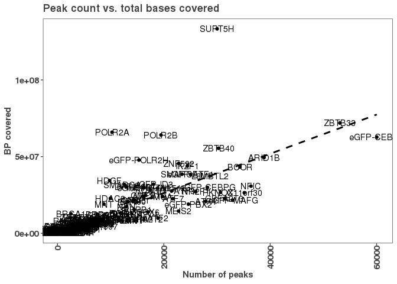

``` r
ggsave("figures/peak_count_vs_peak_length.pdf")
```

    ## Saving 7 x 5 in image

#### eGFP peak count distribution

``` r
num_peaks_df$egfp_labeled <- FALSE
num_peaks_df[grep("eGFP", num_peaks_df$dbp), "egfp_labeled"] <- TRUE

g <- ggplot(num_peaks_df, aes(x = num_peaks, color = egfp_labeled))
g + stat_ecdf() + 
  scale_color_manual(values = c("#424242","#a8404c")) +
  ylab("Cumulative density") +
  xlab("Consensus peaks") + 
  ggtitle("eGFP vs. non-eGFP peak count")
```

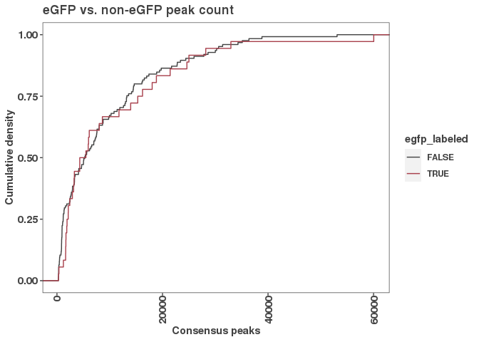

``` r
  ggsave("figures/egfp_peak_vs_non_egfp_number_consensus_peaks.pdf")
```

    ## Saving 7 x 5 in image

``` r
# Test whether the distribution of peak counts is the same for eGFP labeled proteins
# Note: the ks-test will give a p-value estimate since of of the values are tied.
ks.test(x = num_peaks_df[which(num_peaks_df$egfp_labeled),"num_peaks"],
        y = num_peaks_df[which(!num_peaks_df$egfp_labeled),"num_peaks"])
```

    ## 
    ##  Two-sample Kolmogorov-Smirnov test
    ## 
    ## data:  num_peaks_df[which(num_peaks_df$egfp_labeled), "num_peaks"] and num_peaks_df[which(!num_peaks_df$egfp_labeled), "num_peaks"]
    ## D = 0.22067, p-value = 0.1314
    ## alternative hypothesis: two-sided

There is not a difference in peak counts for eGFP labelled proteins.

#### Plotting the MEAN width of consensus peaks for each DBP

``` r
# Let's grab the peak widths for each DBP
peak_widths_df <- lapply(filtered_consensus_peaks, 
                      function(peaks) paste(width(peaks), collapse = ";")) %>%
  as.data.frame() %>%
  pivot_longer(cols = everything(),
               names_to = "dbp",
               values_to = "peak_width") %>%
  separate_rows("peak_width", sep = ";", convert = T)

# Summary data frame (math applied in socket settings). This is set up to encapsulate mean, median, sd, cv of peak widths for each DBP
peak_widths_summary <- peak_widths_df %>% 
  group_by(dbp) %>%
  summarize("mean_width" = mean(peak_width),
            "median_width" = median(peak_width),
            "sd_width" = sd(peak_width),
            "cv_width" = (sd_width/mean_width)*100)
```

    ## `summarise()` ungrouping output (override with `.groups` argument)

``` r
# Plotting resulting peak_width_summary distribution of consensus peaks for each DBP. 
#NOTE: many have 0 consensus peaks

g <- ggplot(peak_widths_summary, aes(x = mean_width))
g + geom_histogram(bins = 60) + 
  xlab("Mean peak width") +
  ylab("Count") +
  ggtitle("Peak width distribution")
```

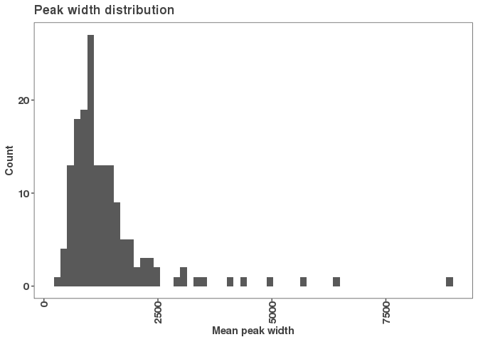

``` r
ggsave("figures/peak_width_distribution.pdf")
```

    ## Saving 7 x 5 in image

``` r
# Plotting the mean width versus the covariance (cv) of peak widths for that DBP. This will distinguish if a DBP has a uniform consensus peak width or high variance in consensus peak width.
g <- ggplot(peak_widths_summary, aes(x = mean_width, y = cv_width, label = dbp))
g + geom_point() + 
  geom_text() + 
  xlab("Mean peak width") +
  ylab("CV peak width") +
  ggtitle("Peak width: mean vs. coefficient of variation")
```

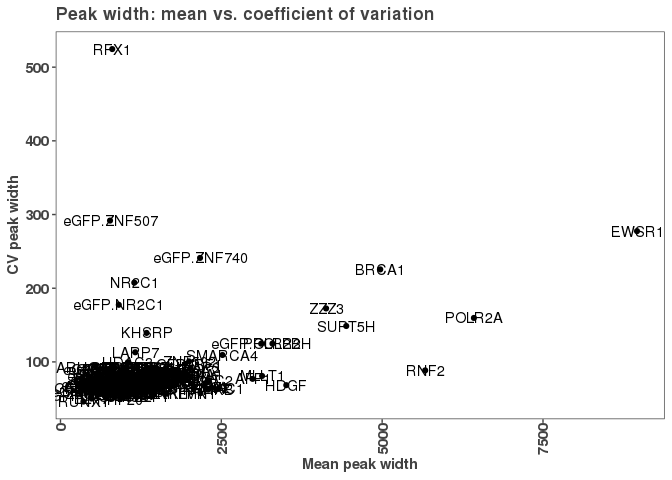

``` r
ggsave("figures/peak_width_vs_cv.pdf")
```

    ## Saving 7 x 5 in image

It seems that most DBPs have a relatively small peak width ~ 1000bp +/- 500bp and relatively small CV ~100bp. However, a few including POLII subunits have wider peaks widths. RFX1 is unique in that it has a typical mean peak width, but a very large CV. Indicating that while most peaks are in the typical range, it may have some very large peaks.

``` r
# Let's look at PolII and SUPT5H: The 'core' transcriptional machinery in particular
g <- ggplot(peak_widths_df %>% filter(dbp %in% c("POLR2A", "POLR2B", "SUPT5H")), aes(x = log10(peak_width)))
g + geom_histogram(bins = 100) + 
  facet_grid(dbp~., scales = "free_y") + 
  xlab("log10(Peak width)") +
  ylab("Count") +
  ggtitle("Peak width distribution: POLII")
```

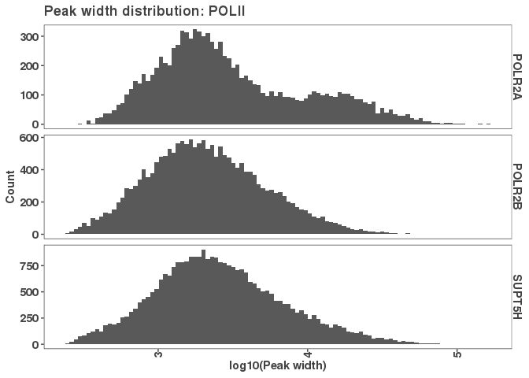

``` r
ggsave("figures/peak_width_distribution_polII.pdf")
```

    ## Saving 7 x 5 in image

``` r
ggsave("figures/peak_width_distribution_polII.png")
```

    ## Saving 7 x 5 in image

So interestingly it seems that there are two peaks in POLR2A's binding, but not for the other subunits. This may indicate two binding modes for POLR2A.

``` r
# Here is a more extreme example that has a high variance in peak widths (RFX1) 
g <- ggplot(peak_widths_df %>% filter(dbp %in% c("RFX1")), aes(x = log10(peak_width)))
g + geom_histogram(bins = 100) + 
  facet_grid(dbp~., scales = "free_y") + 
  xlab("log10(Peak width)") +
  ylab("Count") +
  ggtitle("Peak width distribution: RFX1")
```

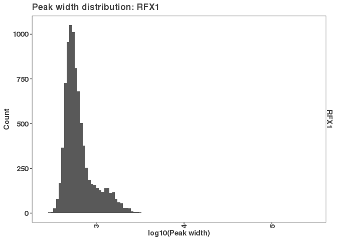

``` r
ggsave("figures/peak_width_distribution_RFX1.pdf")
```

    ## Saving 7 x 5 in image

RFX1 has just 28 peaks which are above 3000 bps which is skewing the distribution. With one peak that has a width of 286683.

### Example of RFX1 peak

``` r
# Loading in Gencode annotaitons to start intersecting with genomic features
gencode_gr <- rtracklayer::import("/Shares/rinn_class/data/genomes/human/gencode/v32/gencode.v32.annotation.gtf")

gencode_gm <- gencode_gr %>%
  as.data.frame() %>%
  filter(type == "exon") %>%
  dplyr::select(seqnames, start, end, width, strand, gene_type,
                gene_id, exon_id, transcript_id, gene_name) 

names(gencode_gm) <- c("chromosome", "start", "end", "width", "strand",
                       "feature", "gene", "exon", "transcript", "symbol")
write_csv(gencode_gm, "../util/gencode_genemodel_for_Gviz.csv")
```

``` r
# Let's choose the largest RFX1 peak to plot
lg_rfx1_peak_index <- which.max(width(filtered_consensus_peaks[["RFX1"]]))
largest_rfx1_peak <- filtered_consensus_peaks[["RFX1"]][lg_rfx1_peak_index]

plot_replicate_peaks("RFX1", 
                     region = largest_rfx1_peak, 
                     bw_axis_limits = list(c(0,0.6)),
                     plot_title = "RFX1 largest peak",
                     save_pdf = T,
                     height_per_dbp = 4,
                     fixed_height = 3,
                     pdf_path = "figures/RFX1_largest_peak_track.pdf",
                     png_path = "figures/RFX1_largest_peak_track.png")
```

    ## RStudioGD 
    ##         2


#### DNA binding protein distribution at promoters

The purpose of this code is to determine the distribution of DNA-binding proteins (DBPs) at promoters. We will look at the number of DBPs bound at a given promoter as well as whether there are any promoters which are not bound by any DBPs. We will also ask whether any DBPs do not bind to any promoters.

``` r
# We are going to make promoter annotation lists for lncRNA and mRNA together and seperate
# We are using the function 'get_promoter_regions' see "../util/intersect_functions.R"
lncrna_mrna_promoters <- get_promoter_regions(gencode_gr, biotype = c("lncRNA", "protein_coding"))
rtracklayer::export(lncrna_mrna_promoters, "results/lncrna_mrna_promoters.gtf")

lncrna_promoters <- get_promoter_regions(gencode_gr, biotype = "lncRNA")
rtracklayer::export(lncrna_promoters, "results/lncrna_promoters.gtf")

mrna_promoters <- get_promoter_regions(gencode_gr, biotype = "protein_coding")
rtracklayer::export(mrna_promoters, "results/mrna_promoters.gtf")
```

#### Promoter overlaps compared to toal number of peaks for each DBP

``` r
num_peaks_df <- data.frame("dbp" = names(filtered_consensus_peaks),
                           "num_peaks" = sapply(filtered_consensus_peaks, length))
# Getting number of overlaps of DBPs per promoter(type)
promoter_peak_counts <- count_peaks_per_feature(lncrna_mrna_promoters, filtered_consensus_peaks, type = "counts")

# Counting up overlaps for all promoters and lncRNA and mRNA seperately.
num_peaks_df$peaks_overlapping_promoters <- rowSums(promoter_peak_counts)
num_peaks_df$peaks_overlapping_lncrna_promoters <- rowSums(promoter_peak_counts[,lncrna_promoters$gene_id])
num_peaks_df$peaks_overlapping_mrna_promoters <- rowSums(promoter_peak_counts[,mrna_promoters$gene_id])

# Plotting the number of peaks per DBP and how many promoters were overlapped.
ggplot(num_peaks_df,
       aes(x = num_peaks, y = peaks_overlapping_promoters)) +
  scale_color_manual(values = c("#424242", "#a8404c"))+
  xlab("Peaks per DBP") +
  ylab("Number of peaks overlapping promoters") +
  ggtitle("Relationship Between Number of DBP Peaks and Promoter Overlaps")+
  geom_point() +
  geom_abline(slope = 1, linetype="dashed") +
  geom_smooth(method = "lm", se=F, formula = 'y ~ x') +
  stat_regline_equation(label.x = 35000, label.y = 18000) +
  ylim(0,60100) +
  xlim(0,60100)
```

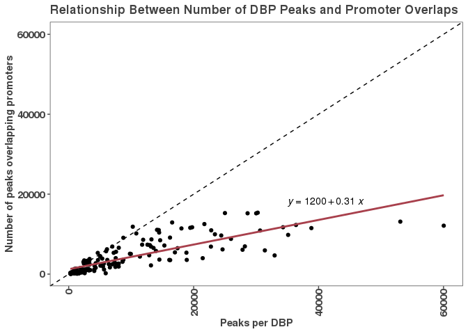

``` r
ggsave("figures/peak_number_vs_promoter_overlap.pdf")
```

    ## Saving 7 x 5 in image

``` r
# While a linear fit broadly captures the trend, 
# the DBPs with a large number of peaks tends to skew
# the trend as there are proportionately more 
# non-promoter binding events in those DPBs with many peaks.
# The trend is much more linear for DBPs with few binding events.
ggplot(num_peaks_df,
       aes(x = num_peaks, y = peaks_overlapping_promoters)) +
  scale_color_manual(values = c("#424242", "#a8404c"))+
  xlab("Peaks per DBP") +
  ylab("Number of peaks overlapping promoters") +
  ggtitle("Relationship Between Number of DBP Peaks and Promoter Overlaps")+
  geom_point() +
  geom_abline(slope = 1, linetype="dashed") +
  geom_smooth(method = "lm", se = TRUE, formula = 'y ~ x') +
  ylim(0,2000) + xlim(0,2000) + 
  stat_regline_equation()
```

    ## Warning: Removed 113 rows containing non-finite values (stat_smooth).

    ## Warning: Removed 113 rows containing non-finite values (stat_regline_equation).

    ## Warning: Removed 113 rows containing missing values (geom_point).

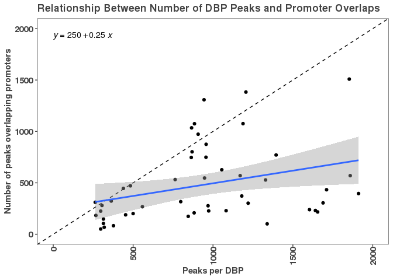

``` r
# A loess fit shows illustrates this quite well.
# In short, that's why the intercept is pulled up
# to ~1200 vs. the ~250 that you might expect.
ggplot(num_peaks_df,
       aes(x = num_peaks, y = peaks_overlapping_promoters)) +
  scale_color_manual(values = c("#424242", "#a8404c"))+
  xlab("Peaks per DBP") +
  ylab("Number of peaks overlapping promoters") +
  ggtitle("Relationship Between Number of DBP Peaks and Promoter Overlaps")+
  geom_point() +
  geom_abline(slope = 1, linetype="dashed") +
  geom_smooth(method = "lm", se = TRUE, formula = 'y ~ x') +
  geom_smooth(method = "loess", color = "#a8404c", formula = 'y ~ x') 
```

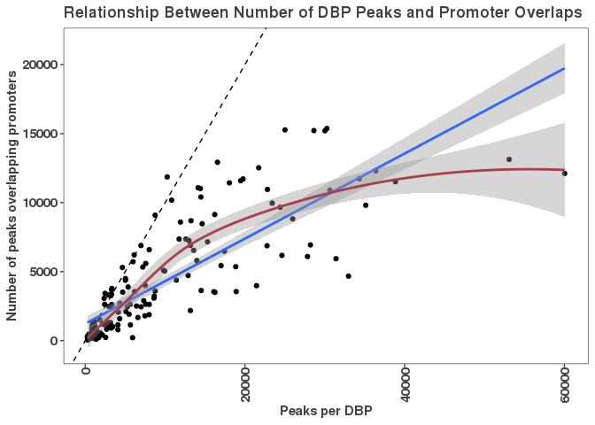

#### Goal: let's bring all of these data together into a dataframe, that we will keep adding columns to as we go (rows are promoters).

``` r
# First we will establish the promoter peak occurence matrix (rows = promoters, cols = dbp binding {0,1})
promoter_peak_occurence <- count_peaks_per_feature(lncrna_mrna_promoters, filtered_consensus_peaks, 
                                               type = "occurrence")
# Output to promoter_peak_occurecne_matrix
write.table(promoter_peak_occurence, "results/lncrna_mrna_promoter_peak_occurence_matrix.tsv")

# Now we want to make into a data frame using the promoter annotations as rows and attributes as columns.
# We will use lncrna_mrna_promoters to index "all promoters"
# First make sure promoter_peak_occurence and lncrna_mrna_promoters are in the same order
stopifnot(all(colnames(promoter_peak_occurence) == lncrna_mrna_promoters$gene_id))

# Make a data frame of binding events per promoter.
peak_occurence_df <- data.frame("gene_id" = colnames(promoter_peak_occurence),
                                "gene_name" = lncrna_mrna_promoters$gene_name,
                                "gene_type" = lncrna_mrna_promoters$gene_type,
                                "chr" = lncrna_mrna_promoters@seqnames,   
                                "3kb_up_tss_start" = lncrna_mrna_promoters@ranges@start,
                                "strand" = lncrna_mrna_promoters@strand,
                                "number_of_dbp" = colSums(promoter_peak_occurence))

# This is the CSV file we will start building upon adding columns of properties as we analyze them
# The output file name will change based on what is added later, but the "peak_occurence_df" will be used throughout.
write_csv(peak_occurence_df, "results/peak_occurence_dataframe.csv")
```

Now that we have our consensus peaks organized, characterized and filtered above we return to our goal

#### Goal: density plot the number of DBPs per promoter

``` r
# Make a density plot of all promoter binding events per goal #1.
g <- ggplot(peak_occurence_df, aes(x = number_of_dbp))
g + geom_density(alpha = 0.2, color = "#424242", fill = "#424242") +
  theme_paperwhite() +
  xlab(expression("Number of DBPs")) +
  ylab(expression("Density")) +
  ggtitle("Promoter binding events",
          subtitle = "mRNA and lncRNA genes") 
```

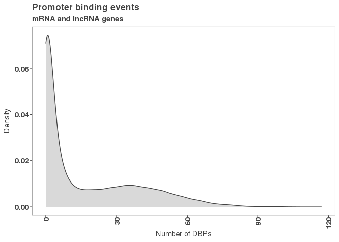

``` r
ggsave("figures/k562_promoter_binding_density.png")
```

    ## Saving 7 x 5 in image

``` r
ggsave("figures/k562_promoter_binding_density.pdf")
```

    ## Saving 7 x 5 in image

``` r
# Histogram of the same data
g <- ggplot(peak_occurence_df, aes(x = number_of_dbp))
g + geom_histogram(color = "#424242", fill = "#424242", bins = 30) +
  theme_paperwhite() +
  xlab(expression("Number of DBPs")) +
  ylab(expression("Count")) +
  ggtitle("Promoter binding events",
          subtitle = "mRNA and lncRNA genes") 
```

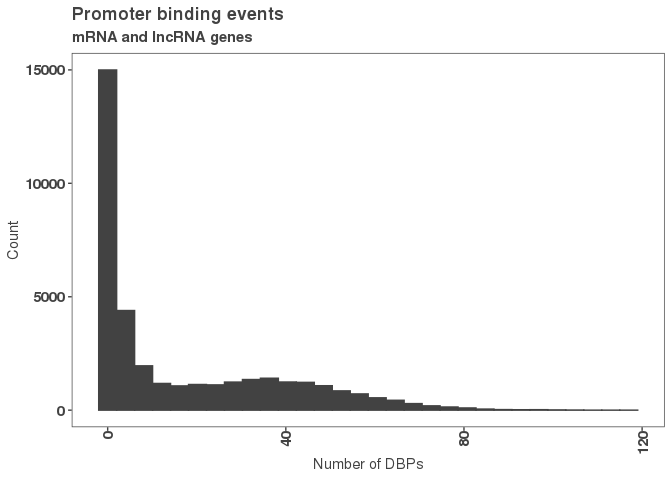

``` r
ggsave("figures/k562_promoter_binding_histogram.png")
```

    ## Saving 7 x 5 in image

``` r
ggsave("figures/k562_promoter_binding_histogram.pdf")
```

    ## Saving 7 x 5 in image

``` r
summary(peak_occurence_df)
```

    ##    gene_id           gene_name          gene_type              chr        X3kb_up_tss_start   strand   
    ##  Length:36814       Length:36814       Length:36814       chr1   : 3464   Min.   :      307   +:18651  
    ##  Class :character   Class :character   Class :character   chr2   : 2488   1st Qu.: 30372123   -:18163  
    ##  Mode  :character   Mode  :character   Mode  :character   chr19  : 2135   Median : 58868078   *:    0  
    ##                                                           chr11  : 2109   Mean   : 73853473            
    ##                                                           chr17  : 2061   3rd Qu.:110087716            
    ##                                                           chr12  : 1971   Max.   :248903196            
    ##                                                           (Other):22586                                
    ##  number_of_dbp   
    ##  Min.   :  0.00  
    ##  1st Qu.:  0.00  
    ##  Median :  5.00  
    ##  Mean   : 16.98  
    ##  3rd Qu.: 32.00  
    ##  Max.   :117.00  
    ## 

``` r
# Just locating the unbound promoters in any experiment
unbound_promoters <- peak_occurence_df %>% filter(peak_occurence_df$number_of_dbp < 1)
write_csv(unbound_promoters, "results/unbound_lncrna_mrna_promoters.csv")

# 7 promoters are not bound
length(unbound_promoters)
```

    ## [1] 7

``` r
# Determining how many DBPs don't bind to any promoters.
dbp_promoter_ovl <- get_overlapping_peaks(lncrna_mrna_promoters, filtered_consensus_peaks)
num_ovl <- sapply(dbp_promoter_ovl, length)

min(num_ovl)
```

    ## [1] 46

``` r
summary(num_ovl)
```

    ##    Min. 1st Qu.  Median    Mean 3rd Qu.    Max. 
    ##      46     530    1931    2939    4677   11004

There are no proteins that don't overlap any promoters and the least number of promoters bound is eGFP-TSC22D4 which overlapped 46

``` r
# Arrange the lncRNA and mRNA overlaps in long data format.
num_peaks_dfl <- num_peaks_df %>%
  dplyr::select(-peaks_overlapping_promoters) %>%
  pivot_longer(cols = peaks_overlapping_lncrna_promoters:peaks_overlapping_mrna_promoters,
               names_to = "gene_type",
               values_to = "peaks_overlapping_promoters") %>%
  mutate(gene_type = gsub("peaks_overlapping_", "", gene_type))

ggplot(num_peaks_dfl, aes(x = num_peaks, y = peaks_overlapping_promoters, 
                         col = gene_type)) +
         geom_point() +
         geom_abline(slope = 1, linetype="dashed") +
  geom_smooth(method = "lm", se = FALSE, formula = "y ~ x") +
  stat_regline_equation() +
  scale_color_manual(values = c("#a8404c", "#424242"))+
  xlab("Peaks per DBP") +
  ylab("Peaks Overlapping Promoters") +
  ggtitle("Number of DBP Peaks and Promoter Overlaps")
```

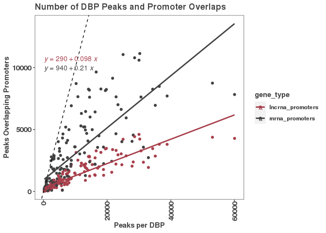

``` r
ggsave("figures/peaks_overlaps_relationship_by_gene_type.png", height = 5, width = 8)
ggsave("figures/peaks_overlaps_relationship_by_gene_type.pdf", height = 5, width = 8)
```
