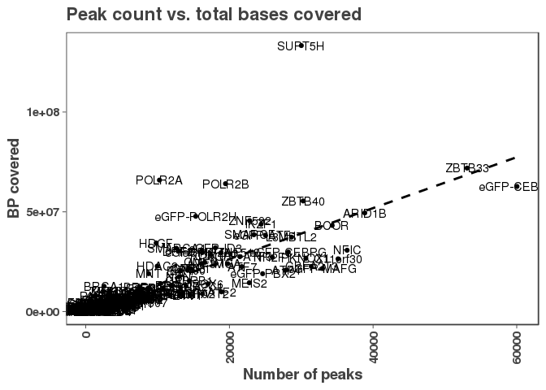
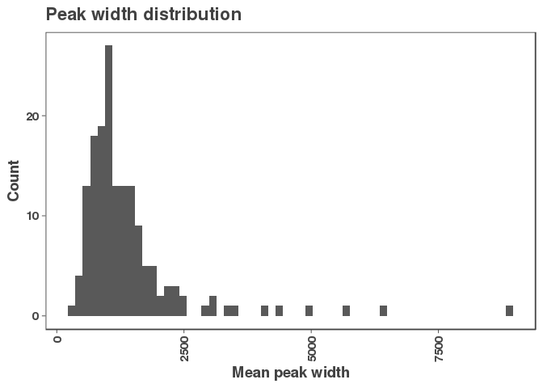
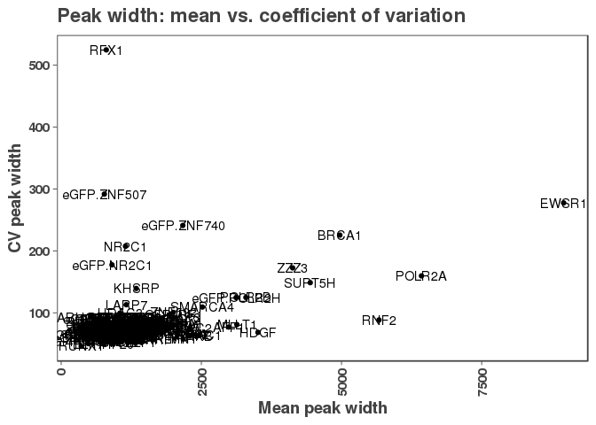
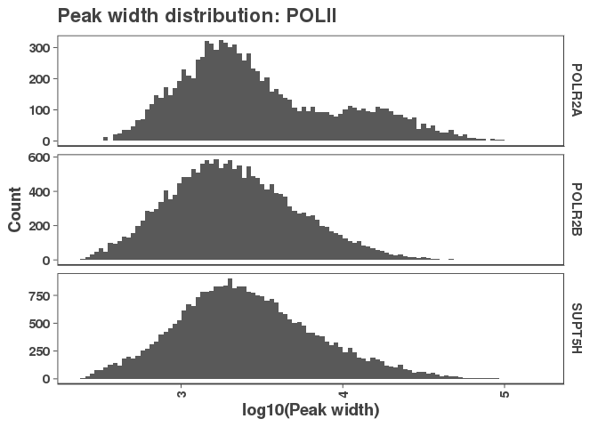
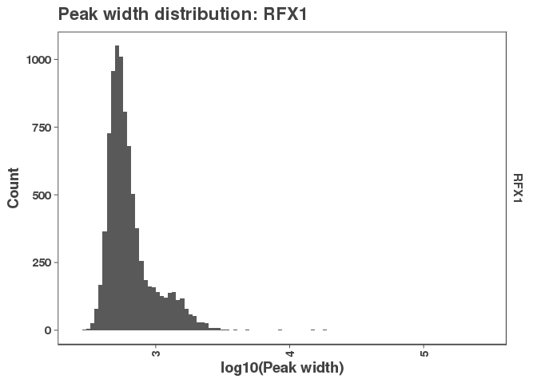
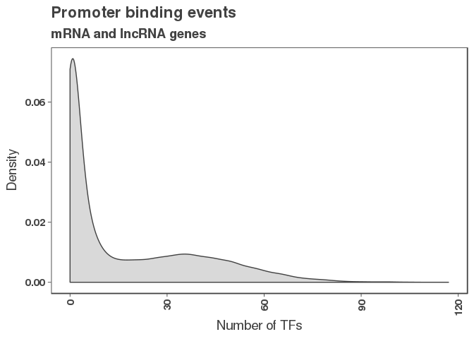

Purpose: Create consensus peak sets
===================================

To be conservative in our peak calls and be sure that we're dealing with replicatable peaks in the following analyses, here will will create a consensus peak .bed file for each DNA binding protein by taking only those peaks which overlap in all replicate experiments.

The resulting peaks will consist of peaks which overlapped by at least on base pair in each replicate and will use the `GenomicRanges::reduce` function to merge the peaks by taking the outer boundaries of overlapping peaks. This strategy may widen some peaks, but will ensure that each peak in the resulting peak set has evidence in all experiments performed for that DNA binding protein.

``` r
# For details on this function, see intersect_functions.R
# In this process we also filter to only the peaks on canonical chromosomes.
consensus_peaks <- create_consensus_peaks(broadpeakfilepath = "/Shares/rinn_class/data/k562_chip/results/bwa/mergedLibrary/macs/broadPeak")
```

Number of peaks threshold
-------------------------

Since we want to study robust DNA binding proteins in K562 cells, we will implement a cutoff for the minimum number of peaks a DBP must have in order to be considered in the following analyses. There are some DBPs have have no replicate concordant peaks.

``` r
num_peaks_df <- data.frame("dbp" = names(consensus_peaks),
                           "num_peaks" = sapply(consensus_peaks, length))
g <- ggplot(num_peaks_df, aes(x = num_peaks))
g + geom_histogram(bins = 70) +
  xlab("Number of consensus peaks") +
  ylab("Count") +
  ggtitle("Distribution of number of consensus peaks")
```


``` r
ggsave("figures/consensus_peaks_histogram.pdf")
```

    ## Saving 7 x 5 in image

#### No replicate concordance

The proteins with zero consensus peaks are: MCM2 MCM5 MCM7 NR3C1 TRIM25

#### Peaks cutoff

``` r
# We're going toconsensus_peaks apply a cutoff at 250 peaks
num_peaks_threshold <- 250
consensus_peaks <- consensus_peaks[num_peaks_df$num_peaks > num_peaks_threshold]
```

Since this captures the majority of DPBs and still provides a reasonable number of peaks to work with, we chose a cutoff of 250 peaks. This corresponds to a cutoff at the 15.3th percentil and results in losing the following proteins: ARNT BCLAF1 COPS2 CSDE1 DNMT1 eGFP-ETS2 FOXA1 KAT8 KDM4B MCM2 MCM5 MCM7 NCOA1 NCOA2 NCOA4 NR0B1 NR3C1 NUFIP1 PYGO2 THRA TRIM25 TRIP13 XRCC3 YBX1 YBX3 ZBTB8A ZC3H8 ZNF318 ZNF830

``` r
# Export the peak lists.
for(i in 1:length(consensus_peaks)) {
  rtracklayer::export(consensus_peaks[[i]], paste0("results/", names(consensus_peaks)[i], "_consensus_peaks.bed"))
}
```

Summary of consensus peaks
--------------------------

Here we'll look at a few characteristics of the remaining peaksets.

#### Total peak length

``` r
# Subset to remaining peaks
num_peaks_df <- num_peaks_df %>% filter(dbp %in% names(consensus_peaks))

# Calculate the total peak width (bp bound by all peaks)
num_peaks_df$total_peak_length <- sapply(consensus_peaks, function(peaks) sum(width(peaks)))

g <- ggplot(num_peaks_df, aes(x = num_peaks, y = total_peak_length, label = dbp))
g + geom_point() + 
  geom_smooth(method = "lm", se = FALSE, color = "black", lty = 2) +
  geom_text() +
  ylab("BP covered") +
  xlab("Number of peaks") +
  ggtitle("Peak count vs. total bases covered")
```



``` r
ggsave("figures/peak_count_vs_peak_length.pdf")
```

    ## Saving 7 x 5 in image

#### eGFP peak count distribution

``` r
num_peaks_df$egfp_labeled <- FALSE
num_peaks_df[grep("eGFP", num_peaks_df$dbp), "egfp_labeled"] <- TRUE

g <- ggplot(num_peaks_df, aes(x = num_peaks, color = egfp_labeled))
g + stat_ecdf() + 
  scale_color_manual(values = c("#424242","#a8404c")) +
  ylab("Cumulative density") +
  xlab("Consensus peaks") + 
  ggtitle("eGFP vs. non-eGFP peak count")
```


``` r
# Test whether the distribution of peak counts is the same for eGFP labeled proteins
ks.test(x = num_peaks_df[which(num_peaks_df$egfp_labeled),"num_peaks"],
        y = num_peaks_df[which(!num_peaks_df$egfp_labeled),"num_peaks"])
```

    ## 
    ##  Two-sample Kolmogorov-Smirnov test
    ## 
    ## data:  num_peaks_df[which(num_peaks_df$egfp_labeled), "num_peaks"] and num_peaks_df[which(!num_peaks_df$egfp_labeled), "num_peaks"]
    ## D = 0.22067, p-value = 0.1314
    ## alternative hypothesis: two-sided

There is not a difference in peak counts for eGFP labelled proteins.

#### Peak width distributions

``` r
# Let's grab the peak widths for all peak sets
peak_widths_df <- lapply(consensus_peaks, 
                      function(peaks) paste(width(peaks), collapse = ";")) %>%
  as.data.frame() %>%
  pivot_longer(cols = everything(),
               names_to = "dbp",
               values_to = "peak_width") %>%
  separate_rows("peak_width", sep = ";", convert = T)

peak_widths_summary <- peak_widths_df %>% 
  group_by(dbp) %>%
  summarize("mean_width" = mean(peak_width),
            "median_width" = median(peak_width),
            "sd_width" = sd(peak_width),
            "cv_width" = (sd_width/mean_width)*100)

g <- ggplot(peak_widths_summary, aes(x = mean_width))
g + geom_histogram(bins = 60) + 
  xlab("Mean peak width") +
  ylab("Count") +
  ggtitle("Peak width distribution")
```



``` r
ggsave("figures/peak_width_distribution.pdf")
```

    ## Saving 7 x 5 in image

``` r
g <- ggplot(peak_widths_summary, aes(x = mean_width, y = cv_width, label = dbp))
g + geom_point() + 
  geom_text() + 
  xlab("Mean peak width") +
  ylab("CV peak width") +
  ggtitle("Peak width: mean vs. coefficient of variation")
```



``` r
ggsave("figures/peak_width_vs_cv.pdf")
```

    ## Saving 7 x 5 in image

It seems that most DBPs have a relatively small peak width ~ 1000bp +/- 500bp and relatively small CV ~100bp. However, a few including POLII subunits have wider peaks widths. RFX1 is unique in that it has a typical mean peak width, but a very large CV. Indicating that while most peaks are in the typical range, it may have some very large peaks.

``` r
# Let's look at PolII in particular
g <- ggplot(peak_widths_df %>% filter(dbp %in% c("POLR2A", "POLR2B", "SUPT5H")), aes(x = log10(peak_width)))
g + geom_histogram(bins = 100) + 
  facet_grid(dbp~., scales = "free_y") + 
  xlab("log10(Peak width)") +
  ylab("Count") +
  ggtitle("Peak width distribution: POLII")
```



``` r
ggsave("figures/peak_width_distribution_polII.pdf")
```

    ## Saving 7 x 5 in image

So interestingly it seems that there are two peaks in POLR2A's binding, but not for the other subunits. This may indicate two binding modes for POLR2A.

``` r
# Also RFX1 which had a very high CV.
g <- ggplot(peak_widths_df %>% filter(dbp %in% c("RFX1")), aes(x = log10(peak_width)))
g + geom_histogram(bins = 100) + 
  facet_grid(dbp~., scales = "free_y") + 
  xlab("log10(Peak width)") +
  ylab("Count") +
  ggtitle("Peak width distribution: RFX1")
```



``` r
ggsave("figures/peak_width_distribution_RFX1.pdf")
```

    ## Saving 7 x 5 in image

``` r
max(peak_widths_df[which(peak_widths_df$dbp == "RFX1" & peak_widths_df$peak_width > 3000),"peak_width"])
```

    ## [1] 286683

And it does seem that RFX1 has just 28 peaks which are above 3000 bps which is skewing the distribution. With one peak that has a width of 286683.

#### DNA binding protein distribution at promoters

The purpose of this code is to determine the distribution of DNA-binding proteins (DBPs) at promoters. We will look at the number of DBPs bound at a given promoter as well as whether there are any promoters which are not bound by any DBPs. We will also ask whether any DBPs do not bind to any promoters.

``` r
gencode_gr <- rtracklayer::import("/Shares/rinn_class/data/genomes/human/gencode/v32/gencode.v32.annotation.gtf")
# For convenience, we'll export these lists to read in the following analyses.
lncrna_mrna_promoters <- get_promoter_regions(gencode_gr, biotype = c("lncRNA", "protein_coding"))
rtracklayer::export(lncrna_mrna_promoters, "results/lncrna_mrna_promoters.gtf")

lncrna_promoters <- get_promoter_regions(gencode_gr, biotype = "lncRNA")
rtracklayer::export(lncrna_promoters, "results/lncrna_promoters.gtf")

mrna_promoters <- get_promoter_regions(gencode_gr, biotype = "protein_coding")
rtracklayer::export(mrna_promoters, "results/mrna_promoters.gtf")
```

``` r
promoter_peak_occurence <- count_peaks_per_feature(lncrna_mrna_promoters, consensus_peaks, 
                                               type = "occurence")
write.table(promoter_peak_occurence, "results/lncrna_mrna_promoter_peak_occurence_matrix.tsv")

# Make a data frame of binding events per promoter.
peak_occurence_df <- data.frame("gene_id" = colnames(promoter_peak_occurence),
                                "number_of_tfs" = colSums(promoter_peak_occurence))
write_csv(peak_occurence_df, "results/lncrna_mrna_promoter_peak_counts.csv")
```

``` r
# Make a density plot of all promoter binding events per goal #1.
g <- ggplot(peak_occurence_df, aes(x = number_of_tfs))
g + geom_density(alpha = 0.2, color = "#424242", fill = "#424242") +
  theme_paperwhite() +
  xlab(expression("Number of TFs")) +
  ylab(expression("Density")) +
  ggtitle("Promoter binding events",
          subtitle = "mRNA and lncRNA genes")
```



``` r
ggsave("figures/k562_promoter_binding_density.png")
```

    ## Saving 7 x 5 in image

``` r
ggsave("figures/k562_promoter_binding_density.pdf")
```

    ## Saving 7 x 5 in image

``` r
unbound_promoters <- peak_occurence_df %>% filter(peak_occurence_df$number_of_tfs < 1)
write_csv(unbound_promoters, "results/unbound_lncrna_mrna_promoters.csv")
```

``` r
tf_promoter_ovl <- get_overlapping_peaks(lncrna_mrna_promoters, consensus_peaks)
num_ovl <- sapply(tf_promoter_ovl, length)
```

There are no proteins that don't overlap any promoters and the least number of promoters bound is eGFP-TSC22D4 which overlapped 46
