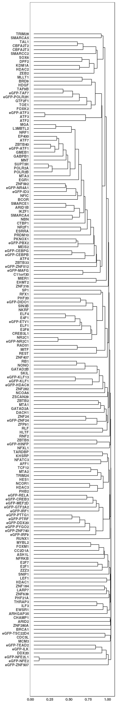
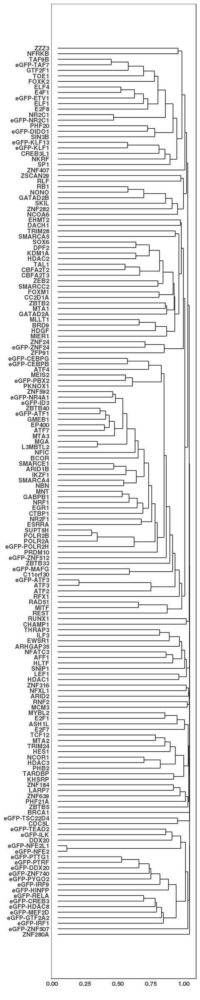
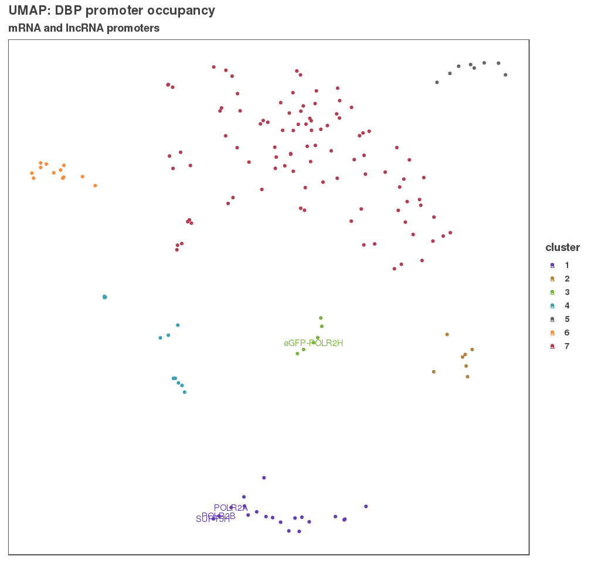
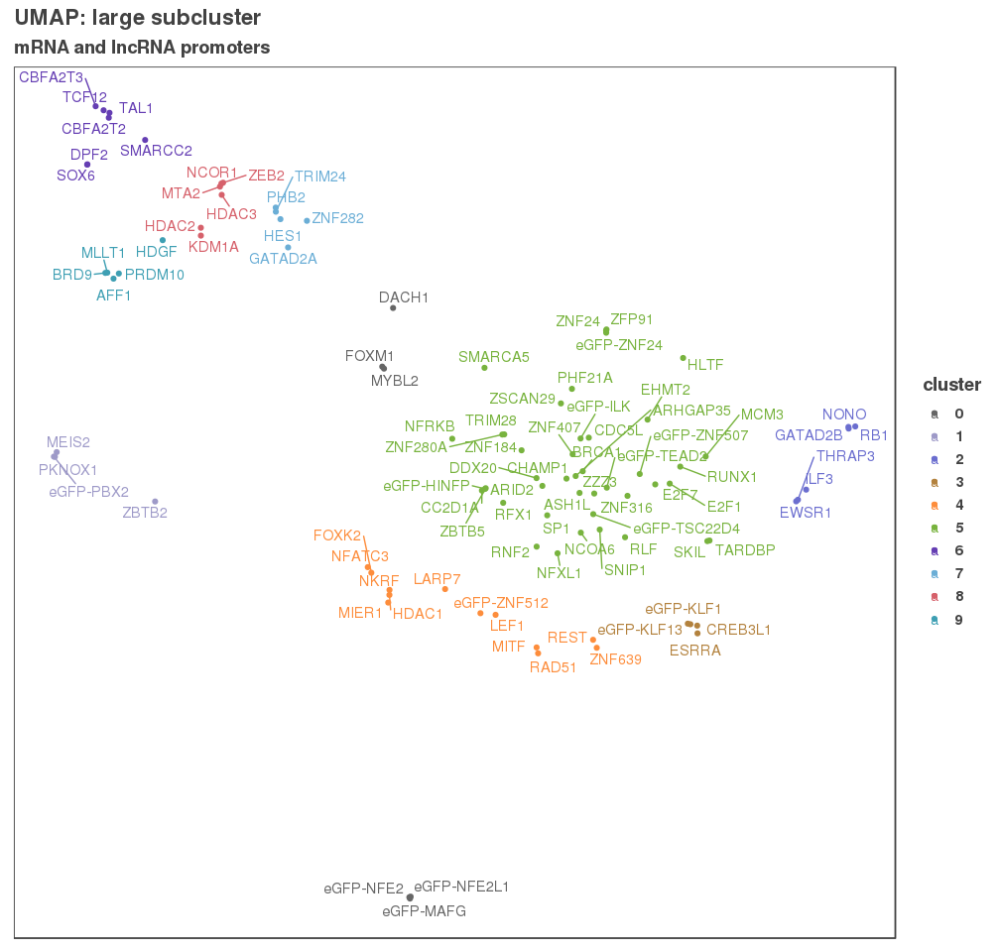

Global clustering
=================

``` r
# We are going to start out with a function to import files called "import_peaks"
# This the filtered consensus_peaks; final list of 161 TFs after filtering
# consensus_peaks <- import_peaks("../01_consensus_peaks/results/consensus_peaks")

# Let's grab both the lncRNA and mRNA promoters
# proms <- rtracklayer::import("../01_consensus_peaks/results/lncrna_mrna_promoters.gtf")
lncrna_promoters <- rtracklayer::import("../01_consensus_peaks/results/lncrna_promoters.gtf")
mrna_promoters <- rtracklayer::import("../01_consensus_peaks/results/mrna_promoters.gtf")

# Counts the number of promoters that each TF binds to
promoter_peak_occurence <- read.table("../01_consensus_peaks/results/lncrna_mrna_promoter_peak_occurence_matrix.tsv") %>%
  as.matrix()
```

Now that we have a binary matrix and counts of number of features that intersect with DNA binding events -- let's cluster to see if the grouping makes sense. We are using a binary matrix that calculates the distance betweeen each sample using the binary distance metric.

``` r
# Hierarchical clustering with binary distance measure
bin_hier <- hclust(dist(promoter_peak_occurence, method = "binary"))

ggdendro::ggdendrogram(bin_hier, rotate = TRUE,  size = 3)
```



``` r
ggsave("figures/all_hclust_binary_dist.pdf", height = 26, width = 6)
ggsave("figures/all_hclust_binary_dist.png", height = 26, width = 6)
```

lncRNA promoter binding clustering
----------------------------------

``` r
lncrna_peak_occurence <- promoter_peak_occurence[,lncrna_promoters$gene_id]

bin_hier <- hclust(dist(lncrna_peak_occurence, method = "binary"))

ggdendro::ggdendrogram(bin_hier, rotate = TRUE,  size = 3)
```


``` r
ggsave("figures/lncrna_hclust_binary_dist.pdf", height = 26, width = 6)
ggsave("figures/lncrna_hclust_binary_dist.png", height = 26, width = 6)
```

mRNA promoter binding clustering
--------------------------------

``` r
mrna_peak_occurence <- promoter_peak_occurence[,mrna_promoters$gene_id]

bin_hier <- hclust(dist(lncrna_peak_occurence, method = "binary"))

ggdendro::ggdendrogram(bin_hier, rotate = TRUE,  size = 3)
```



``` r
ggsave("figures/mrna_hclust_binary_dist.pdf", height = 26, width = 6)
ggsave("figures/mrna_hclust_binary_dist.png", height = 26, width = 6)
```

UMAP dimensionality reduction
=============================

Here we're going to perform UMAP and cluster with HDBscan to get a global view of DBP binding on lncRNA and mRNA promoters.

``` r
umap_params <- umap.defaults
umap_params$n_neighbors <- 4
umap_params$random_state <- 7748

umap_fit <- umap(promoter_peak_occurence, config = umap_params)
umap_df <- umap_fit$layout %>% as.data.frame() %>%
  rownames_to_column("dbp")

labels <- hdbscan(umap_fit$layout, minPts = 6)
umap_df$cluster <- factor(labels$cluster)
write_csv(umap_df, "results/umap_lncrna_mrna_promoters.csv")


col_pal <- c("#653EB3", "#B3823E", "#78B33E", "#3E9FB3", "#666666", "#fd8d3c", "#B33E52")
g <- ggplot(umap_df, aes(x = V1, y = V2, label = dbp, color = cluster))
g + geom_point() + 
  geom_text(data = umap_df %>% filter(dbp %in% c("POLR2A",
                                                  "POLR2B",
                                                  "SUPT5H",
                                                  "eGFP-POLR2H"))) + 
  ggtitle("UMAP: DBP promoter occupancy",
          subtitle = "mRNA and lncRNA promoters") +
  theme_paperwhite() +
  theme(axis.title = element_blank(),
        axis.text = element_blank(),
        axis.ticks = element_blank()) +
  scale_color_manual(values = col_pal)
```



``` r
ggsave("figures/umap_mrna_lncrna_promoters.png")
ggsave("figures/umap_mrna_lncrna_promoters.pdf")


# Let's make a df of the clusters for naming and gene ontology
clusters_df <- umap_df %>%
  dplyr::select(cluster, dbp) %>%
  group_by(cluster) %>%
  summarize(dbp = paste(dbp, collapse = " ")) %>%
  mutate(dbp = gsub("eGFP-","", dbp))
write_csv(clusters_df, "results/umap_clusters.csv")
knitr::kable(clusters_df)
```

| cluster | dbp                                                                                                                                                                                                                                                                                                                                                                                                                                                                                                                                                                                                        |
|:--------|:-----------------------------------------------------------------------------------------------------------------------------------------------------------------------------------------------------------------------------------------------------------------------------------------------------------------------------------------------------------------------------------------------------------------------------------------------------------------------------------------------------------------------------------------------------------------------------------------------------------|
| 1       | ATF7 ATF1 ID3 NR4A1 EGR1 EP400 GABPB1 GMEB1 L3MBTL2 MGA MNT MTA3 NFIC NRF1 POLR2A POLR2B SUPT5H ZBTB33 ZBTB40 ZNF592                                                                                                                                                                                                                                                                                                                                                                                                                                                                                       |
| 2       | ARID1B BCOR CTBP1 IKZF1 NBN SMARCA4 SMARCE1                                                                                                                                                                                                                                                                                                                                                                                                                                                                                                                                                                |
| 3       | C11orf30 POLR2H TAF7 GTF2F1 TAF9B TOE1                                                                                                                                                                                                                                                                                                                                                                                                                                                                                                                                                                     |
| 4       | E2F8 E4F1 DIDO1 ETV1 NR2C1 ELF1 ELF4 NR2C1 NR2F1 PHF20 SIN3B                                                                                                                                                                                                                                                                                                                                                                                                                                                                                                                                               |
| 5       | ATF2 ATF3 ATF4 ATF3 CEBPB CEBPG KHSRP MTA1                                                                                                                                                                                                                                                                                                                                                                                                                                                                                                                                                                 |
| 6       | CREB3 DDX20 GTF2A2 HDAC8 IRF1 IRF9 MEF2D PTRF PTTG1 PYGO2 RELA ZNF740                                                                                                                                                                                                                                                                                                                                                                                                                                                                                                                                      |
| 7       | AFF1 ARHGAP35 ARID2 ASH1L BRCA1 BRD9 CBFA2T2 CBFA2T3 CC2D1A CDC5L CHAMP1 CREB3L1 DACH1 DDX20 DPF2 E2F1 E2F7 HINFP ILK KLF1 KLF13 MAFG NFE2 NFE2L1 PBX2 TEAD2 TSC22D4 ZNF24 ZNF507 ZNF512 EHMT2 ESRRA EWSR1 FOXK2 FOXM1 GATAD2A GATAD2B HDAC1 HDAC2 HDAC3 HDGF HES1 HLTF ILF3 KDM1A LARP7 LEF1 MCM3 MEIS2 MIER1 MITF MLLT1 MTA2 MYBL2 NCOA6 NCOR1 NFATC3 NFRKB NFXL1 NKRF NONO PHB2 PHF21A PKNOX1 PRDM10 RAD51 RB1 REST RFX1 RLF RNF2 RUNX1 SKIL SMARCA5 SMARCC2 SNIP1 SOX6 SP1 TAL1 TARDBP TCF12 THRAP3 TRIM24 TRIM28 ZBTB2 ZBTB5 ZEB2 ZFP91 ZNF184 ZNF24 ZNF280A ZNF282 ZNF316 ZNF407 ZNF639 ZSCAN29 ZZZ3 |

### Sub clustering of largest cluster

``` r
dbps_in_large_cluster <- umap_df[umap_df$cluster == 7, "dbp"]
lc_peak_occurence <- promoter_peak_occurence[dbps_in_large_cluster,]

umap_params <- umap.defaults
umap_params$n_neighbors <- 4
umap_params$min_dist <- 0.1
umap_params$spread <- 0.15
umap_params$random_state <- 2187

umap_fit <- umap(lc_peak_occurence, config = umap_params)
umap_sub <- umap_fit$layout %>% as.data.frame() %>%
  rownames_to_column("dbp")

labels <- hdbscan(umap_fit$layout, minPts = 4)
umap_sub$cluster <- factor(labels$cluster)
write_csv(umap_sub, "results/umap_largest_subcluster.csv")


col_pal <- c("#666666", "#9e9ac8", "#6b6ecf", "#B3823E", "#fd8d3c", "#78B33E", "#653EB3", "#6baed6", "#d6616b", "#3E9FB3")
g <- ggplot(umap_sub, aes(x = V1, y = V2, label = dbp, color = cluster))
g + geom_point()  +
    ggtitle("UMAP: large subcluster",
          subtitle = "mRNA and lncRNA promoters") +
  theme_paperwhite() +
  theme(axis.title = element_blank(),
        axis.text = element_blank(),
        axis.ticks = element_blank()) +
  scale_color_manual(values = col_pal) + 
  geom_text_repel()
```



``` r
ggsave("figures/umap_large_subcluster_promoters.png", height = 11, width = 11.5)
ggsave("figures/umap_large_subcluster_promoters.pdf", height = 11, width = 11.5)

clusters_df <- umap_sub %>%
  dplyr::select(cluster, dbp) %>%
  group_by(cluster) %>%
  summarize(dbp = paste(dbp, collapse = " ")) %>%
  mutate(dbp = gsub("eGFP-","", dbp))
write_csv(clusters_df, "results/umap_clusters.csv")
knitr::kable(clusters_df)
```

| cluster | dbp                                                                                                                                                                                                                                                               |
|:--------|:------------------------------------------------------------------------------------------------------------------------------------------------------------------------------------------------------------------------------------------------------------------|
| 0       | DACH1 MAFG NFE2 NFE2L1 FOXM1 MYBL2                                                                                                                                                                                                                                |
| 1       | PBX2 MEIS2 PKNOX1 ZBTB2                                                                                                                                                                                                                                           |
| 2       | EWSR1 GATAD2B ILF3 NONO RB1 THRAP3                                                                                                                                                                                                                                |
| 3       | CREB3L1 KLF1 KLF13 ESRRA                                                                                                                                                                                                                                          |
| 4       | ZNF512 FOXK2 HDAC1 LARP7 LEF1 MIER1 MITF NFATC3 NKRF RAD51 REST ZNF639                                                                                                                                                                                            |
| 5       | ARHGAP35 ARID2 ASH1L BRCA1 CC2D1A CDC5L CHAMP1 DDX20 E2F1 E2F7 HINFP ILK TEAD2 TSC22D4 ZNF24 ZNF507 EHMT2 HLTF MCM3 NCOA6 NFRKB NFXL1 PHF21A RFX1 RLF RNF2 RUNX1 SKIL SMARCA5 SNIP1 SP1 TARDBP TRIM28 ZBTB5 ZFP91 ZNF184 ZNF24 ZNF280A ZNF316 ZNF407 ZSCAN29 ZZZ3 |
| 6       | CBFA2T2 CBFA2T3 DPF2 SMARCC2 SOX6 TAL1 TCF12                                                                                                                                                                                                                      |
| 7       | GATAD2A HES1 PHB2 TRIM24 ZNF282                                                                                                                                                                                                                                   |
| 8       | HDAC2 HDAC3 KDM1A MTA2 NCOR1 ZEB2                                                                                                                                                                                                                                 |
| 9       | AFF1 BRD9 HDGF MLLT1 PRDM10                                                                                                                                                                                                                                       |
