Peak permutation
================

Our goal here is take the consensus peaks for each DBP and randomize them around the genome 1,000 times. Each time we will count how it overlaps a feature tested in this study (e.g. promoters)

``` r
fl <- list.files("results/", pattern = "permutation_results", full.names = T)
if(length(fl) < 3) {
  perm_res <- lapply(res_files, readRDS) %>%
    unlist(recursive = F) %>%
    rbind_list()
  
  # Since we did some filtering after this test was run, let's now filter to just the DBPs
  # with enough peaks to use in the analysis.
  perm_res <- perm_res %>% filter(tf %in% names(peak_list))
  
  length(region_list)
  perm_res$padj <- p.adjust(perm_res$pval, method = "BH", n = length(region_list)*length(peak_list))
  
  # Let's write out the permutaiton of promoter overlaps for each DBP. So we don't have to run again :)
  perm_res_family <- perm_res %>%
    filter(grepl("family", region),
           !grepl("\\?", region))
  write_csv(perm_res_family, "results/permutation_results_repeat_families.csv")
  
  perm_res_class <- perm_res %>%
    filter(grepl("class", region),
           !grepl("\\?", region))
  write_csv(perm_res_class, "results/permutation_results_repeat_classes.csv")
  
  perm_res_promoters <- perm_res %>%
    filter(grepl("promoters", region))
  write_csv(perm_res_promoters, "results/permutation_results_promoters.csv")
}
perm_res <- read.csv("results/permutation_results_all.csv")
perm_res_family <- read.csv("results/permutation_results_repeat_families.csv")
perm_res_class <- read.csv("results/permutation_results_repeat_classes.csv")
perm_res_promoters <- read.csv("results/permutation_results_promoters.csv")
```

Nearly all DBPs were enriched on both lncRNA and mRNA promoters. A few however, were significantly depleted.

``` r
perm_res_summary <- perm_res_promoters %>%
  mutate(significant = padj < 0.01) %>%
  group_by(alternative, region, significant) %>%
  summarize(count = n(),
            dbps = paste(tf, collapse = ";"))
```

    ## `summarise()` regrouping output by 'alternative', 'region' (override with `.groups` argument)

``` r
# Clarify labels for plot
perm_res_summary$alternative <- gsub("greater", "Enriched", perm_res_summary$alternative)
perm_res_summary$alternative <- gsub("less", "Depleted", perm_res_summary$alternative)

perm_res_summary[perm_res_summary$significant == T, "sig"] <- "padj < 0.01"
perm_res_summary[perm_res_summary$significant == F, "sig"] <- "padj >= 0.01"


#### FIGURE: Supplemental Figure 1B
g <- ggplot(perm_res_summary, aes(x = sig, y = count))
g + geom_bar(stat = "identity") + 
  ylim(0,180) +
  geom_text(stat='identity', aes(label=count), vjust=-0.2) +
  geom_text(data = perm_res_summary %>% filter(count < 4),
            aes(label = dbps,
                y = count + 50),
            size = 3) +
  facet_grid(region ~ alternative) +
  xlab("") +
  ylab("Count") +
  ggtitle("DBP enrichment on promoters")
```

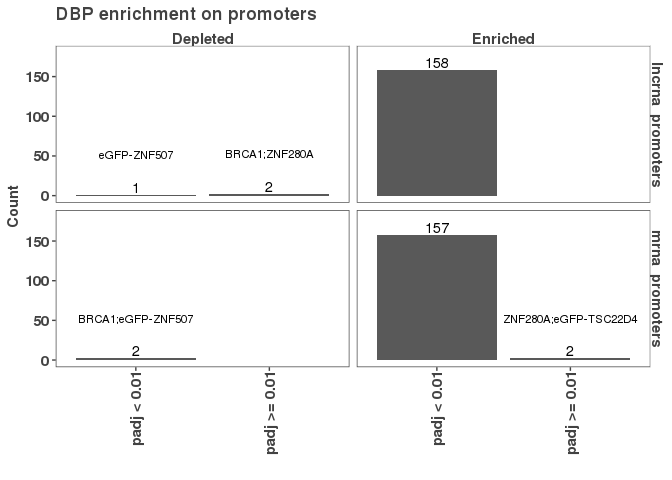

``` r
ggsave("figures/dbp_enrichment_on_promoters.png")
```

    ## Saving 7 x 5 in image

``` r
ggsave("figures/dbp_enrichment_on_promoters.pdf")
```

    ## Saving 7 x 5 in image

``` r
depleted_on_promoters <- perm_res_promoters %>% filter(alternative == "less", padj <= 0.01)

plot_perm_test <- function(row, df) {
  region <- df$region[row]
  dbp <- df$tf[row]
  observed <- df$observed[row]
  permuted <- df$permuted[row]
  padj <- round(df$padj[row],4)
  nperm <- df$nperm[row]
  df <- data.frame("region" = region, 
                   "dbp" = dbp, 
                   "permuted" = permuted) %>%
    separate_rows(permuted, sep = ";", convert = T)
  g <- ggplot(df, aes(x = permuted)) + 
    geom_histogram(bins = 30) +
    geom_vline(xintercept = observed, lty = 2) +
    ggtitle(paste0(region, " -- ", dbp),
            subtitle = paste0("padj = ", padj, " nperms = ", nperm))
  return(g)
}
pl <- lapply(1:nrow(depleted_on_promoters), plot_perm_test, df = depleted_on_promoters)
gridExtra::grid.arrange(grobs = pl, ncol = 1)
```

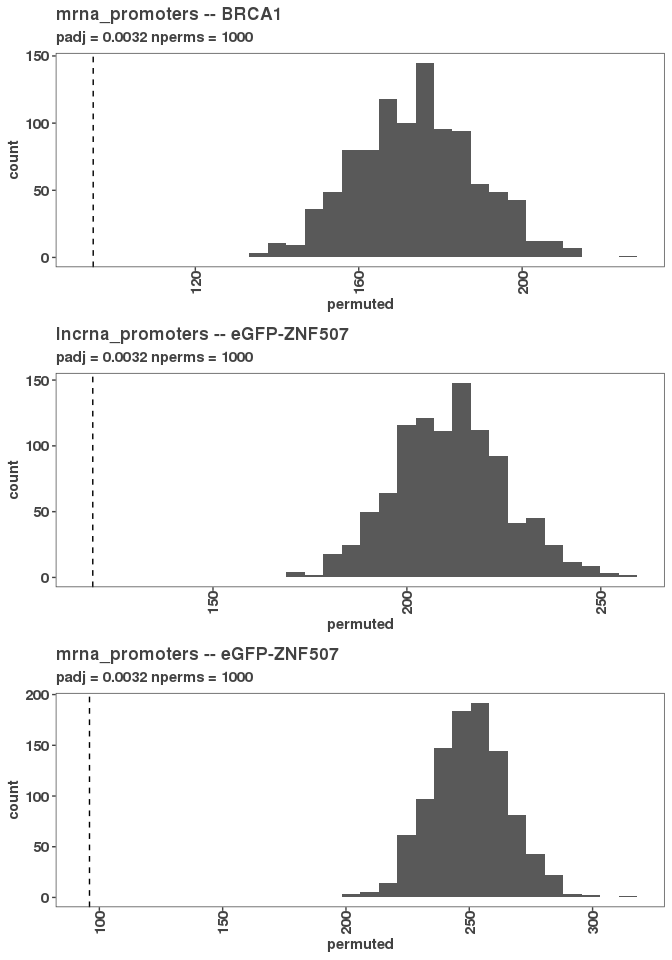

Depleted on promoters:

mrna\_promoters-BRCA1 lncrna\_promoters-eGFP-ZNF507 mrna\_promoters-eGFP-ZNF507

And a few were neither enriched or depleted

``` r
ns_promoters <- perm_res_promoters %>% filter(padj > 0.01)
pl <- lapply(1:nrow(ns_promoters), plot_perm_test, df = ns_promoters)
gridExtra::grid.arrange(grobs = pl, ncol = 1)
```

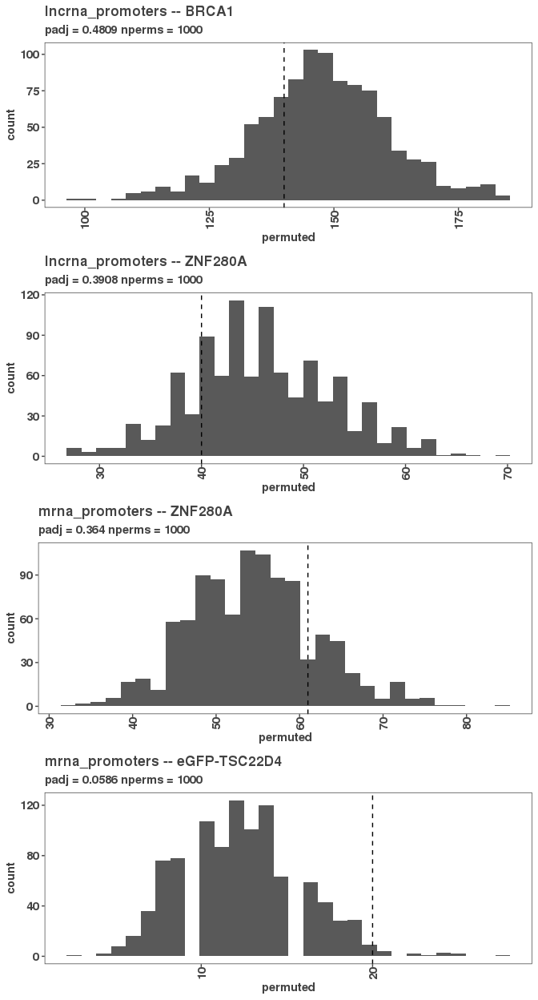

Not significant:

lncrna\_promoters-BRCA1 lncrna\_promoters-ZNF280A mrna\_promoters-ZNF280A mrna\_promoters-eGFP-TSC22D4

``` r
sig_overlaps <- perm_res %>% filter(padj < 0.01)

# let's fill in those that were significant in any row / colum
sig_tf <- unique(sig_overlaps$tf)
sig_regions <- unique(sig_overlaps$region)

# So 72/88 regions had at lest one significant depletion or enrichment.
# And 161/161 tfs had at least one significant depletion or enrichment.
overlaps <- perm_res %>%
  filter(tf %in% sig_tf,
         region %in% sig_regions)
# Those that had zero overlaps have a z-score of NA.
# Let's make it zero.
overlaps[is.na(overlaps$zscore), "zscore"] <- 0

sig_df <- overlaps %>%
  dplyr::select(region, tf, zscore) %>%
  pivot_wider(names_from = tf, values_from = zscore, values_fill = list("zscore" = 0))

sig_matrix <- sig_df %>%
  column_to_rownames("region") %>%
  as.matrix()


region_clust <- hclust(dist(sig_matrix))
tf_clust <- hclust(dist(t(sig_matrix)))
plot(region_clust)
```

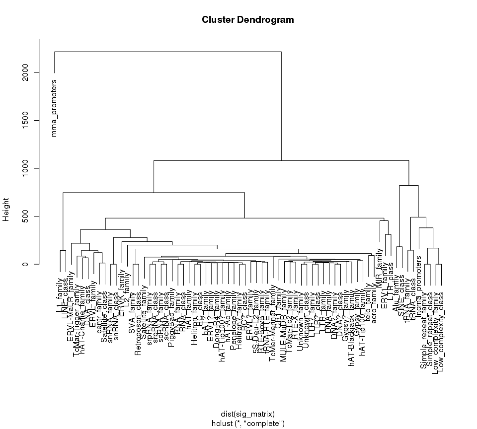

It looks like in terms of enrichment, lncRNA promoters are not clustered with mRNA promoters, but rather with the MIR family, tRNAs, and simple repeats. Thus, lncRNA promoters appear to be closser to other noncoding genes than protein coding genes wrt/ repeat content.

``` r
sig_df_long <- sig_df %>%
  pivot_longer(2:ncol(.), names_to = "tf", values_to = "zscore")
sig_df_long$region <- factor(sig_df_long$region, region_clust$labels[region_clust$order])
sig_df_long$tf <- factor(sig_df_long$tf, tf_clust$labels[tf_clust$order])

# Let's get rid of things that have fewer than X enrichments
region_summary <- sig_overlaps %>%
  group_by(region) %>%
  summarize(count = n())
```

    ## `summarise()` ungrouping output (override with `.groups` argument)

``` r
regions_to_include <- region_summary[which(region_summary$count > 40), "region"]
sig_df_long <- sig_df_long %>% filter(region %in% regions_to_include$region)

g <- ggplot(sig_df_long, aes(x = tf, y = region, fill = zscore))
g + geom_tile() + scale_fill_gradient2()
```


Diving deeper into lncRNA and mRNA promoter overlaps
====================================================

``` r
# Just look at mRNA and lncRNA
sig_df_family <- sig_df_long %>%
  filter(grepl("promoter", region))
# Let's recluster
class_ov_matrix <- sig_df_family %>%
  pivot_wider(names_from = tf, values_from = zscore) %>%
  column_to_rownames("region") %>%
  as.matrix()

sig_df_familyw <- sig_df_family %>%
  pivot_wider(names_from = region, values_from = zscore) 
sig_df_familyw$diff <- sig_df_familyw$lncrna_promoters - sig_df_familyw$mrna_promoters

g <- ggplot(sig_df_family, aes(x = tf, y = region, fill = zscore))
g + geom_raster() + scale_fill_gradient2() + coord_flip() + 
  theme(axis.text.x = element_text(angle = 90L, hjust = 1L, vjust = 0.5))
```

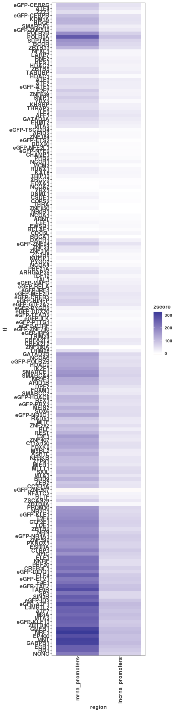

``` r
ggsave("figures/repeat_classes_vs_tf_peaks.png", height = 28, width = 5)

# Order so the bigger zscores come up on top
sig_df_family <- sig_df_family %>% arrange(abs(zscore))
# New style of heatmap:
g <- ggplot(sig_df_family, aes(x = tf, y = region, color = zscore, size = zscore))
g + geom_point() + scale_color_gradient2() + coord_flip() + 
  theme_minimal() +
   theme(panel.grid.major = element_blank(), panel.grid.minor = element_blank(),
panel.background = element_blank(), axis.line = element_line(colour = "black")) + 
  theme(axis.text.x = element_text(angle = 90L, hjust = 1L, vjust = 0.5))
```

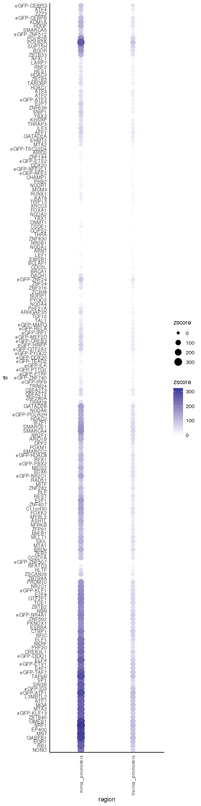

``` r
ggsave("figures/mRNA_lncRNA_vs_tf_peaks_pointmap.png", height = 28, width = 4)
```

Digging depeer into repeat family and class overlaps
====================================================

``` r
# Just look at repeat classes
# There's not a lot going on the ? classes and they tend to cluster with their main class type.
# Exceppt for LTR_class? which is quite different than LTR_class
# I'm going to take them out for now.
sig_df_classes <- sig_df_long %>%
  filter(grepl("class", region),
         !grepl("\\?", region))
# Let's recluster
class_ov_matrix <- sig_df_classes %>%
  pivot_wider(names_from = tf, values_from = zscore) %>%
  column_to_rownames("region") %>%
  as.matrix()
class_region_clust <- hclust(dist(class_ov_matrix))
class_tf_clust <- hclust(dist(t(class_ov_matrix)))
plot(class_region_clust)
```

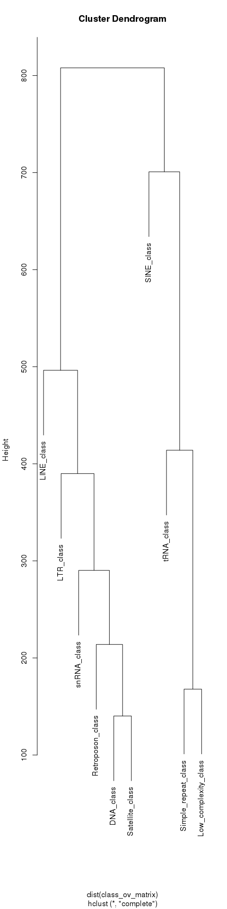

``` r
plot(class_tf_clust)
```

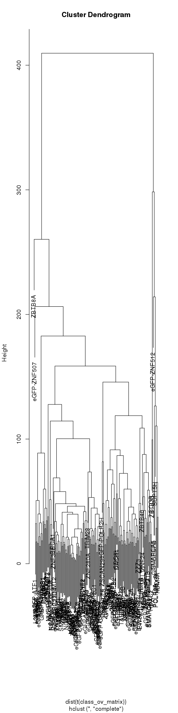

``` r
sig_df_classes$region <- factor(sig_df_classes$region,  class_region_clust$labels[class_region_clust$order])
sig_df_classes$tf<- factor(sig_df_classes$tf,  class_tf_clust$labels[class_tf_clust$order])
```

``` r
summary(sig_df_classes$zscore)
```

    ##     Min.  1st Qu.   Median     Mean  3rd Qu.     Max. 
    ## -91.3065  -5.7306   0.3388   4.8610  10.1118 329.8942

``` r
g <- ggplot(sig_df_classes, aes(x = tf, y = region, fill = zscore))
g + geom_tile() + scale_fill_gradient2(limits = c(-100, 100), na.value = "#ffffff") +  
  theme(axis.text.x = element_text(angle = 90L, hjust = 1L, vjust = 0.5))
```

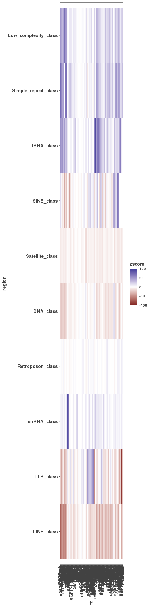

``` r
ggsave("figures/repeat_classes_vs_tf_peaks.pdf", height = 5, width = 28)
```

``` r
# Order so the bigger zscores come up on top
sig_df_classes <- sig_df_classes %>% arrange(abs(zscore))
# New style of heatmap:
g <- ggplot(sig_df_classes, aes(x = tf, y = region, color = zscore, size = zscore))
g + geom_point() + scale_color_gradient2() + coord_flip() + 
  theme_minimal() +
   theme(panel.grid.major = element_blank(), panel.grid.minor = element_blank(),
panel.background = element_blank(), axis.line = element_line(colour = "black")) + 
  theme(axis.text.x = element_text(angle = 90L, hjust = 1L, vjust = 0.5))
```

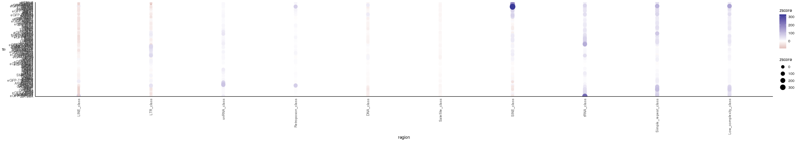

``` r
ggsave("figures/repeat_classes_vs_tf_peaks_pointmap.png", height = 28, width = 5)
```

``` r
# Just look at repeat families
sig_df_family <- sig_df_long %>%
  filter(grepl("family", region),
         !grepl("\\?", region))
# Let's recluster
class_ov_matrix <- sig_df_family %>%
  pivot_wider(names_from = tf, values_from = zscore) %>%
  column_to_rownames("region") %>%
  as.matrix()
class_region_clust <- hclust(dist(class_ov_matrix))
class_tf_clust <- hclust(dist(t(class_ov_matrix)))
plot(class_region_clust)
```

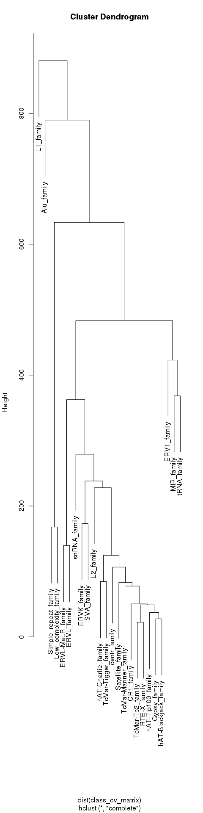

``` r
plot(class_tf_clust)
```

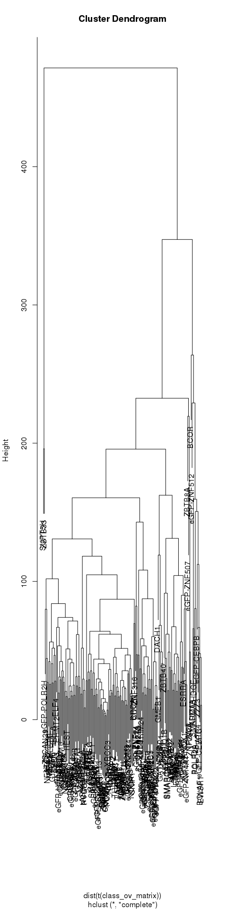

``` r
sig_df_family$region <- factor(sig_df_family$region,  class_region_clust$labels[class_region_clust$order])
sig_df_family$tf<- factor(sig_df_family$tf,  class_tf_clust$labels[class_tf_clust$order])
```

``` r
g <- ggplot(sig_df_family, aes(x = tf, y = region, fill = zscore))
g + geom_tile() + scale_fill_gradient2(limits = c(-100, 100), na.value = "#ffffff") + 
  theme(axis.text.x = element_text(angle = 90L, hjust = 1L, vjust = 0.5))
```

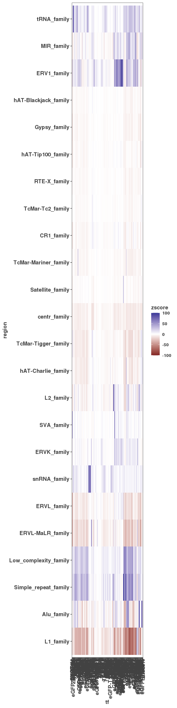

``` r
ggsave("figures/repeat_families_vs_tf_peaks.pdf", height = 12, width = 28)
```

``` r
# Order so the bigger zscores come up on top
sig_df_family <- sig_df_family %>% arrange(abs(zscore))
# New style of heatmap:
g <- ggplot(sig_df_family, aes(x = tf, y = region, color = zscore, size = zscore))
g + geom_point() + scale_color_gradient2() + coord_flip() + 
  theme_minimal() +
   theme(panel.grid.major = element_blank(), panel.grid.minor = element_blank(),
panel.background = element_blank(), axis.line = element_line(colour = "black")) + 
  theme(axis.text.x = element_text(angle = 90L, hjust = 1L, vjust = 0.5))
```

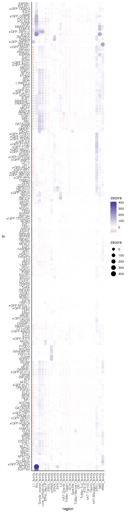

``` r
ggsave("figures/repeat_families_vs_tf_peaks_pointmap.png", height = 28, width = 5)
```

``` r
# Look at number of observed versus expected peaks in lncRNA and mRNA promoters for each DNA binding protein (TF); compare to chi square p-value result in plots below
lncrna_promoters <- rtracklayer::import("../01_consensus_peaks/results/lncrna_promoters.gtf")
mrna_promoters <- rtracklayer::import("../01_consensus_peaks/results/mrna_promoters.gtf")

peak_occurrence_matrix <- read.table("../01_consensus_peaks/results/lncrna_mrna_promoter_peak_occurence_matrix.tsv")
lncrna_matrix <- peak_occurrence_matrix[,lncrna_promoters$gene_id]
mrna_matrix <- peak_occurrence_matrix[,mrna_promoters$gene_id]
peak_list <- import_peaks("../01_consensus_peaks/results/consensus_peaks/filtered_by_peaks/")

lncrna_num_overlaps <- rowSums(lncrna_matrix)
mrna_num_overlaps <- rowSums(mrna_matrix)
num_peaks <- sapply(peak_list, length)
total_lncrna <- length(lncrna_promoters)
total_mrna <- length(mrna_promoters)
total_genes <- total_lncrna + total_mrna
chisq_res <- data.frame("tf" =character(),
                        "lncrna_peaks_observed" = numeric(),
                        "chisq_stat" = numeric(),
                        "chisq_pval" = numeric(),
                        "lncrna_peaks_expected" = numeric(),
                        "mrna_peaks_observed" = numeric(),
                        "mrna_peaks_expected" = numeric())
for(i in 1:length(num_peaks)) {
  total_peaks <- num_peaks[[i]]
  df1 <- data.frame("gene_type" = c("lncRNA","lncRNA", "mRNA", "mRNA"),
                    "promoter_bound" = c("bound", "not_bound", "bound", "not_bound"),
                    "count" = c(lncrna_num_overlaps[[i]],
                                total_lncrna - lncrna_num_overlaps[[i]],
                                mrna_num_overlaps[[i]],
                                total_mrna - mrna_num_overlaps[[i]])) %>%
    pivot_wider(names_from = gene_type, values_from = count) %>%
    column_to_rownames("promoter_bound") %>%
    as.matrix()
  
  csres <- chisq.test(df1)
  
  phi_coef <- phi(df1)
  
  tdf <- data.frame("tf" = names(num_peaks[i]),
                    "lncrna_peaks_observed" = lncrna_num_overlaps[[i]],
                    "chisq_stat" = csres$statistic,
                    "chisq_pval" = csres$p.value,
                    "lncrna_peaks_expected" = csres$expected[1,1],
                    "phi_coefficient" = phi_coef$phi,
                    "mrna_peaks_observed" = mrna_num_overlaps[[i]],
                    "mrna_peaks_expected" = csres$expected[1,2])
  # Update chisq_res to include number of observed and expected peaks, chi square value, and     p-value for each TF so that we can use this information to plot
  chisq_res <- bind_rows(chisq_res, tdf)
}

chisq_res$padj <- p.adjust(chisq_res$chisq_pval, method = "BH")
chisq_res$lncrna_diff <- chisq_res$lncrna_peaks_observed - chisq_res$lncrna_peaks_expected
chisq_res$mrna_diff <- chisq_res$mrna_peaks_observed - chisq_res$mrna_peaks_expected
write_csv(chisq_res, "results/lncrna_vs_mrna_chisq_results.csv")
```

#### Enriched on lncRNA

``` r
# Plot the difference between number of observed and expected peaks in lncRNA promoters for each TF versus the -log10 of the chi square p-value
g <- ggplot(chisq_res, aes(x = lncrna_diff, y = -log10(chisq_pval)))
g + geom_point() + 
  ggtitle("lncRNA vs. mRNA chi-squared: observed vs. expected")
```

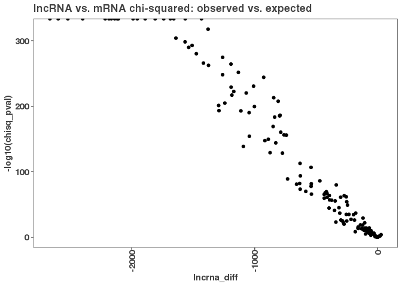

``` r
g <- ggplot(chisq_res, aes(x = lncrna_diff, y = phi_coefficient))
g + geom_point() + 
  ggtitle("lncRNA vs. mRNA chi-squared: observed vs. expected")
```

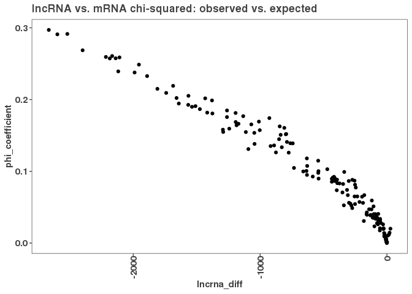

``` r
# Zoom in on the above plot to look at just at a few TFs centered around diff = 0, including those with positive values of observed-expected number of peaks in lncRNA promoters, which are labeled by name
g2 <- ggplot(chisq_res, aes(x = lncrna_diff, y = -log10(chisq_pval) ))
g2 + geom_point()  + xlim(-35, 35) + ylim(0, 5)  + geom_text(data = subset(chisq_res, lncrna_diff > 0), aes(lncrna_diff, -log10(chisq_pval), label = tf, check_overlap = TRUE)) + 
  geom_hline(yintercept = -log10(0.01), lty = 2) + 
  ggtitle("lncRNA vs. mRNA chi-squared: observed vs. expected")
```

    ## Warning: Ignoring unknown aesthetics: check_overlap

    ## Warning: Removed 134 rows containing missing values (geom_point).

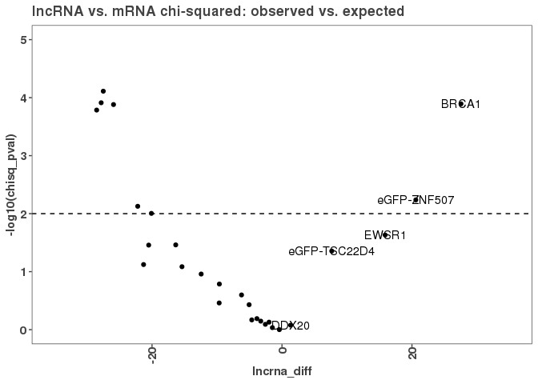
