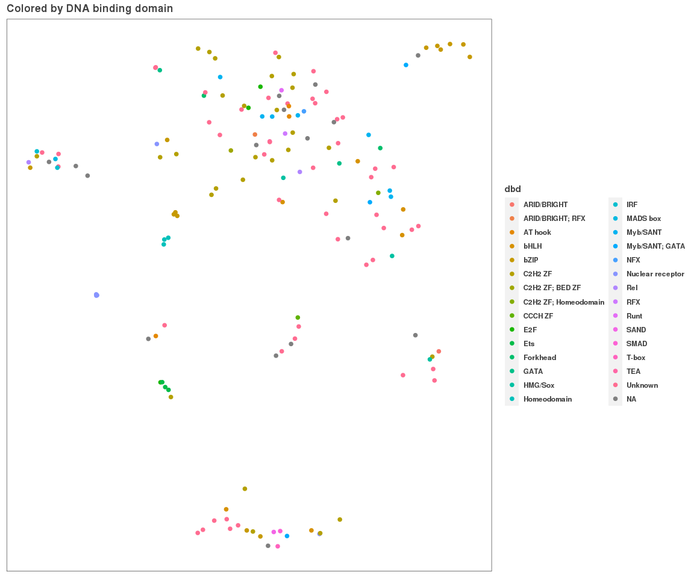
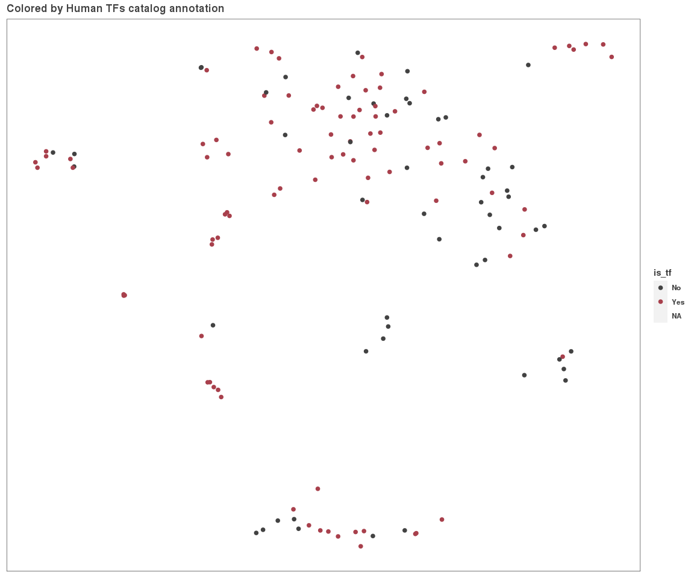
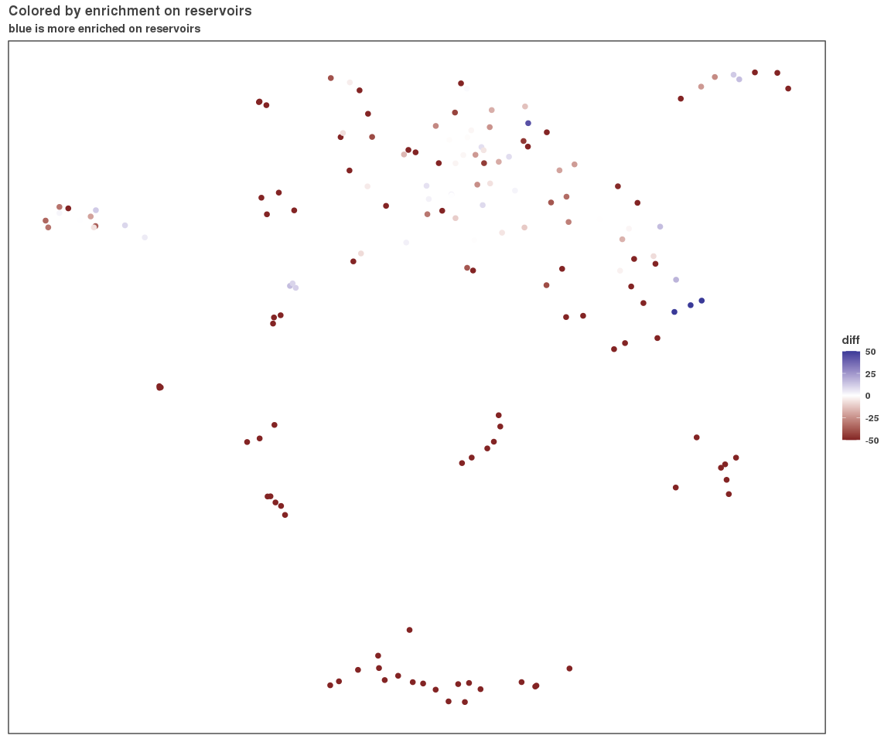
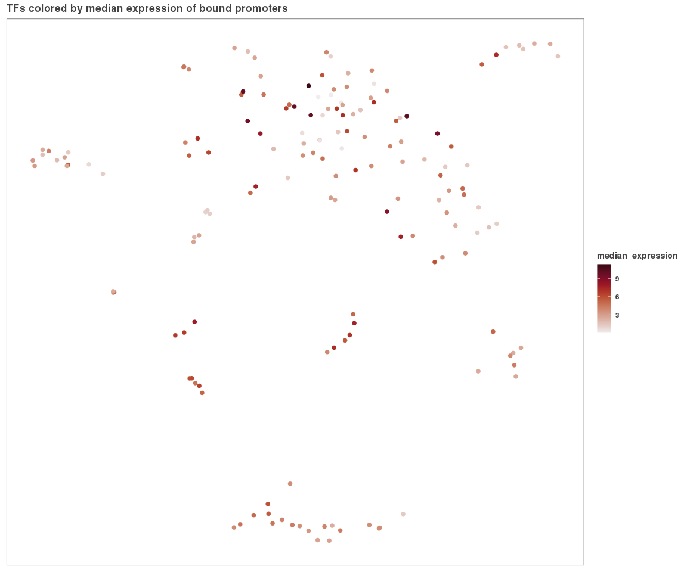
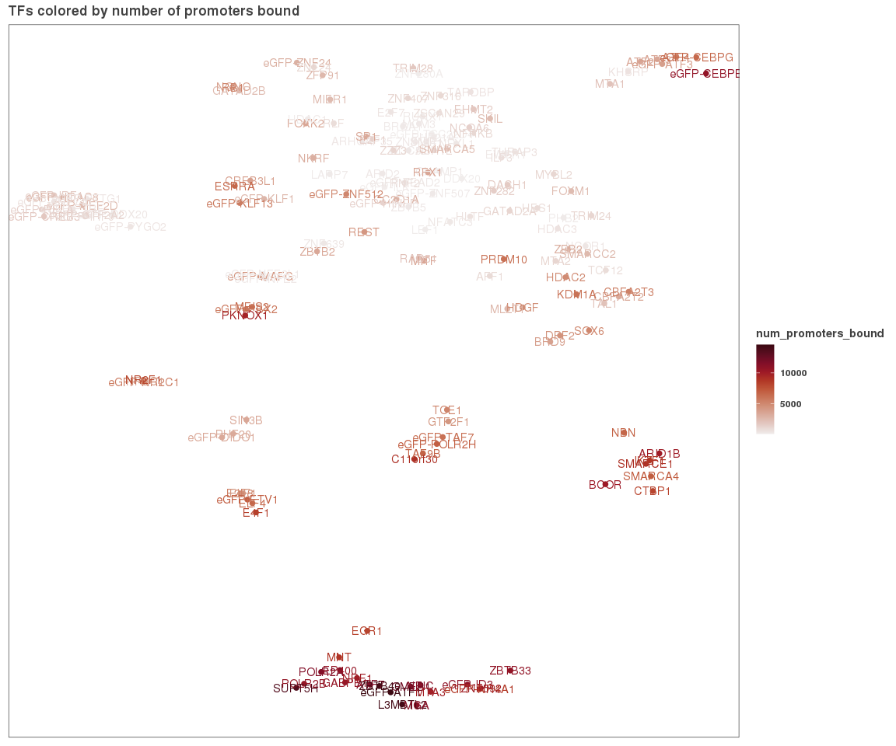
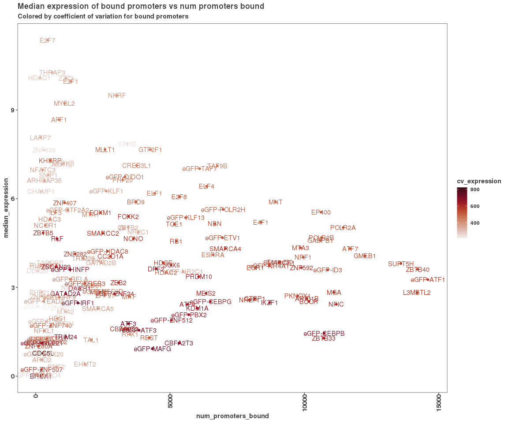

Mapping info to UMAP
====================

First, let's bring in some data from the The Human TFs paper.

``` r
# http://humantfs.ccbr.utoronto.ca/download/v_1.01/DatabaseExtract_v_1.01.csv
system("cd data; wget http://humantfs.ccbr.utoronto.ca/download/v_1.01/DatabaseExtract_v_1.01.csv")

tf_info <- read.csv("data/DatabaseExtract_v_1.01.csv")
umap_df <- read.csv("results/umap_lncrna_mrna_promoters.csv")

umap_df$HGNC_symbol <- sapply(umap_df$dbp, function(x) {
  tmp <- unlist(strsplit(x, "-"))
  if (length(tmp) == 1) {
    return(tmp[[1]])
  } else {
    return(tmp[[2]])
  }
})
length(which(tolower(umap_df$HGNC_symbol) %in% tolower(tf_info$HGNC.symbol)))
```

    ## [1] 145

``` r
tfs <- tf_info[which(tf_info$HGNC.symbol %in% umap_df$HGNC_symbol),]
missing_tfs <- umap_df$HGNC_symbol[which(!(umap_df$HGNC_symbol %in% tfs$HGNC.symbol))]
tf_info <- tf_info %>% dplyr::select(c("Ensembl.ID","HGNC.symbol", "DBD", "Is.TF.","TF.assessment","Binding.mode","Motif.status",
                                       "Interpro.ID.s.","EntrezGene.ID",
                                       "EntrezGene.Description","PDB.ID","TF.tested.by.HT.SELEX.",
                                       "TF.tested.by.PBM.", "Conditional.Binding.Requirements", "Go.Evidence", "Pfam.Domains..By.ENSP.ID.",
                                       "Is.C2H2.ZF.KRAB.."  ))
names(tf_info) <- c("ensembl_id", "hgnc_symbol", "dbd", 
                    "is_tf", "tf_assessment",
                    "binding_mode", "motif_status",
                    "interpro_id", "entrez_id", 
                    "entrez_desc", "pdb_id",
                    "ht_selex", "pbm", "conditional_binding",
                    "go_evidence", "pfam_domains",
                    "is_c2hc_zf_krab")
names(umap_df)[5] <- "hgnc_symbol"
names(umap_df)
```

    ## [1] "dbp"         "V1"          "V2"          "cluster"     "hgnc_symbol"

``` r
umap_df <- merge(umap_df, tf_info, all.x = T, by = "hgnc_symbol")
umap_df <- umap_df %>% arrange(cluster)
write_csv(umap_df, "results/umap_with_tf_info.csv")
```

``` r
# cp /Shares/rinn_class/data/k562_chip/analysis/09_expression/expression_summary_per_tf.csv /Shares/rinn_class/data/CLASS_2020/analysis/02_global_clustering/data/.
binding_summary <- read.csv("../07_binding_versus_expression/results/expression_summary_per_tf.csv")
csres <- read_csv("/Shares/rinn_class/data/k562_chip/analysis/09_expression/results/chisq_res.csv")
```

    ## Parsed with column specification:
    ## cols(
    ##   tf = col_character(),
    ##   ghosts_peaks_observed = col_double(),
    ##   chisq_stat = col_double(),
    ##   chisq_pval = col_double(),
    ##   ghosts_peaks_expected = col_double(),
    ##   padj = col_double(),
    ##   diff = col_double(),
    ##   enrich_score = col_double()
    ## )

``` r
names(binding_summary)[1] <- "dbp"
names(csres)[1] <- "dbp"
umap_df   <- merge(umap_df, csres, all.x = T)
umap_df <- merge(umap_df, binding_summary)
umap_df <- umap_df %>%
  dplyr::rename("umap_x" = "V1", 
         "umap_y" = "V2")
```

``` r
g <- ggplot(umap_df, aes(x = umap_x, y = umap_y, color = dbd))
g + geom_point(size = 2) + theme_paperwhite() + 
  theme(axis.line = element_blank(),
      axis.text.x = element_blank(),
      axis.text.y = element_blank(),
      axis.ticks = element_blank(),
      axis.title.x = element_blank(),
      axis.title.y = element_blank())  + 
  ggtitle("Colored by DNA binding domain")
```



``` r
g <- ggplot(umap_df, aes(x = umap_x, y = umap_y, color = is_tf))
g + geom_point(size = 2) + theme_paperwhite() + 
  theme(axis.line = element_blank(),
      axis.text.x = element_blank(),
      axis.text.y = element_blank(),
      axis.ticks = element_blank(),
      axis.title.x = element_blank(),
      axis.title.y = element_blank()) +
  scale_color_manual(values = c("#424242","#a8404c")) +
  ggtitle("Colored by Human TFs catalog annotation")
```

    ## Warning: Removed 16 rows containing missing values (geom_point).



``` r
g <- ggplot(umap_df, aes(x = umap_x, y = umap_y, color = diff))
g + geom_point(size = 2) + theme_paperwhite() + 
  scale_color_gradient2(limits = c(-50,50), oob = scales::squish) +
  theme(axis.line = element_blank(),
      axis.text.x = element_blank(),
      axis.text.y = element_blank(),
      axis.ticks = element_blank(),
      axis.title.x = element_blank(),
      axis.title.y = element_blank()) +
  ggtitle("Colored by enrichment on reservoirs",
          subtitle = "blue is more enriched on reservoirs")
```



``` r
# let's map expression of bound genes
g <- ggplot(umap_df, aes(x = umap_x, y = umap_y, 
                         color = median_expression, label = dbp))
g + geom_point(size = 2) + theme_paperwhite() + 
  # scale_color_manual(values = cbPalette) +
  theme(axis.line = element_blank(),
      axis.text.x = element_blank(),
      axis.text.y = element_blank(),
      axis.ticks = element_blank(),
      axis.title.x = element_blank(),
      axis.title.y = element_blank()) +
  scale_color_gradientn(colors = pals::ocean.amp(100)) +
  ggtitle("TFs colored by median expression of bound promoters")
```



``` r
g <- ggplot(umap_df, aes(x = umap_x, y = umap_y, 
                         color = num_promoters_bound, label = dbp))
g + geom_point(size = 2) + theme_paperwhite() + 
  # scale_color_manual(values = cbPalette) +
  theme(axis.line = element_blank(),
      axis.text.x = element_blank(),
      axis.text.y = element_blank(),
      axis.ticks = element_blank(),
      axis.title.x = element_blank(),
      axis.title.y = element_blank()) +
  geom_text() +
  scale_color_gradientn(colors = pals::ocean.amp(100)) +
  ggtitle("TFs colored by number of promoters bound")
```



``` r
g <- ggplot(umap_df, aes(x = num_promoters_bound, 
                         y = median_expression, 
                         label = dbp, color = cv_expression))
g + geom_point() + 
  geom_text() + 
  scale_color_gradientn(colors = pals::ocean.amp(100)) +
  ggtitle("Median expression of bound promoters vs num promoters bound",
          subtitle = "Colored by coefficient of variation for bound promoters")
```


