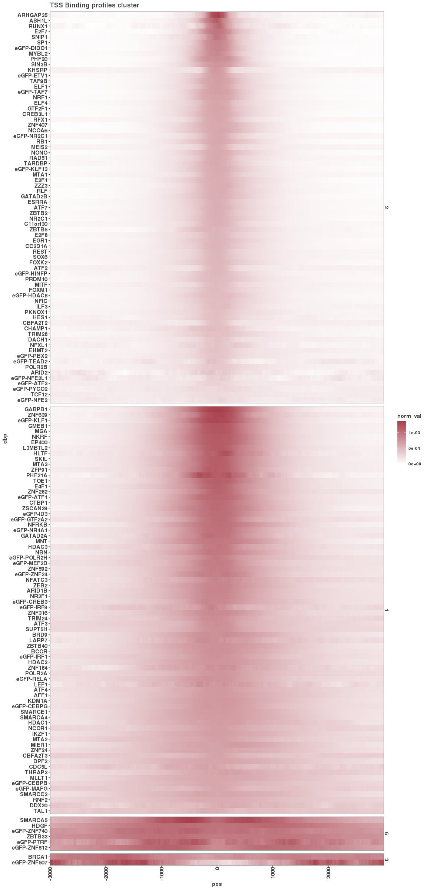
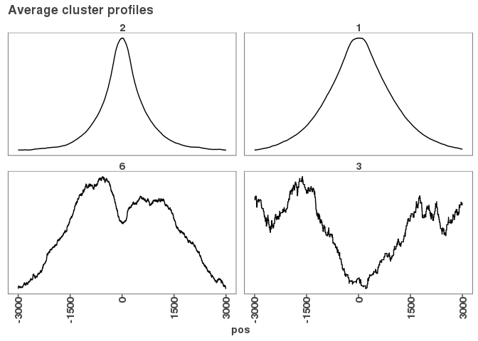
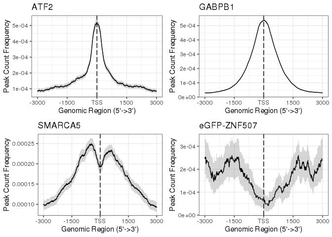

TSS profile plots
=================

``` r
base_path <- "../01_consensus_peaks/results/"
all_promoters <- rtracklayer::import(paste0(base_path,
                                            "lncrna_mrna_promoters.gtf"))
lncrna_promoters <- rtracklayer::import(paste0(base_path,
                                               "lncrna_promoters.gtf"))
mrna_promoters <- rtracklayer::import(paste0(base_path,
                                             "mrna_promoters.gtf"))
consensus_peaks <- import_peaks(paste0(base_path,
                                       "consensus_peaks/filtered_by_peaks"))
```

Generating permutations for 95% confidence in tss profile plots using the 'get\_tag\_matrix', 'get\_tag\_count'. These functions were adaped from the [Chipseeker](https://bioconductor.org/packages/release/bioc/html/ChIPseeker.html) R package.

``` r
if (!file.exists("results/tss_profiles.csv")) {
  
  tag_count_df <- data.frame("pos" = integer(0),
                             "value" = numeric(0),
                             "Lower" = numeric(0),
                             "Upper" = numeric(0),
                             "dbp" = character(0))
  
  for (i in 1:length(consensus_peaks)) {
    
    if (i %% 10 == 0) { print(i) }
    tag_matrix <- get_tag_matrix(consensus_peaks[[i]], 
                                 windows = all_promoters)
    tag_count <- get_tag_count(tag_matrix, 
                               xlim = c(-3000, 3000), 
                               conf = 0.95, 
                               ncpus = 6)
    tag_count$dbp <- names(consensus_peaks)[i]
    
    tag_count_df <- bind_rows(tag_count_df, tag_count)
  }
  write_csv(tag_count_df, "results/tss_profiles.csv")
} 
```

#### Clustering and plotting tss meta profile plots.

Specifically heat map of profile plots around tss +/- 3Kb

``` r
tag_count_df <- read.csv("results/tss_profiles.csv")

tcm <- tag_count_df %>%
  dplyr::select(pos, value, dbp) %>%
  pivot_wider(names_from = pos, values_from = value) %>%
  column_to_rownames("dbp") %>%
  as.matrix()

set.seed(908)
tcmz <- t(scale(t(tcm)))
tmp_hclust <- hclust(dist(tcmz))
summary(tmp_hclust$height)
```

    ##    Min. 1st Qu.  Median    Mean 3rd Qu.    Max. 
    ##   1.488   4.062   7.624  17.714  16.975 150.552

``` r
clusters <- data.frame("dbp" = row.names(tcm),
                       "cluster" = cutree(tmp_hclust, h = 65))
table(clusters$cluster)
```

    ## 
    ##  1  2  3  4  5  6  7  8  9 10 11 12 
    ## 74 71  2  1  1  6  1  1  1  1  1  1

``` r
tag_count_df <- merge(tag_count_df, clusters)

# Filter to only clusters that contain at least two DBPs.
non_singleton <- which(table(clusters$cluster) > 1)
tag_count_df <- tag_count_df %>% filter(cluster %in% non_singleton)

tcmdf <- tcmz %>% as.data.frame() %>%
  rownames_to_column("dbp") %>%
  pivot_longer(2:ncol(.), names_to = "pos", values_to = "value") %>%
  merge(clusters)


# Order by peak intensity at center
peak_center <- tag_count_df %>% filter(pos %in% -10:10) %>%
  group_by(dbp, cluster) %>% 
  summarize(mean_peak_center = mean(value)) %>%
  arrange(mean_peak_center)

cluster_peak_center <- peak_center %>% group_by(cluster) %>%
  summarize(mean_peak_center = mean(mean_peak_center)) %>%
  arrange(-mean_peak_center)

# Normalize each cluster to the max signal to aid in visibility
norm_factor <- tag_count_df %>% group_by(cluster) %>%
  summarize(cluster_max = max(value))
norm_factor$norm_factor <-  max(norm_factor$cluster_max) / norm_factor$cluster_max
tag_count_df <- merge(tag_count_df, norm_factor)

tag_count_df$norm_val <- tag_count_df$value * tag_count_df$norm_factor

tag_count_df$dbp <- factor(tag_count_df$dbp, levels = peak_center$dbp)
tag_count_df$cluster <- factor(tag_count_df$cluster, 
                               levels = cluster_peak_center$cluster)
tag_count_df$pos <- as.numeric(tag_count_df$pos)

#### FIGURE: Supplemental Figure 2C
g <- ggplot(tag_count_df, aes(x = pos, y = dbp, fill = norm_val))
g + geom_raster() + facet_grid(cluster~., scales = "free_y", space = "free") + 
  scale_fill_gradientn(colors = colorRampPalette(c("#ffffff", "#a8404c"))(100)) + 
  scale_x_continuous(expand = c(0,0)) + 
  ggtitle("TSS Binding profiles cluster")
```



``` r
ggsave("figures/tss_profile_heatmap.pdf", height = 25, width = 12)
ggsave("figures/tss_profile_heatmap.png", height = 25, width = 12)

write_csv(tag_count_df, "results/tss_profiles_clustered.csv")

cluster_members <- tag_count_df %>% group_by(cluster) %>%
  summarize(dbps = paste(unique(dbp), collapse = " "))
knitr::kable(cluster_members)
```

| cluster | dbps                                                                                                                                                                                                                                                                                                                                                                                                                                                                                                                                  |
|:--------|:--------------------------------------------------------------------------------------------------------------------------------------------------------------------------------------------------------------------------------------------------------------------------------------------------------------------------------------------------------------------------------------------------------------------------------------------------------------------------------------------------------------------------------------|
| 2       | ATF2 DACH1 eGFP-HDAC8 MYBL2 CC2D1A E2F8 CHAMP1 ESRRA eGFP-TEAD2 ARHGAP35 eGFP-DIDO1 EHMT2 C11orf30 GTF2F1 FOXK2 HES1 eGFP-KLF13 ASH1L EGR1 ATF7 E2F7 ILF3 RUNX1 eGFP-NFE2 eGFP-HINFP FOXM1 CREB3L1 E2F1 GATAD2B KHSRP MEIS2 CBFA2T2 eGFP-ATF3 MITF eGFP-NFE2L1 SIN3B eGFP-NR2C1 ARID2 eGFP-PBX2 ZBTB2 PKNOX1 eGFP-PYGO2 NCOA6 eGFP-TAF7 NFIC NFXL1 NONO NR2C1 ELF1 ELF4 PHF20 POLR2B PRDM10 RAD51 RB1 REST RFX1 RLF eGFP-ETV1 TRIM28 SP1 SNIP1 SOX6 TCF12 ZNF407 TAF9B TARDBP MTA1 ZZZ3 ZBTB5 NRF1                                    |
| 1       | AFF1 MLLT1 MNT ARID1B eGFP-NR4A1 MTA2 MTA3 eGFP-POLR2H ZFP91 eGFP-ZNF24 SMARCC2 ATF3 ATF4 eGFP-RELA NCOR1 BCOR NFATC3 eGFP-CEBPG BRD9 NFRKB ZNF24 ZNF282 NKRF CBFA2T3 ZNF316 eGFP-CEBPB eGFP-KLF1 CDC5L NR2F1 ZNF639 ZSCAN29 EP400 CTBP1 PHF21A KDM1A DDX20 DPF2 GABPB1 GATAD2A eGFP-IRF9 LEF1 HDAC3 GMEB1 E4F1 eGFP-ATF1 HDAC1 HDAC2 THRAP3 eGFP-CREB3 TOE1 SKIL HLTF IKZF1 eGFP-GTF2A2 RNF2 SMARCE1 eGFP-ID3 eGFP-IRF1 ZEB2 MGA eGFP-MAFG SUPT5H ZNF184 eGFP-MEF2D ZBTB40 TRIM24 NBN L3MBTL2 POLR2A ZNF592 LARP7 SMARCA4 MIER1 TAL1 |
| 6       | eGFP-PTRF ZBTB33 SMARCA5 HDGF eGFP-ZNF512 eGFP-ZNF740                                                                                                                                                                                                                                                                                                                                                                                                                                                                                 |
| 3       | eGFP-ZNF507 BRCA1                                                                                                                                                                                                                                                                                                                                                                                                                                                                                                                     |

``` r
write_csv(cluster_members, "results/tss_profiles_cluster_members.csv")
```

Pulling out a few examples of DBP profile plots around promoter TSS. A vast majority of DBP profiles resemble cluster 2 and very few, but interesting examples that are the oposite (concave to start -vs- convex)

``` r
rep_profiles <- tag_count_df %>% group_by(cluster, pos) %>%
  summarize(value = mean(value))

#### FIGURE: Figure 2B
g <- ggplot(rep_profiles, aes(x = pos, y = value))
g + geom_line() + facet_wrap(~cluster, scales = "free_y") + 
  theme(axis.text.y = element_blank(),
      axis.title.y = element_blank(),
      axis.ticks.y = element_blank()) +
  scale_x_continuous(breaks = seq(-3000,3000,1500)) +
  ggtitle("Average cluster profiles")
```



``` r
ggsave("figures/average_cluster_profiles.pdf")
ggsave("figures/average_cluster_profiles.png")
```

#### Individual DBP examples of the different profile clusters

(grey is the bootstrapped variance)

``` r
#### FIGURE: Supplemental 2C
# Let's choose a representative from each cluster to plot
# Cluster 2 narrow
tc2 <- tag_count_df %>% filter(dbp == "ATF2")
g2 <- plot_profile(tc2, "ATF2")
# Cluster 1 wide
tc1  <- tag_count_df %>% filter(dbp == "GABPB1")
g1 <- plot_profile(tc1, "GABPB1")
# Cluster 6 dip
tc6  <- tag_count_df %>% filter(dbp == "SMARCA5")
g6 <- plot_profile(tc6, "SMARCA5")
# Cluster 3 depleted at TSS
tc3  <- tag_count_df %>% filter(dbp == "eGFP-ZNF507")
g3 <- plot_profile(tc3, "eGFP-ZNF507")

# Show plot
gridExtra::grid.arrange(g2, g1, g6, g3, nrow = 2)
```



``` r
# Save plot
pdf("figures/example_cluster_profiles.pdf")
gridExtra::grid.arrange(g2, g1, g6, g3, nrow = 2)
dev.off()
```

    ## RStudioGD 
    ##         2
