``` r
knitr::opts_chunk$set(echo = TRUE)
options(stringsAsFactors = F)

library(tidyverse)
library(GenomicRanges)
library(GenomicFeatures)
library(rtracklayer)
library(ggrepel)
library(ggpubr)
library(Rsubread)
library(regioneR)

source("../util/intersect_functions.R")
source("../util/_setup.R")
```

Purpose: Compare expression of genes to binding in promoter regions
===================================================================

This script extracts expression counts from K562 RNA-seq data and identifies DNA-binding events at promoters from the K562 ChIP-seq consensus peak dataset. We have included further analysis on promoters that contain ≥7 DNA-binding events but are not expressed.

### Source for RNA-seq data

total RNA-seq for K562 dataset: <https://www.encodeproject.org/experiments/ENCSR885DVH/>

### Analysis of RNA-seq data

``` r
if(!file.exists("results/k562_tpm.csv")) {
  
  fl <- list.files("data/", pattern = ".bam", full.names = T)
  if(length(fl < 2)) {
    system("wget https://www.encodeproject.org/files/ENCFF625ZBS/@@download/ENCFF625ZBS.bam",
           intern = FALSE, ignore.stdout = TRUE, ignore.stderr = TRUE)
    system("wget https://www.encodeproject.org/files/ENCFF630HEX/@@download/ENCFF630HEX.bam",
           intern = FALSE, ignore.stdout = TRUE, ignore.stderr = TRUE)
  }
  
  counts <- featureCounts(c("data/ENCFF625ZBS.bam", "data/ENCFF630HEX.bam"),
                          annot.ext = "../../../../../Shares/rinn_class/data/genomes/human/gencode/v32/gencode.v32.annotation.gtf",
                          isGTFAnnotationFile = T,
                          isPairedEnd = TRUE,
                          nthreads = 16)
  
  rpk <- counts$counts / (counts$annotation$Length/1000)
  expression <- data.frame("rpk" = rpk) %>%
    rownames_to_column("gene_id") %>%
    pivot_longer(2:3, names_to = "sample", values_to = "rpk")
  
  expression_summary <- expression %>%
    group_by(sample) %>%
    summarize(total_rpk = sum(rpk, na.rm = T))
  expression_summary$rpk_m <- expression_summary$total_rpk / 1e6
  expression <- merge(expression, expression_summary)
  expression$tpm <-expression$rpk / expression$rpk_m
  tpm <- expression %>% group_by(gene_id) %>%
    summarize(tpm = mean(tpm, na.rm = T))
  write_csv(tpm, "results/k562_tpm.csv")
}
tpm <- read_csv("results/k562_tpm.csv")
```

    ## Parsed with column specification:
    ## cols(
    ##   gene_id = col_character(),
    ##   gene_name = col_character(),
    ##   tpm = col_double()
    ## )

``` r
peak_list <- import_peaks("../01_consensus_peaks/results/consensus_peaks/")

lncrna_promoters <- rtracklayer::import("../01_consensus_peaks/results/lncrna_promoters.gtf")
mrna_promoters <- rtracklayer::import("../01_consensus_peaks/results/mrna_promoters.gtf")
promoters <- rtracklayer::import("../01_consensus_peaks/results/lncrna_mrna_promoters.gtf")
promoters_df <- promoters %>% as.data.frame() %>% dplyr::select(gene_id, gene_type, gene_name)

lncrna_matrix <- count_peaks_per_feature(lncrna_promoters, peak_list, type = "occurrence")
mrna_matrix <- count_peaks_per_feature(mrna_promoters, peak_list, type = "occurrence")
promoter_peak_occurrence <- count_peaks_per_feature(promoters, peak_list, type = "occurrence")

peak_occurrence_df <- data.frame("gene_id" = colnames(promoter_peak_occurrence),
                                "number_of_tfs" = colSums(promoter_peak_occurrence))
peak_occurrence_df <- merge(peak_occurrence_df, tpm)
peak_occurrence_df <- merge(peak_occurrence_df, promoters_df)
```

``` r
g <- ggplot(peak_occurrence_df, aes(y = log10(tpm), x = number_of_tfs, color = gene_type))
g + 
  geom_point(data = peak_occurrence_df %>% filter(tpm < 0.001), alpha = 0.2) +
  geom_smooth() + 
  scale_y_continuous(expand = c(0,0)) + 
  scale_x_continuous(expand = c(0,0)) + 
  scale_color_manual(values = c("#424242","#a8404c"), name = "Gene type") + 
  ggtitle("Expression vs. promoter binding events") + 
  xlab(expression('Number of TFs')) +
  ylab(expression(log[10](TPM)))
```

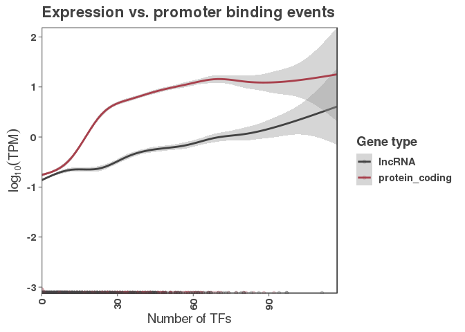

``` r
ggsave("figures/k562_expression_vs_promoter_binding.png")
ggsave("figures/k562_expression_vs_promoter_binding.pdf")


# lncRNA density plot
g <- ggplot(peak_occurrence_df %>% filter(gene_type == "lncRNA"), aes(y = log10(tpm), x = number_of_tfs, color = gene_type))
g + stat_density_2d(aes(fill = ..density..), geom = "raster", contour = FALSE, n = 500) + 
  scale_fill_gradientn(colors = colorRampPalette(colors = c("#ffffff", "#a8404c"))(100)) + 
  scale_y_continuous(expand = c(0,0)) + 
  scale_x_continuous(expand = c(0,0)) + 
  ggtitle("lncRNA binding vs. expression") + 
  xlab(expression('Number of TFs')) +
  ylab(expression(log[10](TPM)))
```

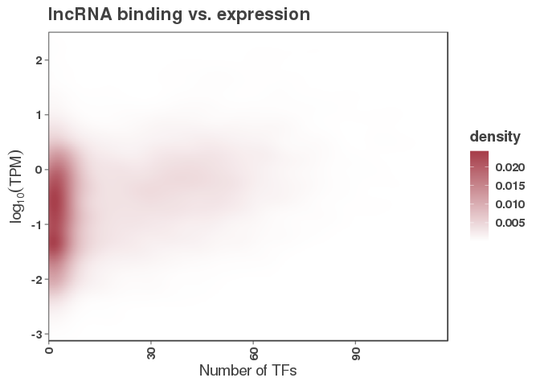

``` r
ggsave("figures/lncRNA_binding_vs_expression_density.png")
ggsave("figures/lncRNA_binding_vs_expression_density.pdf")


# mRNA density plot
g <- ggplot(peak_occurrence_df %>% filter(gene_type == "protein_coding"), aes(y = log10(tpm), x = number_of_tfs, color = gene_type))
g + stat_density_2d(aes(fill = ..density..), geom = "raster", contour = FALSE, n = 500) + 
  scale_fill_gradientn(colors = colorRampPalette(colors = c("#ffffff", "#a8404c"))(100)) + 
  scale_y_continuous(expand = c(0,0)) + 
  scale_x_continuous(expand = c(0,0)) + 
  ggtitle("mRNA binding vs. expression") + 
  xlab(expression('Number of TFs')) +
  ylab(expression(log[10](TPM)))
```

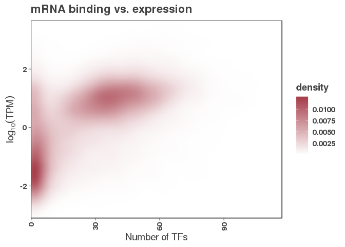

``` r
ggsave("figures/mRNA_binding_vs_expression_density.png")
ggsave("figures/mRNA_binding_vs_expression_density.pdf")

g <- ggplot(peak_occurrence_df, aes(y = log2(tpm), x = number_of_tfs))
g + geom_hex(bins =60) + facet_grid(~gene_type) + 
  scale_fill_gradientn(colors = colorRampPalette(colors = c("#ffffff", "#a8404c"))(100)) + 
  scale_y_continuous(expand = c(0,0)) + 
  scale_x_continuous(expand = c(0,0))
```

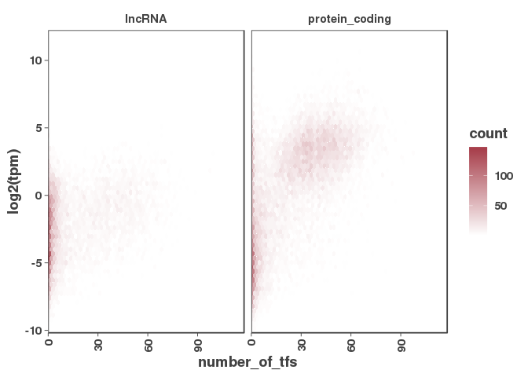

``` r
## let's try a binned approach
quantile(peak_occurrence_df$tpm)
```

    ##           0%          25%          50%          75%         100% 
    ##    0.0000000    0.0000000    0.1372609    2.9048675 4546.9813891

``` r
peak_occurrence_df$expression <- cut(peak_occurrence_df$tpm, breaks = c(-1, 0.001, 0.137, 3, 5000),
                                    labels = c("off", "low", "med", "high"))
table(peak_occurrence_df$expression)
```

    ## 
    ##   off   low   med  high 
    ## 10878  7526  9306  9104

``` r
g <- ggplot(peak_occurrence_df, aes(x = expression, y = number_of_tfs, color = gene_type))
g + geom_boxplot() + stat_compare_means() + 
  scale_color_manual(values = c("#a8404c", "#424242"))  
```

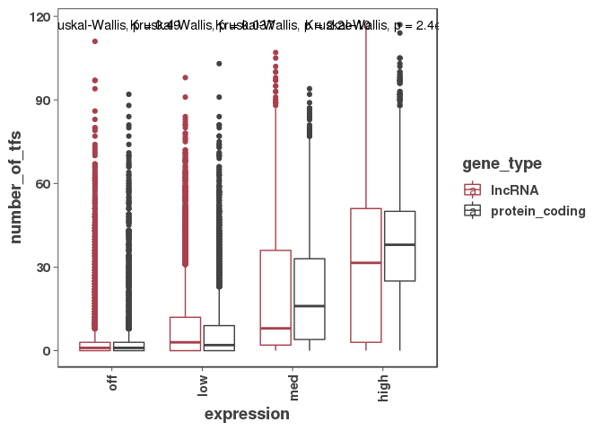

``` r
g <- ggplot(peak_occurrence_df, aes(x = number_of_tfs, fill = gene_type))
g + geom_density(alpha = 0.2) + scale_fill_manual(values = c("#424242","#a8404c"))  + 
  ggtitle("RNA-seq all genes")
```


``` r
off_genes <- peak_occurrence_df %>% filter(tpm < 0.001)
g <- ggplot(off_genes, aes(x = number_of_tfs, fill = gene_type))
g + geom_density(alpha = 0.2) + scale_fill_manual(values = c("#424242","#a8404c"))  + 
  ggtitle("RNA-seq zero expression")
```

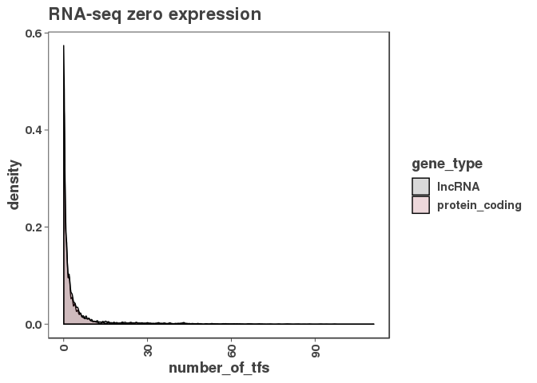

``` r
g <- ggplot(peak_occurrence_df %>% filter(tpm > 1), aes(x = number_of_tfs, fill = gene_type))
g + geom_density(alpha = 0.2) + scale_fill_manual(values = c("#424242","#a8404c"))  + 
  ggtitle("RNA-seq expressed: TPM > 1")
```

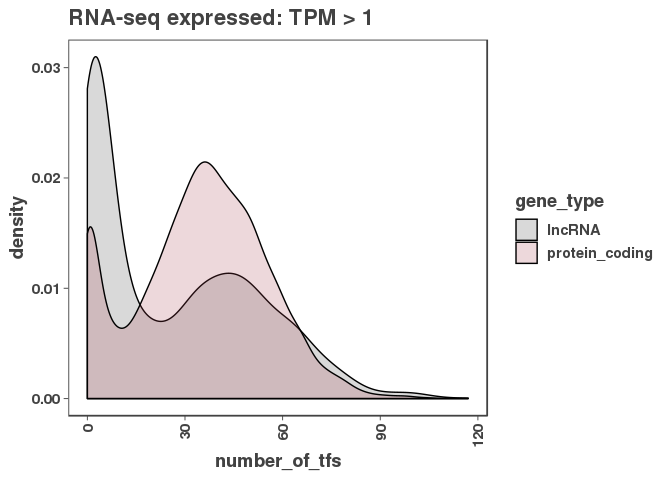

``` r
reservoirs <- off_genes %>% filter(number_of_tfs > 7)


ov_proms <- read_csv("/Shares/rinn_class/data/k562_chip/analysis/08_overlapping_promoters/results/overlapped_promoter_regions.csv")
```

    ## Parsed with column specification:
    ## cols(
    ##   seqnames = col_character(),
    ##   start = col_double(),
    ##   end = col_double(),
    ##   width = col_double(),
    ##   strand = col_character(),
    ##   num_overlaps = col_double(),
    ##   gene_id = col_character(),
    ##   gene_name = col_character(),
    ##   gene_type = col_character(),
    ##   gene_strands = col_character()
    ## )

``` r
ov_proms_genes <- ov_proms %>% dplyr::select(gene_id, gene_name, num_overlaps, gene_type, gene_strands)
ov_proms_genes$overlapping_gene_ids <- ov_proms_genes$gene_id

ov_proms_genes <- ov_proms_genes %>% separate_rows(gene_id, sep = ";")
names(ov_proms_genes) <- c("gene_id", "overlapping_gene_names", "num_overlaps", "overlapping_gene_types", "overlapping_gene_strands", "overlapping_gene_ids")

ov_proms_genes <- ov_proms_genes[!duplicated(ov_proms_genes$gene_id),]


reservoirs_w_overlaps <- merge(reservoirs, ov_proms_genes, all.x = T)
reservoirs_w_overlaps[is.na(reservoirs_w_overlaps$num_overlaps), "num_overlaps"] <- 0


table(reservoirs_w_overlaps$num_overlaps)
```

    ## 
    ##    0    2    3    4 
    ## 1141  174   44    3

``` r
length(which(reservoirs_w_overlaps$num_overlaps > 0))
```

    ## [1] 221

``` r
length(which(reservoirs_w_overlaps$num_overlaps > 0)) / nrow(reservoirs_w_overlaps)
```

    ## [1] 0.1622614

``` r
reservoir_promoters <- promoters[which(promoters$gene_id %in% reservoirs_w_overlaps$gene_id)]
reservoir_promoters$name <- paste(reservoir_promoters$gene_id, "promoter_tss6kb", sep = "_")
reservoir_promoters$score <- 0
rtracklayer::export(reservoir_promoters, "results/k562_reservoir_promoters.bed")
reservoir_promoters_df <- reservoir_promoters %>% 
  as.data.frame() %>%
  dplyr::select(gene_id, seqnames, start, end)
names(reservoir_promoters_df) <- c("gene_id", "promoter_seqnames", "promoter_start", "promoter_end")


reservoirs_w_overlaps <- merge(reservoirs_w_overlaps, reservoir_promoters_df)
write_csv(reservoirs_w_overlaps, "results/k562_reservoir_promoters_info.csv")
```

### Chi-square statistics for reservoir promoters with POLII binding vs. without POLII binding

``` r
# Get reservoir promoters
reservoir_promoters <- promoters[promoters$gene_id %in% reservoirs$gene_id,]

# Get peaks
poliia <- rtracklayer::import("/Shares/rinn_class/data/CLASS_2020/analysis/01_consensus_peaks/results/consensus_peaks/POLR2A_consensus_peaks.bed")
poliib <- rtracklayer::import("/Shares/rinn_class/data/CLASS_2020/analysis/01_consensus_peaks/results/consensus_peaks/POLR2B_consensus_peaks.bed")
polii_peaks <- c(poliia, poliib)

# Get reservoirs with and without POLII in them
pol_reservoir_overlaps <- findOverlaps(reservoir_promoters, polii_peaks)
pol_reservoir_proms <- reservoir_promoters[unique(pol_reservoir_overlaps@from)]
nn <- c(1:length(reservoir_promoters))
mm <- subset(nn, !(nn %in% pol_reservoir_overlaps@from))
nopol_reservoir_proms <- reservoir_promoters[mm]

pol_matrix <- count_peaks_per_feature(pol_reservoir_proms, peak_list, type = "occurrence")
nopol_matrix <- count_peaks_per_feature(nopol_reservoir_proms, peak_list, type = "occurrence")

pol_num_overlaps <- rowSums(pol_matrix)
nopol_num_overlaps <- rowSums(nopol_matrix)
num_peaks <- sapply(peak_list, length)
total_pol <- length(pol_reservoir_proms)
total_nopol <- length(nopol_reservoir_proms)
total_reservoirs <- length(reservoir_promoters)

chisq_res <- data.frame("tf" =character(),
                  "polii_peaks_observed" = numeric(),
                  "chisq_stat" = numeric(),
                  "chisq_pval" = numeric(),
                  "polii_peaks_expected" = numeric())

for(i in 1:length(num_peaks)) {
  total_peaks <- num_peaks[[i]]
  df1 <- data.frame("gene_type" = c("pol","pol", "nopol", "nopol"),
                    "promoter_bound" = c("bound", "not_bound", "bound", "not_bound"),
                    "count" = c(pol_num_overlaps[[i]],
                                total_pol - pol_num_overlaps[[i]],
                                nopol_num_overlaps[[i]],
                                total_nopol - nopol_num_overlaps[[i]])) %>%
    pivot_wider(names_from = gene_type, values_from = count) %>%
    column_to_rownames("promoter_bound") %>%
    as.matrix()
  csres <- chisq.test(df1)
  tdf <- data.frame("tf" = names(num_peaks[i]),
                    "polii_peaks_observed" = pol_num_overlaps[[i]],
                    "chisq_stat" = csres$statistic,
                    "chisq_pval" = csres$p.value,
                    "polii_peaks_expected" = csres$expected[1,1])
  chisq_res <- bind_rows(chisq_res, tdf)
}
chisq_res$padj <- p.adjust(chisq_res$chisq_pval, method = "BH")
chisq_res$diff <- chisq_res$polii_peaks_observed - chisq_res$polii_peaks_expected

write_csv(chisq_res, "results/k562_polII_reservoirs_chisquare.csv")
```

Figure C: Histogram of promoters by number of DNA-binding factors bound

``` r
peak_occurrence_df$expression <- "off"
peak_occurrence_df[which(peak_occurrence_df$tpm > 0.001), "expression"] <- "expressed"

g <- ggplot(peak_occurrence_df, aes(x = number_of_tfs))
g + geom_density(alpha = 0.2, fill = "#424242")  +
  geom_vline(xintercept = 30, lty = 2) +
  geom_vline(xintercept = 100, lty = 2)+
  ggtitle("Promoter Density vs Number of TFs")
```

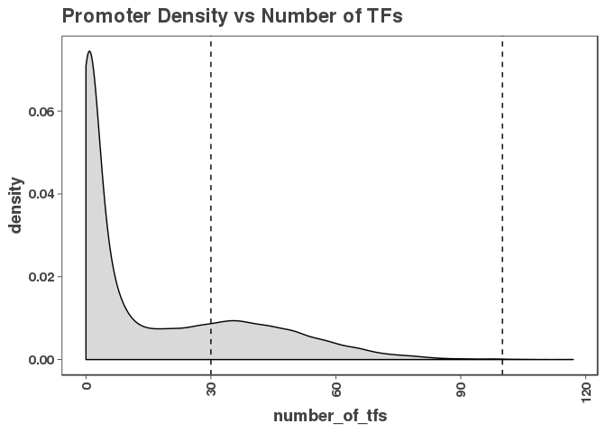

``` r
ggsave("figures/k562_binding_histogram.png")
ggsave("figures/k562_binding_histogram.pdf")
```

Figure D: Histogram of promoters by number of DNA-binding factors bound for different biotypes and expression levels

``` r
g <- ggplot(peak_occurrence_df, aes(x = number_of_tfs))
g + geom_histogram(binwidth = 5)  + 
  xlim(30, 100) +
  facet_wrap(expression~gene_type, scales = "free_y")
```

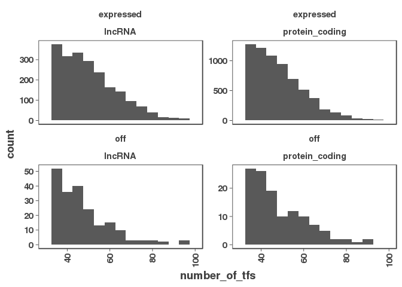

``` r
ggsave("figures/k562_binding_histogram_expression.png")
ggsave("figures/k562_binding_histogram_expression.pdf")
```

Figure E: Histogram of promoters by gene expression for different DNA-binding factor densities. In red are prommoters with fewer than 25 factors bound). In black are promomters with 25 or more factors bound.

``` r
peak_occurrence_df$tf_binding <- "low"
peak_occurrence_df[which(peak_occurrence_df$number_of_tfs > 25), "tf_binding"] <- "high"

g <- ggplot(peak_occurrence_df, aes(x = log10(tpm), color = tf_binding))
g + geom_density(alpha = 0.2) +
  scale_color_manual(values = c("#424242","#a8404c"), name = "tf_binding")
```

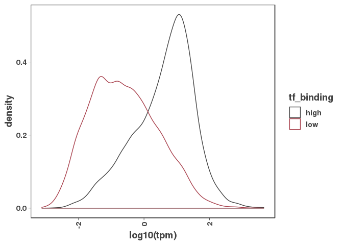

``` r
ggsave("figures/k562_expression_histogram.png")
ggsave("figures/k562_expression_histogram.pdf")
```

Figure F: Chi-square values vs. difference in expected and observed binding for DNA-binding factors at promoters with or without POLII bound

``` r
g <- ggplot(chisq_res, aes(x = diff, y = -log10(padj)))
g + geom_point(colour = "#424242") +
    geom_text_repel(
    data = subset(chisq_res, diff > 100 | diff < -10),
    aes(label = tf),
    size = 3,
    color ="#a8404c",
    box.padding = unit(0.35, "lines"),
    point.padding = unit(0.3, "lines")) +
  geom_vline(xintercept = 0, lty = 2) +
  ggtitle("Reservoirs: polII vs non-polII") 
```

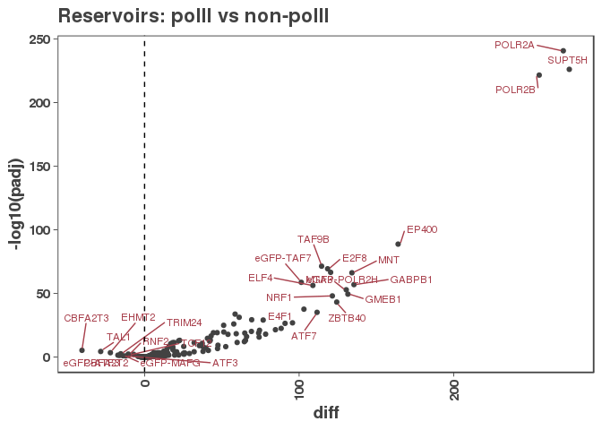

``` r
ggsave("figures/k562_polII_reservoirs_chisquare.png")
ggsave("figures/k562_polII_reservoirs_chisquare.pdf")
```
