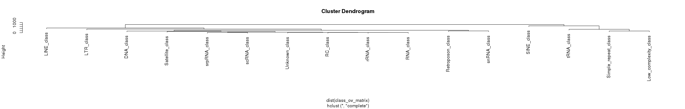
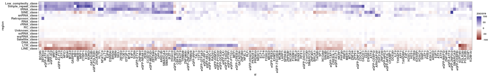
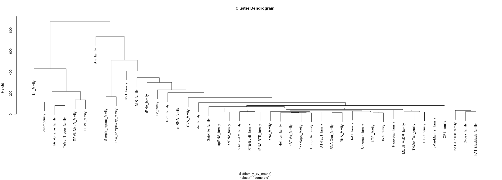
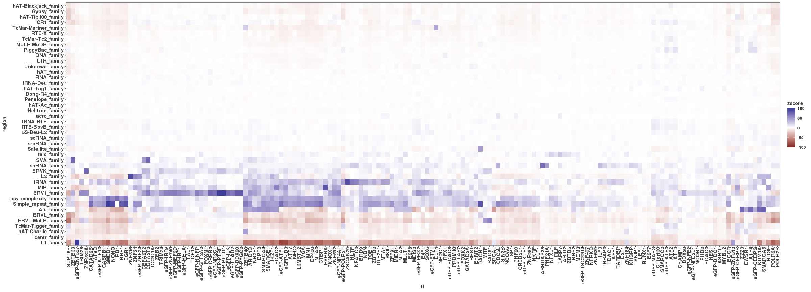

``` r
base_path <- "../02_permutation_of_consensus_peaks/results"
perm_res_family <- read.csv(file.path(base_path,
                                      "permutation_results_repeat_families.csv"))
perm_res_class <- read.csv(file.path(base_path,
                                     "permutation_results_repeat_classes.csv"))
```

``` r
class_ov_matrix <- perm_res_class %>%
  dplyr::select(region, tf, zscore) %>%
  pivot_wider(names_from = tf, values_from = zscore) %>%
  column_to_rownames("region") %>%
  as.matrix()
class_region_clust <- hclust(dist(class_ov_matrix))
class_tf_clust <- hclust(dist(t(class_ov_matrix)))
plot(class_region_clust)
```



``` r
perm_res_class$region <- factor(perm_res_class$region,  
                                class_region_clust$labels[class_region_clust$order])
perm_res_class$tf <- factor(perm_res_class$tf,  
                           class_tf_clust$labels[class_tf_clust$order])


#### FIGURE: Figure 3A
g <- ggplot(perm_res_class, aes(x = tf, y = region, fill = zscore))
g + geom_tile() + 
  scale_fill_gradient2(limits = c(-100, 100), na.value = "#ffffff") +  
  theme(axis.text.x = element_text(angle = 90L, hjust = 1L, vjust = 0.5))
```



``` r
ggsave("figures/dbp_binding_on_repeat_classes.png", height = 4, width = 25)
ggsave("figures/dbp_binding_on_repeat_classes.pdf", height = 4, width = 25)
```

``` r
# Let's filter out regions that have no significant enrichments or depletions
sig_overlaps <- perm_res_family %>% filter(padj < 0.01)
sig_regions <- unique(as.character(sig_overlaps$region))

family_ov_matrix <- perm_res_family %>%
  filter(!is.na(zscore), !is.na(region),
         region %in% sig_regions) %>%
  dplyr::select(region, tf, zscore) %>%
  pivot_wider(names_from = tf, values_from = zscore) %>%
  column_to_rownames("region") %>%
  as.matrix()
family_region_clust <- hclust(dist(family_ov_matrix))
family_tf_clust <- hclust(dist(t(family_ov_matrix)))
plot(family_region_clust)
```



``` r
subset_family <- perm_res_family %>% filter(!is.na(zscore), !is.na(region),
         region %in% sig_regions)

subset_family$region <- factor(subset_family$region,  
                                family_region_clust$labels[family_region_clust$order])
subset_family$tf <- factor(subset_family$tf,  
                           family_tf_clust$labels[family_tf_clust$order])


#### FIGURE: Figure 3A
g <- ggplot(subset_family, aes(x = tf, y = region, fill = zscore))
g + geom_tile() + 
  scale_fill_gradient2(limits = c(-100, 100), na.value = "#ffffff") +  
  theme(axis.text.x = element_text(angle = 90L, hjust = 1L, vjust = 0.5))
```



``` r
ggsave("figures/dbp_binding_on_repeat_family.png", height = 9, width = 25)
ggsave("figures/dbp_binding_on_repeat_family.pdf", height = 9, width = 25)
```
