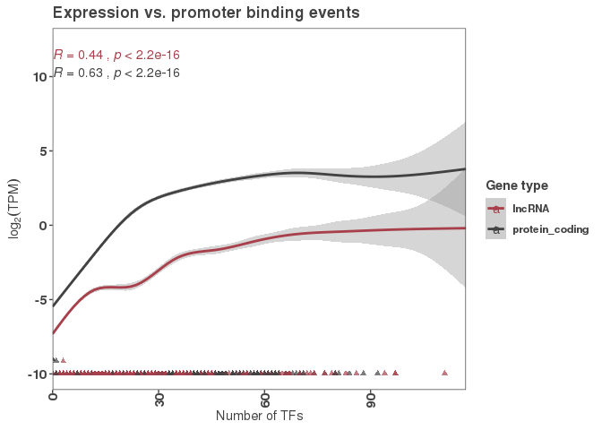
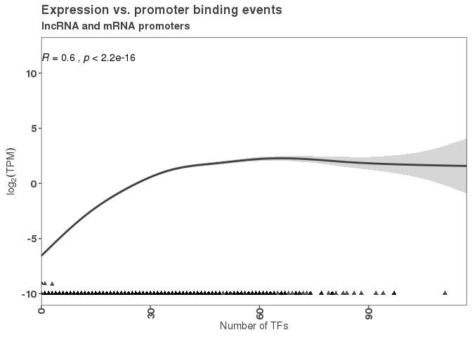
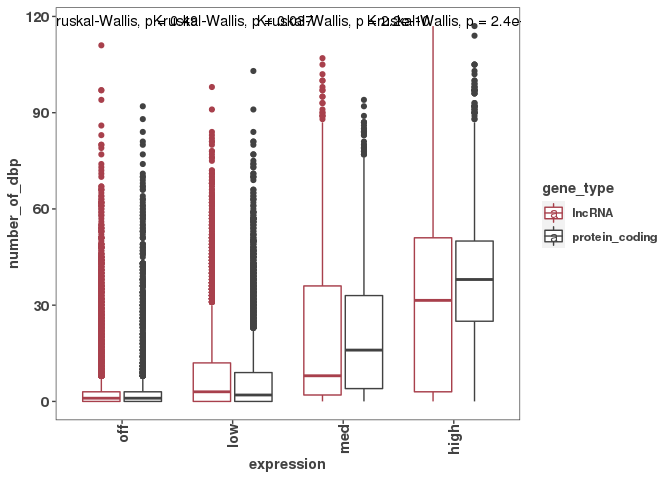
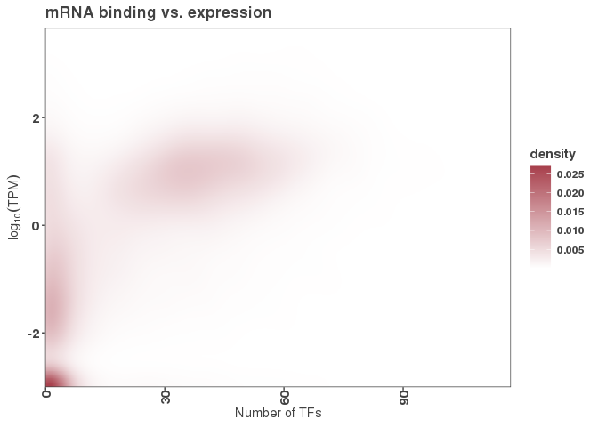
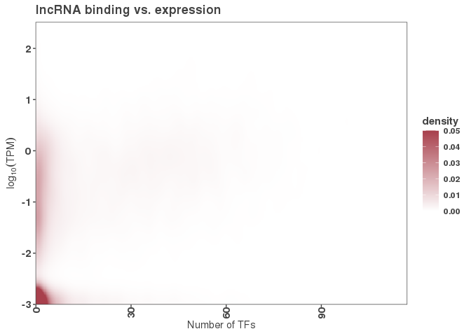
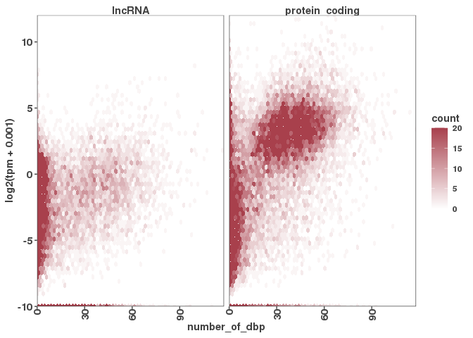
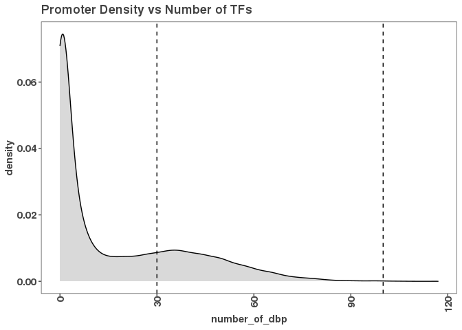
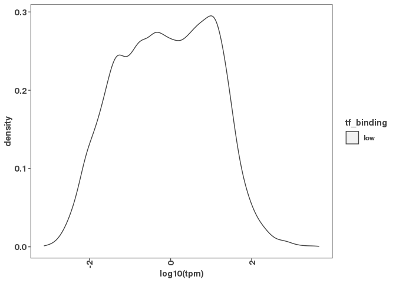
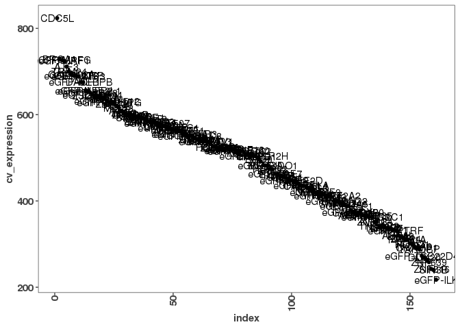

Expression vs. DNA-binding at promoters
=======================================

#### Purpose: Compare expression of genes to binding in promoter regions

This script extracts expression counts from K562 RNA-seq data and identifies DNA-binding events at promoters from the K562 ChIP-seq consensus peak dataset. We have included further analysis on promoters that contain ≥7 DNA-binding events but are not expressed.

### Source for RNA-seq data

total RNA-seq for K562 dataset: <https://www.encodeproject.org/experiments/ENCSR885DVH/>

### Analysis of RNA-seq data

Loading in the RNAseq data and converting to TPM and saving as CSV of TPM values

``` r
if (!file.exists("results/k562_tpm.csv")) {
  
  fl <- list.files("data/", pattern = ".bam", full.names = T)
  if (length(fl < 2)) {
    system("cd data;
           wget https://www.encodeproject.org/files/ENCFF625ZBS/@@download/ENCFF625ZBS.bam",
           intern = FALSE, ignore.stdout = TRUE, ignore.stderr = TRUE)
    system("cd data;
           wget https://www.encodeproject.org/files/ENCFF630HEX/@@download/ENCFF630HEX.bam",
           intern = FALSE, ignore.stdout = TRUE, ignore.stderr = TRUE)
  }
  
  counts <- featureCounts(c("data/ENCFF625ZBS.bam", "data/ENCFF630HEX.bam"),
                          annot.ext = "../../../genomes/human/gencode/v32/gencode.v32.annotation.gtf",
                          isGTFAnnotationFile = T,
                          isPairedEnd = TRUE,
                          nthreads = 16)
  
  rpk <- counts$counts / (counts$annotation$Length/1000)
  expression <- data.frame("rpk" = rpk) %>%
    rownames_to_column("gene_id") %>%
    pivot_longer(2:3, names_to = "sample", values_to = "rpk")
  
  expression_summary <- expression %>%
    group_by(sample) %>%
    summarize(total_rpk = sum(rpk, na.rm = T))
  expression_summary$rpk_m <- expression_summary$total_rpk / 1e6
  expression <- merge(expression, expression_summary)
  expression$tpm <- expression$rpk / expression$rpk_m
  tpm <- expression %>% group_by(gene_id) %>%
    summarize(tpm = mean(tpm, na.rm = T))
  write_csv(tpm, "results/k562_tpm.csv")
}
tpm <- read.csv("results/k562_tpm.csv")
```

Let's add the expression data to our peak\_occurence\_df generated in 01\_consensus\_peaks. Our strategy will be to keep adding variables to our observations (promoters). We can then plot from this data frame as it grows.

``` r
base_path <- "../01_consensus_peaks/results/"
peak_occurrence_df <- read.csv(file.path(base_path,
                                         "peak_occurence_dataframe.csv"))
peak_occurrence_matrix <- read.table(file.path(base_path,
                                         "lncrna_mrna_promoter_peak_occurence_matrix.tsv"))
# TODO WHERE IS THIS FILE WRITTEN OUT??
expression_occurrence_df <- read.csv("results/peak_tpm_occurence_df.csv")
peak_occurrence_df <- merge(peak_occurrence_df, expression_occurrence_df)
#filtering out an old column used to be called number_tfs is now number_of_dbp.
peak_occurrence_df <- peak_occurrence_df %>% dplyr::select(-number_of_tfs)
```

#### Plotting binding of lncRNAs and mRNAs versus expression

We see an upward trend in both lncRNA and mRNA promoters between number of binding events and expression output

``` r
### FIGURE: Figure 4A
## NOTE: The GAM smoothing (s) uses a shrinkage version of the cubic regression spline.
## The dip in lncRNA may be a result of the smoothing basis, but I still need to figure
## out how this is determined theoretically and whether it makes sense in this context. 
g <- ggplot(peak_occurrence_df, 
            aes(y = log2(tpm + 0.001), x = number_of_dbp, color = gene_type))
g + geom_point(data = peak_occurrence_df %>% filter(tpm < 0.001),
             shape = 17, alpha = 0.7) +
  geom_smooth(method = 'gam', formula = y ~ s(x, bs = "cs")) +
  stat_cor() +
  scale_x_continuous(expand = c(0,0)) +
  scale_color_manual(values = c("#a8404c", "#424242"), name = "Gene type") + 
  ggtitle("Expression vs. promoter binding events") + 
  xlab(expression('Number of TFs')) +
  ylab(expression(log[2](TPM)))
```



``` r
ggsave("figures/k562_expression_vs_lncRNA_mRNA_promoter_binding.png")
ggsave("figures/k562_expression_vs_lncRNA_mRNA_promoter_binding.pdf")
```

Supplemental Figure 4a all promoters together versus expression
===============================================================

``` r
#### FIGURE: Supplemental 4A
# TODO: These correlation values are with log(TPM) consider linear correlation.
g <- ggplot(peak_occurrence_df, aes(y = log2(tpm + 0.001), x = number_of_dbp))
g + geom_point(data = peak_occurrence_df %>% filter(tpm < 0.001), 
               shape = 17, alpha = 0.7) +
  geom_smooth(method = 'gam', formula = y ~ s(x, bs = "cs"),
              color = "#424242") +
  stat_cor() +
  scale_x_continuous(expand = c(0,0)) + 
  ggtitle("Expression vs. promoter binding events",
          subtitle = "lncRNA and mRNA promoters") + 
  xlab(expression('Number of TFs')) +
  ylab(expression(log[2](TPM)))
```



``` r
ggsave("figures/k562_expression_vs_all_promoter_binding.png")
ggsave("figures/k562_expression_vs_all_promoter_binding.pdf")
```

Here we will plot the binding events as a funciton of off, low, medium and high expression We find that at off and low expressed promoters there is no difference in binding events (including hundreds at a single promoter) between lncRNA and mRNA promoters.

``` r
## let's try a binned approach
quantile(peak_occurrence_df$tpm)
```

    ##           0%          25%          50%          75%         100% 
    ##    0.0000000    0.0000000    0.1372609    2.9048675 4546.9813891

``` r
peak_occurrence_df$expression <- cut(peak_occurrence_df$tpm, 
                                     breaks = c(-1, 0.001, 0.137, 3, 5000),
                                    labels = c("off", "low", "med", "high"))

levels(cut(peak_occurrence_df$tpm, breaks = c(-1, 0.001, 0.137, 3, 5000)))
```

    ## [1] "(-1,0.001]"    "(0.001,0.137]" "(0.137,3]"     "(3,5e+03]"

``` r
table(peak_occurrence_df$expression)
```

    ## 
    ##   off   low   med  high 
    ## 10878  7526  9306  9104

``` r
#### FIGURE: Figure 4B
g <- ggplot(peak_occurrence_df, 
            aes(x = expression, y = number_of_dbp, color = gene_type))
g + geom_boxplot() + stat_compare_means() + 
  scale_color_manual(values = c("#a8404c", "#424242"))  
```



``` r
ggsave("figures/bin-exp_binding_vs_expression_density.png")
ggsave("figures/bin-exp_binding_vs_expression_density.pdf")
```

Figure 4C : Browser examples

``` r
# TODO: What should we plot as browser examples here?
```

Plotting Number of DBPs versus expression on mRNA promoters as a "heat map" Note the distribution around 30-60 DBPs bound at a given mRNA promoter

``` r
# mRNA density plot
g <- ggplot(peak_occurrence_df %>% filter(gene_type == "protein_coding"), 
            aes(y = log10(tpm + 0.001), x = number_of_dbp, color = gene_type))
g + stat_density_2d(aes(fill = ..density..), 
                    geom = "raster", contour = FALSE, n = 500) + 
  scale_fill_gradientn(colors = colorRampPalette(colors = c("#ffffff", "#a8404c"))(100)) + 
  scale_y_continuous(expand = c(0,0)) + 
  scale_x_continuous(expand = c(0,0)) + 
  ggtitle("mRNA binding vs. expression") + 
  xlab(expression('Number of TFs')) +
  ylab(expression(log[10](TPM)))
```



``` r
ggsave("figures/mRNA_binding_vs_expression_density.png")
ggsave("figures/mRNA_binding_vs_expression_density.pdf")
```

Plotting Number of DBPs versus expression on lncRNA promoters as a 2D density plot Note the faint distribution around 30-60 DBPs bound at a given lncRNA promoter

``` r
# lncRNA density plot
g <- ggplot(peak_occurrence_df %>% filter(gene_type == "lncRNA"), 
            aes(y = log10(tpm + 0.001), x = number_of_dbp, color = gene_type))
g + stat_density_2d(aes(fill = ..density..), geom = "raster", contour = FALSE, n = 500) + 
  scale_fill_gradientn(colors = colorRampPalette(colors = c("#ffffff", "#a8404c"))(100),
                       limits = c(0,0.05),
                       oob  = scales::squish) + 
  scale_y_continuous(expand = c(0,0)) + 
  scale_x_continuous(expand = c(0,0)) + 
  ggtitle("lncRNA binding vs. expression") + 
  xlab(expression('Number of TFs')) +
  ylab(expression(log[10](TPM)))
```



``` r
ggsave("figures/lncRNA_binding_vs_expression_density.png")
ggsave("figures/lncRNA_binding_vs_expression_density.pdf")
```

Plotting lncRNA and mRNA density plots together from above, this is consisten with lncRNA promoters being depleted in general of DBPs similar to what was observed in Figure 2C

``` r
# Plotting lncRNA and mRNA density together.
g <- ggplot(peak_occurrence_df, aes(y = log2(tpm + 0.001), x = number_of_dbp))
g + geom_hex(bins = 60) + facet_grid(~gene_type) + 
  scale_fill_gradientn(colors = colorRampPalette(colors = c("#ffffff", "#a8404c"))(100),
                       limits = c(0,20),
                       oob = scales::squish) + 
  scale_y_continuous(expand = c(0,0)) + 
  scale_x_continuous(expand = c(0,0))
```



``` r
ggsave("figures/lncRNA-mRNA_binding_vs_expression_density.png")
```

    ## Saving 7 x 5 in image

``` r
ggsave("figures/lncRNA-mRNA_binding_vs_expression_density.pdf")
```

    ## Saving 7 x 5 in image

Histogram of promoters by number of DNA-binding factors bound

``` r
peak_occurrence_df$expression <- "off"
peak_occurrence_df[which(peak_occurrence_df$tpm > 0.001), "expression"] <- "expressed"

g <- ggplot(peak_occurrence_df, aes(x = number_of_dbp))
g + geom_density(alpha = 0.2, fill = "#424242")  +
  geom_vline(xintercept = 30, lty = 2) +
  geom_vline(xintercept = 100, lty = 2) +
  ggtitle("Promoter Density vs Number of TFs")
```



``` r
ggsave("figures/k562_binding_histogram.png")
ggsave("figures/k562_binding_histogram.pdf")
```

Histogram of promoters by number of DNA-binding factors bound for different biotypes and expression levels

``` r
g <- ggplot(peak_occurrence_df, aes(x = number_of_dbp))
g + geom_histogram(binwidth = 5)  + 
  xlim(30, 100) +
  facet_wrap(expression~gene_type, scales = "free_y")
```


``` r
ggsave("figures/k562_binding_histogram_expression.png")
ggsave("figures/k562_binding_histogram_expression.pdf")
```

Histogram of promoters by gene expression for different DNA-binding factor densities. In red are prommoters with fewer than 25 factors bound). In black are promomters with 25 or more factors bound.

``` r
peak_occurrence_df$tf_binding <- "low"
peak_occurrence_df[which(peak_occurrence_df$number_of_tfs > 25), "tf_binding"] <- "high"

g <- ggplot(peak_occurrence_df, aes(x = log10(tpm), color = tf_binding))
g + geom_density(alpha = 0.2) +
  scale_color_manual(values = c("#424242","#a8404c"), name = "tf_binding")
```



``` r
ggsave("figures/k562_expression_histogram.png")
ggsave("figures/k562_expression_histogram.pdf")
```

``` r
# Adding expression to the new peak occurence data frame 
# nomenclature that will be used as a starting point in 08_defining_reservoirs.
write_csv(peak_occurrence_df, "results/peak_occurrence_df_exp_added.csv")
```

THIS IS FOR umap\_with\_metadata.
---------------------------------

Median expression of bound promoters per TF
===========================================

``` r
binding_df <- peak_occurrence_matrix %>%
  as.data.frame() %>%
  rownames_to_column("dbp") %>%
  pivot_longer(cols = 2:ncol(.), names_to = "gene_id", values_to = "bound") %>%
  filter(bound > 0)
binding_df <- merge(binding_df, tpm, all.x = T)


binding_summary <- binding_df %>% group_by(dbp) %>%
  summarize(mean_expression = mean(tpm, na.rm = T),
            median_expression = median(tpm, na.rm = T),
            sd_expression = sd(tpm, na.rm = T),
            cv_expression = (sd_expression/mean_expression)*100,
            num_promoters_bound = n(),
            promoters_bound = paste(gene_id, collapse = ";"))
```

    ## `summarise()` ungrouping output (override with `.groups` argument)

``` r
binding_summary <- binding_summary %>% arrange(-cv_expression)
binding_summary$index <- 1:nrow(binding_summary)

g <- ggplot(binding_summary, aes(x = index, y = cv_expression, label = dbp))
g + geom_point() + geom_text()
```



``` r
write_csv(binding_summary, "results/expression_summary_per_tf.csv")
```
