Defining Reservoirs
===================

##### Goal: to characterize the hundreds of promoters that have numerous

DBPs bound, but do not result in expression.

Here we want to find a cut off of binding events at promoters that are expressed less than 0.001 TPM.

``` r
# Read in reservoir annotations combined with promoter peak occurence df. 
base_path <- "../07_binding_versus_expression/results"
peak_occurrence_df <- read.csv(file.path(base_path,
                                         "peak_occurrence_df_exp_added.csv"))
```

Density plots of binding events for lncRNAs and mRNAs expressed above 0.001 TPM We see similar distributions with a slight shift of lncRNA promoters having more promoters with &gt; 60 DBPs bound

``` r
# Plotting the density distribution of number of dbps bound for all promoters.
g <- ggplot(peak_occurrence_df, aes(x = number_of_dbp))
g + geom_density(alpha = 0.2, fill = "#a8404c") +
  ggtitle("Distribution of promoter DBP binding",
          subtitle = "All genes") + 
  geom_vline(xintercept = 7, lty = 2)
```

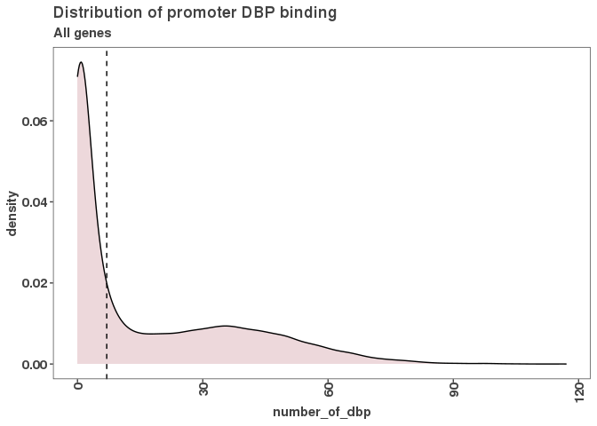

``` r
ggsave("figures/all_genes_binding_distribution.pdf")


# Comparing the density distribution above for non-expressed 
# promoters seperately. 
# Interestingly, mRNA and lncRNA promoters that are not expressed 
# have similar DBP density distributions. 
# Unlike that was seen 07_binding_versus_expression
off_genes <- peak_occurrence_df %>% filter(tpm < 0.001)
g <- ggplot(off_genes, aes(x = number_of_dbp, fill = gene_type))
g + geom_density(alpha = 0.2) + 
  scale_fill_manual(values = c("#424242","#a8404c"))  + 
  ggtitle("Distribution of promoter DBP binding",
          subtitle = "Zero expression RNA-seq") 
```

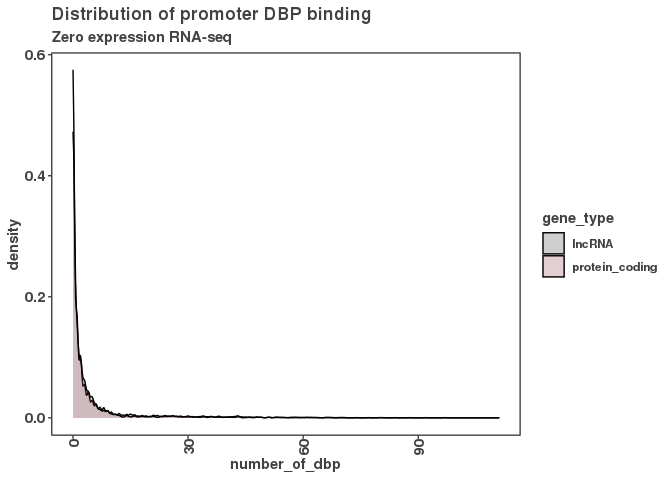

``` r
ggsave("figures/off_genes_binding_distribution.pdf")


# Density distribution of expressed genes with perhaps enrichment of
# lncNRAs in the 30:60 range of dbp binding events
g <- ggplot(peak_occurrence_df %>% filter(tpm > 0.001), 
            aes(x = number_of_dbp, fill = gene_type))
g + geom_density(alpha = 0.5) + 
  scale_fill_manual(values = c("#424242","#a8404c"))  + 
    ggtitle("Distribution of promoter DBP binding",
          subtitle = "TPM > 0.001 RNA-seq") 
```

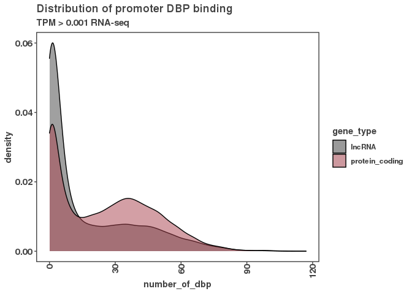

``` r
ggsave("figures/expressed_genes_binding_distribution.pdf")
```

``` r
#### FIGURE: Supplemental 4B
num_peaks_threshold <- 7
g <- ggplot(peak_occurrence_df, aes(x = number_of_dbp))
g + stat_ecdf() + 
  geom_vline(xintercept = num_peaks_threshold, lty = 2, color = "#a8404c") +
  ggtitle("ECDF of promoter binding events")
```

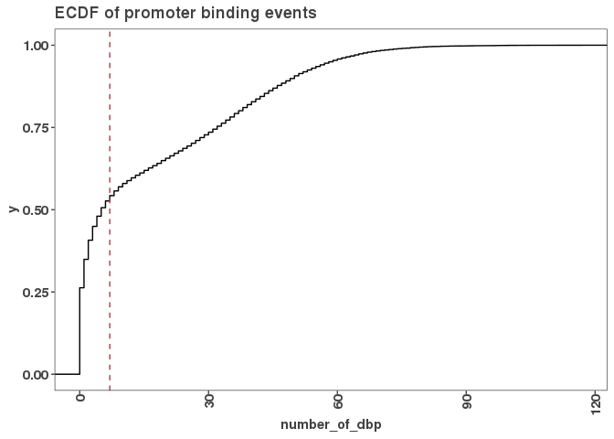

``` r
ggsave("figures/ecdf_promoter_binding_events.pdf")

# Percentile of cutoff
round(ecdf(peak_occurrence_df$number_of_dbp)(num_peaks_threshold)*100,1)
```

    ## [1] 54.3

We defined 7 DBPs as 54% percentile and now we will define "reservoirs" as having 7 binding events and expression less than 0.001 TPM

#### define reservoirs and write out to .csv

``` r
# Let's set a new column defining reservoirs in our peak_occurrence data frame
peak_occurrence_df$reservoir <- 
  as.numeric(peak_occurrence_df$number_of_dbp > 7 & 
               peak_occurrence_df$tpm < 0.001)
write_csv(peak_occurrence_df, "results/08_peak_occurence_df_resvoirs.csv")
```

``` r
#### FIGURE: Supplemental 4C
reservoirs_by_gene_type <- peak_occurrence_df %>%
  group_by(gene_type, reservoir) %>%
  summarize(count = n())
g <- ggplot(reservoirs_by_gene_type, 
            aes(x = factor(reservoir, labels = c("Non-reservoir", "Reservoir")), 
                y = count, fill = gene_type))
g + geom_bar(position = "fill", stat = "identity") +
  scale_fill_manual(values = c("#a8404c", "#424242")) +
  ggtitle("Reservoir status by gene type") + 
  ylab("Fraction") +
  xlab("")
```

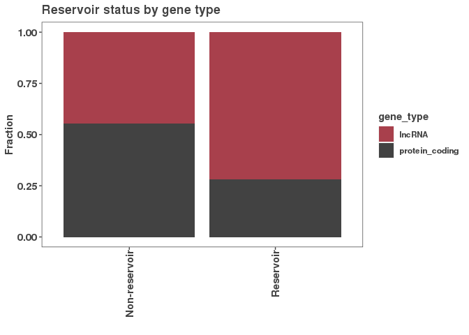

``` r
ggsave("figures/reservoir_status_by_gene_type.pdf")
```

We still have two concerns: I. Overlap with Super Enhancer annotations that have some similar proterties (e.g. many DBPs bound)
II. Neighboring gene-expression

I. Overlap with super enhancers
===============================

Goal: to determine if reservoir promoters are comprised of Super-Enhancer (SE) annotations We used SE annotations from the Super-Enhancer DB (Sedb) from HG19 SEdb: <https://asntech.org/dbsuper/>

We will further lift over these regions to HG38

``` r
if (!file.exists("results/k562_superenhancers_hg38.bed")) {
  
  # download super enhancer annotations
  url <- "http://asntech.org/dbsuper/data/bed/hg19/K562.bed"
  system(paste0("cd data; wget ", url))
  se_hg19 <- rtracklayer::import("data/K562.bed")
  
  # Dowloading liftover chain-file #
  url <- "http://hgdownload.cse.ucsc.edu/goldenpath/hg19/liftOver/hg19ToHg38.over.chain.gz"
  system(paste0("cd data; wget ",
                url, "; gunzip hg19ToHg38.over.chain.gz"))
  
  
  ch <- import.chain("data/hg19ToHg38.over.chain")
  seqlevelsStyle(se_hg19) <- "UCSC" # this is required for liftover 
  se_hg38 <- liftOver(se_hg19, ch)
  
  # Subset just to contiguously liftedOver regions
  se_hg38 <- se_hg38[sapply(width(se_hg38), length) == 1]
  # Exporting .bed file of se_hg38 (super-enhancers with 
  # contigious overlap in hg38)
  rtracklayer::export(se_hg38, "results/k562_superenhancers_hg38.bed")
}
se_hg38 <- rtracklayer::import("results/k562_superenhancers_hg38.bed")
```

``` r
# Reading in all promoters
base_path <- "../01_consensus_peaks/results"
promoters <- rtracklayer::import(file.path(base_path,
                                           "lncrna_mrna_promoters.gtf"))

se_promoters <- subsetByOverlaps(promoters, se_hg38)

# Annotate in data.frame
peak_occurrence_df$annotated_superenhancer <- FALSE
peak_occurrence_df[peak_occurrence_df$gene_id %in% se_promoters$gene_id, 
                   "annotated_superenhancer"] <- TRUE

# et's write this out as a specific .csv here per our goal of 
# adding new variables (SE in this case) to peak_occurence_df 
# (observations == promoters)
write_csv(peak_occurrence_df, "results/08_peak_occurrence_df_super_enhancers")

# Let's count how many reservoirs overlap super-enhancers.
table(peak_occurrence_df$annotated_superenhancer)
```

    ## 
    ## FALSE  TRUE 
    ## 35751  1063

``` r
# Plotting 
se_res_summary <- peak_occurrence_df %>% 
  group_by(reservoir, annotated_superenhancer) %>%
  summarize(count = n())
g <- ggplot(se_res_summary, 
            aes(x = reservoir, y = count, fill = annotated_superenhancer))
g + geom_bar(position = "fill", stat = "identity") +
  scale_fill_manual(values = c("#a8404c", "#424242")) +
  ggtitle("Reservoir status by Superenhancer annotation") +
  ylab("Fraction")
```

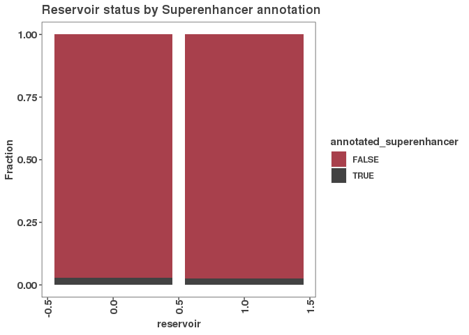

``` r
ggsave("figures/reservoir_status_by_SE_annotation.pdf")
```

#### Hypergeometric test to see if superenhacers are enriched in reservoirs

``` r
t <- length(which(peak_occurrence_df$reservoir == T & 
                    peak_occurrence_df$annotated_superenhancer == T))
num_promoters_w_gt7_dbps <- nrow(peak_occurrence_df %>% 
                                   filter(number_of_dbp > 7))
n <- num_promoters_w_gt7_dbps
number_of_reservoirs <- length(which(peak_occurrence_df$reservoir == T))
a <- number_of_reservoirs
number_of_superenhancers <- length(se_hg38)
b <- number_of_superenhancers

# Hypergeometric test p-value
sum(dhyper(t:b, a, n - a, b))
```

    ## [1] 0.9997505

1.  Bidirectional promoters. Goal: To determine if reservoir promoters are due to regulation of a neighboring or "bidirectional gene"

We will define "Bidirectional promoters if they overlap a gene on the opposite strand within 1000 bp (PMID: 17447839 for definition)". Where the gene has to be on the opposite strand within 1000bp.

``` r
# Load in Gencode annotations
gencode_gr <- rtracklayer::import(
  "../../../genomes/human/gencode/v32/gencode.v32.annotation.gtf")

# Define that the potential "bidirectional promoter is on the 
# opposite strand and less than 1000bp in distance"
# Note this is a newly defined function in 'overlapping_promoters' 
# ../util/intersect_functions.R 
shared_promoters <- overlapping_promoters(gencode_gr, 
                                          upstream = 1000,
                                          downstream = 0)

# Merge in shared promoters to the peak_occurrence_df
peak_occurrence_df <- merge(peak_occurrence_df, shared_promoters, all.x = TRUE)
# Annotate non overlapping promoters
peak_occurrence_df[is.na(peak_occurrence_df$shared_promoter_type), 
                   "shared_promoter_type"] <- "none"


# Plotting percentage of promoters that are "bidirectional", 
# "mutliple_nearby_promoters", "nearby and on same strand"
reservoir_status_by_shared_promoters <- peak_occurrence_df %>%
  group_by(reservoir, shared_promoter_type) %>%
  summarize(count = n())

knitr::kable(reservoir_status_by_shared_promoters)
```

|  reservoir| shared\_promoter\_type      |  count|
|----------:|:----------------------------|------:|
|          0| bidirectional               |   4514|
|          0| multiple\_nearby\_promoters |    984|
|          0| nearby\_same\_strand        |   1247|
|          0| none                        |  28707|
|          1| bidirectional               |    147|
|          1| multiple\_nearby\_promoters |     91|
|          1| nearby\_same\_strand        |    113|
|          1| none                        |   1011|

``` r
g <- ggplot(reservoir_status_by_shared_promoters, 
            aes(x = reservoir, y = count, fill = shared_promoter_type))
g + geom_bar(position = "fill", stat = "identity") +
  scale_fill_manual(values = c("#a8404c","#024059","#71969F","#424242")) +
  ggtitle("Reservoir status by shared promoter status") +
  ylab("Fraction")
```

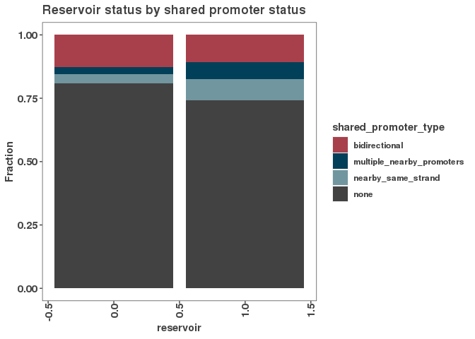

``` r
ggsave("figures/reservoir_status_by_shared_promoter_status.pdf")


# Plotting the number of dbps at each type of promoter
g <- ggplot(peak_occurrence_df %>% filter(reservoir == T),
            aes(x = shared_promoter_type, y = number_of_dbp))
g + geom_boxplot() +
  ggtitle("Number of binding events vs. shared promoter types",
           subtitle = "In reservoirs")
```

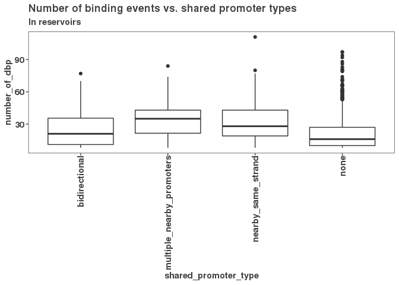

``` r
ggsave("figures/num_binding_events_vs_shared_promoter_type_reservoirs.pdf")

prop.table(table(peak_occurrence_df$reservoir, 
                 peak_occurrence_df$shared_promoter_type), margin = 1)*100
```

    ##    
    ##     bidirectional multiple_nearby_promoters nearby_same_strand      none
    ##   0     12.732709                  2.775584           3.517432 80.974275
    ##   1     10.792952                  6.681351           8.296623 74.229075

``` r
chisq.test(peak_occurrence_df$shared_promoter_type, 
           peak_occurrence_df$reservoir)
```

    ## 
    ##  Pearson's Chi-squared test
    ## 
    ## data:  peak_occurrence_df$shared_promoter_type and peak_occurrence_df$reservoir
    ## X-squared = 160.9, df = 3, p-value < 2.2e-16

``` r
# TODO: ANOVA or some multi group test -- I think the stat above is 
# saying that there is a difference in means but not for each promoter type

# Per usual we are going to now add the promoter_properties variable(s) 
# bidirectional, closeby etc . Importantly this is what will be read 
# into 09_reservoir_binding_properties 
write_csv(peak_occurrence_df, 
          "results/08_peak_occurrence_df_promoter_types.csv")
```

#### Number of shared promoters with neighboring gene expressed

``` r
shared_promoter_expression <- peak_occurrence_df %>%
  filter(reservoir == 1, num_nearby_promoters > 0) %>%
  dplyr::select(gene_id, nearby_promoter_gene_ids, shared_promoter_type) %>%
  separate_rows(nearby_promoter_gene_ids, sep = ";") %>%
  rename(reservoir_gene = gene_id,
         gene_id = nearby_promoter_gene_ids) %>%
  merge(peak_occurrence_df %>% dplyr::select(gene_id,tpm), all.x = T) %>%
  group_by(reservoir_gene, shared_promoter_type) %>%
  summarize(n_expressed = length(which(tpm > 0.1))) %>%
  mutate(at_least_one_expressed = n_expressed > 0) %>%
  group_by(shared_promoter_type, at_least_one_expressed) %>%
  summarize(count = n())
```

    ## `summarise()` regrouping output by 'reservoir_gene' (override with `.groups` argument)

    ## `summarise()` regrouping output by 'shared_promoter_type' (override with `.groups` argument)

``` r
knitr::kable(shared_promoter_expression)
```

| shared\_promoter\_type      | at\_least\_one\_expressed |  count|
|:----------------------------|:--------------------------|------:|
| bidirectional               | FALSE                     |     58|
| bidirectional               | TRUE                      |     89|
| multiple\_nearby\_promoters | FALSE                     |     13|
| multiple\_nearby\_promoters | TRUE                      |     78|
| nearby\_same\_strand        | FALSE                     |     40|
| nearby\_same\_strand        | TRUE                      |     73|

``` r
sum(shared_promoter_expression$count[shared_promoter_expression$at_least_one_expressed == TRUE])
```

    ## [1] 240

``` r
sum(shared_promoter_expression$count[shared_promoter_expression$at_least_one_expressed == FALSE])
```

    ## [1] 111

``` r
g <- ggplot(shared_promoter_expression, aes(x = at_least_one_expressed,
                                            y = count))
g + geom_bar(stat = "identity") + facet_grid(~shared_promoter_type) +
   geom_text(aes(label = count, y = count + 5),
            size = 3)
```

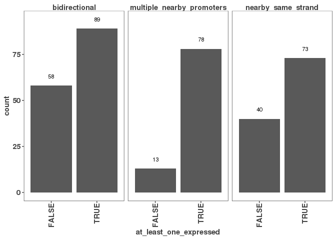

Goal: to test gene-expression levels in 5 genes that surround a reservoir promoter We will using a sliding window approach of windows containing 5 genes. We will compute the median TMP of each window. We will then slide the window one gene ... until all the gene windows of a given chromosome are measured. We then ask what the differences are when a reservoir is or is not these gene windows.

``` r
# Get the TSS position for ordering genes
promoter_tss <- resize(promoters, width = 1, fix = "center") %>%
  as.data.frame() %>%
  mutate(chr = as.character(seqnames)) %>%
  dplyr::select(gene_id, chr, start) %>%
  dplyr::rename(tss = start)
peak_occurrence_df <- merge(peak_occurrence_df, promoter_tss)

# Window assignment function
window_size <- 5
assign_windows <- function(ngenes, window_size) {
  starts <- c(rep(1,(window_size - 1)), 1:(ngenes - (window_size - 1)))
  ends <- 1:ngenes
  sapply(1:length(starts), function(x) {
    paste(seq(starts[x], ends[x]), collapse = ";")
  })
}

# TODO: perhaps this should all be compared to random windows..
# Or potentially for some analyses below, taking out the reservoir
# to just focus on the properties of the neighborhood.
# Calculate the mean tpm per expression window
# We will label the neighborhoods by whether the center gene
# is a reservoir or superenhancer
expression_window_df <- peak_occurrence_df %>%
  arrange(chr, tss) %>%
  group_by(chr) %>%
  mutate(window_5 = assign_windows(n(), window_size)) %>%
  dplyr::select(number_of_dbp, tss, tpm, reservoir, 
                annotated_superenhancer, shared_promoter_type,
                chr, window_5) %>%
  separate_rows(window_5, sep = ";") %>%
  mutate(window_5 = as.numeric(window_5)) %>%
  group_by(chr, window_5) %>%
  arrange(tss) %>%
  mutate(index = 1:n(),
         center = index == 3) %>%
  # Remove the center gene in the calculation of window tpm.
  summarize(mean_tpm = mean(tpm[center == F]),
            res_window = reservoir[center == T],
            se_window = annotated_superenhancer[center == T],
            n_reservoirs = sum(as.numeric(reservoir)),
            n_se = sum(as.numeric(annotated_superenhancer)),
            total_dbps_bound = sum(number_of_dbp[center == F]),
            mean_dbps_bound = mean(number_of_dbp[center == F]),
            n_occupied_promoters = length(which(number_of_dbp[center == F] > 0)),
            dbps_bound = paste(number_of_dbp, collapse = ";"),
            shared_promoter_types = paste(shared_promoter_type, collapse = ";"))
```

    ## `summarise()` regrouping output by 'chr', 'window_5' (override with `.groups` argument)

``` r
# Plotting the summary of expression window measurements to see 
# if there is a difference between reservoir and non-res windows.
data_summary <- function(x) {
   m <- mean(x)
   ymin <- m - sd(x)
   ymax <- m + sd(x)
   return(c(y = m, ymin = ymin, ymax = ymax))
}

# Lets format this data long per window type so that we can plot it all together
expression_window_df$window_type <- "none"
expression_window_df[expression_window_df$se_window == TRUE, "window_type"] <- 
  "superenhancer"
# Instead of making the 35 reservoir and SE containing windows a separate
# Category, we will include them with reservoirs
expression_window_df[expression_window_df$res_window == 1, "window_type"] <- 
  "reservoir"
expression_window_df[expression_window_df$res_window == 1 &
                       expression_window_df$se_window == TRUE, "window_type"] <- 
  "res + se"
window_type_summary <- expression_window_df %>%
  group_by(window_type) %>%
  summarize(mean = mean(mean_tpm),
            count = n()) %>%
  arrange(mean)
```

    ## `summarise()` ungrouping output (override with `.groups` argument)

``` r
knitr::kable(window_type_summary)
```

| window\_type  |       mean|  count|
|:--------------|----------:|------:|
| reservoir     |   7.214255|   1327|
| none          |   8.477688|  34374|
| superenhancer |  37.587719|   1028|
| res + se      |  60.687415|     35|

``` r
# Fold changes
resm <- window_type_summary$mean[window_type_summary$window_type == "reservoir"]
nonem <- window_type_summary$mean[window_type_summary$window_type == "none"]
sem <- window_type_summary$mean[window_type_summary$window_type == "superenhancer"]

log2(nonem/resm)
```

    ## [1] 0.2328205

``` r
log2(sem/nonem)
```

    ## [1] 2.148519

``` r
# Arrange window types by mean
expression_window_df$window_type <- factor(expression_window_df$window_type,
                                           levels = window_type_summary$window_type)

#### FIGURE: Figure 4D
g <- ggplot(expression_window_df %>% filter(window_type != "res + se"), 
            aes(x = window_type, y = log10(mean_tpm + 0.01)))
g + geom_violin() +
  stat_summary(fun.data = data_summary) +
  stat_compare_means(comparisons = list(c("reservoir", "none"),
                                   c("none", "superenhancer"))) +
  ylim(-2,5) +
  ggtitle("Mean expression in five gene windows")
```

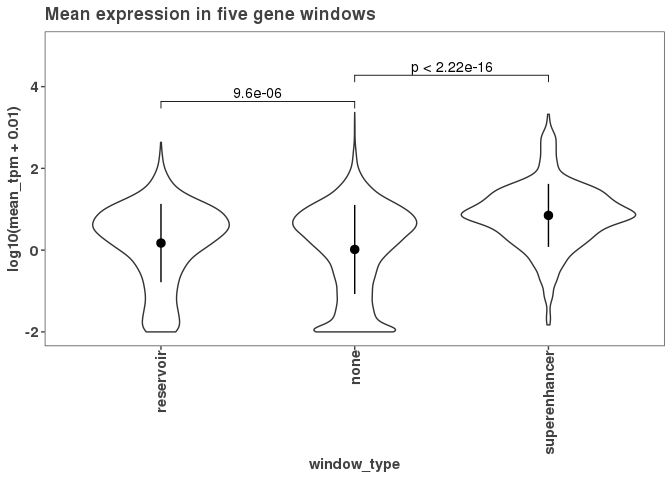

``` r
ggsave("figures/mean_expression_in_5_gene_windows_res_vs_nonres.pdf")
```

    ## Saving 7 x 5 in image

``` r
res_exp_windows <- expression_window_df %>%
  mutate(contains_reservoir = n_reservoirs > 0) %>%
  group_by(contains_reservoir) %>%
  summarize(mean_tpm = mean(mean_tpm))
```

    ## `summarise()` ungrouping output (override with `.groups` argument)

``` r
knitr::kable(res_exp_windows)
```

| contains\_reservoir |  mean\_tpm|
|:--------------------|----------:|
| FALSE               |   9.682692|
| TRUE                |   7.297170|

``` r
# We find that reservoirs tend to be in less highly 
# expressed gene-windows. However the effect is small but significant. 


g <- ggplot(expression_window_df, 
            aes(x = factor(n_reservoirs > 0), y = mean_dbps_bound))
g + geom_violin() +
  stat_compare_means()
```

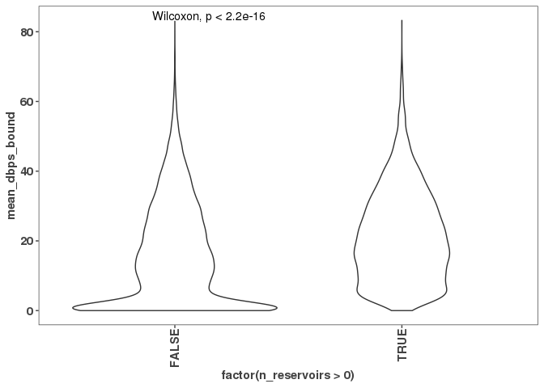

``` r
# When windowed does expression correlate bettwer with binding
# Cool finding that number of DBPs bound in five gene 
# windows also correlates with expression in 5 gene window. 
g <- ggplot(expression_window_df, aes(x = total_dbps_bound, 
                                      y = log10(mean_tpm)))
g + geom_point() + stat_cor() +
  geom_smooth() +
  ggtitle("Five gene windows",
          subtitle = "mean RNA-seq TPM vs DPBs bound in window")
```

    ## Warning: Removed 2136 rows containing non-finite values (stat_cor).

    ## `geom_smooth()` using method = 'gam' and formula 'y ~ s(x, bs = "cs")'

    ## Warning: Removed 2136 rows containing non-finite values (stat_smooth).

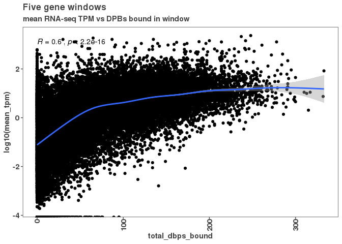

``` r
ggsave("figures/five_gene_window_expression_vs_dbps.pdf")
```

    ## Saving 7 x 5 in image

    ## Warning: Removed 2136 rows containing non-finite values (stat_cor).

    ## `geom_smooth()` using method = 'gam' and formula 'y ~ s(x, bs = "cs")'

    ## Warning: Removed 2136 rows containing non-finite values (stat_smooth).
