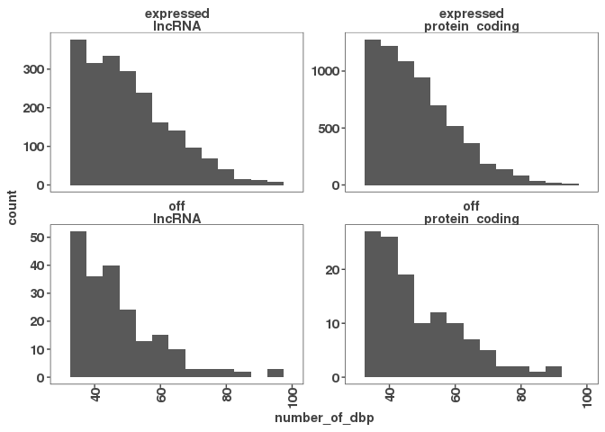
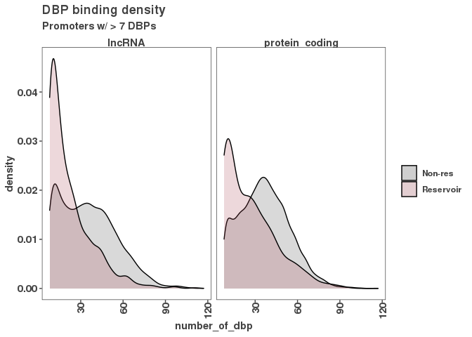
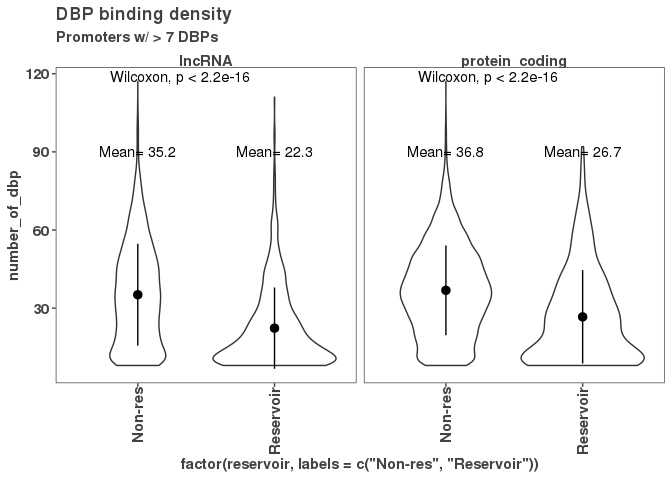
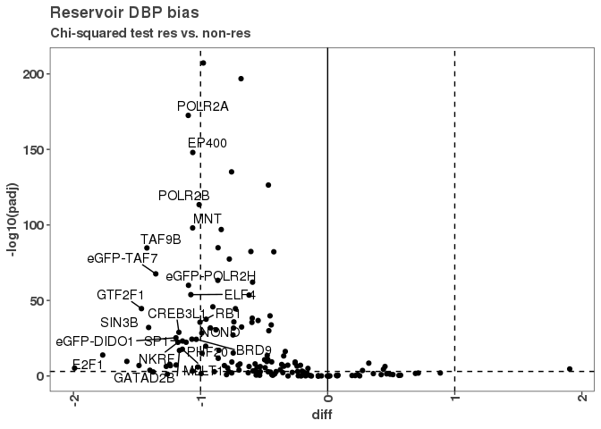
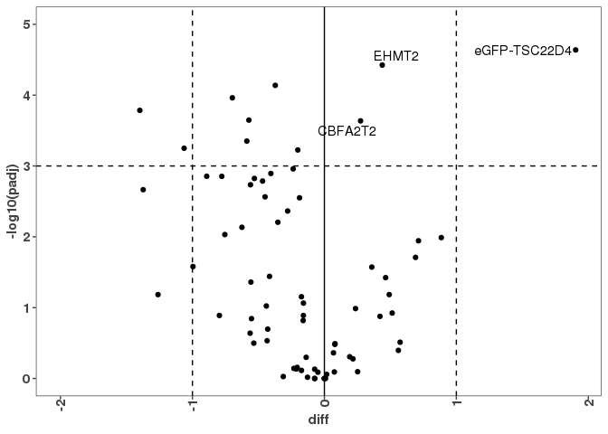
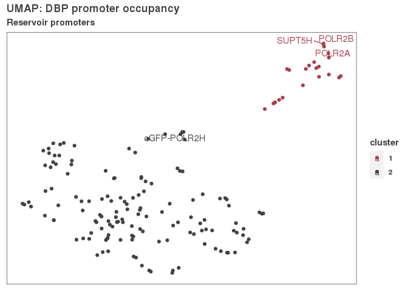
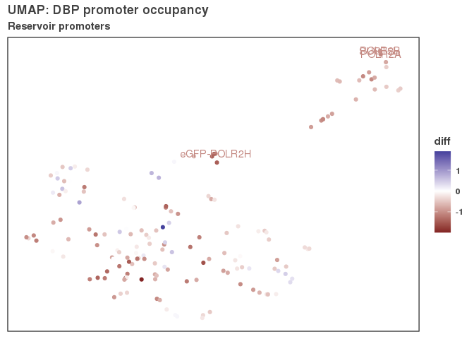

Loading in peak\_occuence\_df and peak\_occurence\_matrix
=========================================================

``` r
base_path <- "../01_consensus_peaks/results"
peak_occurrence_matrix <- read.table(file.path(base_path,
                        "lncrna_mrna_promoter_peak_occurence_matrix.tsv"))

# Read in reservoir annotations combined with promoter peak occurence df. 
base_path <- "../08_defining_reservoirs/results"
peak_occurrence_df <- read.csv(file.path(base_path,
                                "08_peak_occurrence_df_promoter_types.csv"))
```

We are setting up to look at the binding distribution on expressed lncRNA and mRNA vs reservoir mRNA lncRNA binding. Distribution of reservoir vs all subsetted by lncRNA and mRNA

``` r
g <- ggplot(peak_occurrence_df, aes(x = number_of_dbp))
g + geom_histogram(binwidth = 5)  + 
  xlim(30, 100) +
  facet_wrap(expression~gene_type, scales = "free_y")
```

    ## Warning: Removed 26802 rows containing non-finite values (stat_bin).

    ## Warning: Removed 8 rows containing missing values (geom_bar).



``` r
ggsave("figures/many_binders_histogram.png")
```

    ## Saving 7 x 5 in image

    ## Warning: Removed 26802 rows containing non-finite values (stat_bin).

    ## Warning: Removed 8 rows containing missing values (geom_bar).

``` r
ggsave("figures/many_binders_histogram.pdf")
```

    ## Saving 7 x 5 in image

    ## Warning: Removed 26802 rows containing non-finite values (stat_bin).

    ## Warning: Removed 8 rows containing missing values (geom_bar).

``` r
#### FIGURE: Figure 4C
g <- ggplot(peak_occurrence_df %>% filter(number_of_dbp > 7), 
            aes(x = number_of_dbp, 
                fill = factor(reservoir, 
                              labels = c("Non-res", "Reservoir"))))
g + geom_density(alpha = 0.2) + 
  scale_fill_manual(values = c("#424242","#a8404c"),
                    name = " ") + 
  facet_grid(~gene_type) +
  ggtitle("DBP binding density",
          subtitle = "Promoters w/ > 7 DBPs")
```



``` r
ggsave("figures/many_binders_density_plot.png")
```

    ## Saving 7 x 5 in image

``` r
ggsave("figures/many_binders_density_plot.pdf")
```

    ## Saving 7 x 5 in image

``` r
data_summary <- function(x) {
   m <- mean(x)
   ymin <- m - sd(x)
   ymax <- m + sd(x)
   return(c(y = m, ymin = ymin, ymax = ymax))
}

g <- ggplot(peak_occurrence_df %>% filter(number_of_dbp > 7), 
            aes(x = factor(reservoir, labels = c("Non-res", "Reservoir")),
                           y = number_of_dbp))
g + geom_violin() + stat_compare_means() +
  facet_grid(~gene_type) +
  stat_summary(fun.data = data_summary) +
  stat_summary(fun.data = function(x) {
    data.frame(y = 90, 
               label = paste("Mean=", round(mean(x),1))) },
               geom = "text")  +
  ggtitle("DBP binding density",
          subtitle = "Promoters w/ > 7 DBPs")
```



``` r
peak_occurrence_df %>% filter(number_of_dbp > 7) %>%
  group_by(reservoir, gene_type) %>%
  summarize(mean_dbps = mean(number_of_dbp)) %>%
  pivot_wider(names_from = reservoir,
              values_from = mean_dbps) %>%
  mutate(diff = `0` - `1`,
         fc = `1`/`0`)
```

    ## `summarise()` regrouping output by 'reservoir' (override with `.groups` argument)

    ## # A tibble: 2 x 5
    ##   gene_type        `0`   `1`  diff    fc
    ##   <chr>          <dbl> <dbl> <dbl> <dbl>
    ## 1 lncRNA          35.2  22.3  12.8 0.635
    ## 2 protein_coding  36.8  26.7  10.2 0.724

We find that expressed or not expressed promoters still have similar distributions of DBP binding events. With some non-expressed promoters containing 100 independent DBP localization events.

Chi-Squared test for DBPs enriched and depleted at reservoirs versus non-reservoir promoters.

``` r
# Subset columns to only the reservoirs
res_gene_ids <- peak_occurrence_df$gene_id[peak_occurrence_df$reservoir == T]
res_occurrence_matrix <- peak_occurrence_matrix[ , res_gene_ids]
# Non reservoirs that also have more than 7 peaks bound
non_res <- peak_occurrence_df$gene_id[peak_occurrence_df$reservoir == F & 
                                        peak_occurrence_df$number_of_dbp > 7]
non_res_occurrence_matrix <- peak_occurrence_matrix[ , non_res]


# Number of promoters bound in each category
dbp_binding <- data.frame(dbp = rownames(peak_occurrence_matrix),
                          "num_res_promoters_bound" = rowSums(res_occurrence_matrix),
                          "num_nonres_promoters_bound" = rowSums(non_res_occurrence_matrix))

dbp_binding <- dbp_binding %>%
  mutate("num_res_promoters_not_bound" = 
           ncol(res_occurrence_matrix) - num_res_promoters_bound,
         "num_nonres_promoters_not_bound" = 
           ncol(non_res_occurrence_matrix) - num_nonres_promoters_bound)


for (i in 1:nrow(dbp_binding)) {
  df1 <- data.frame("gene_type" = c("reservoir","reservoir", 
                                    "non_res", "non_res"),
                    "promoter_bound" = c("bound", "not_bound", 
                                         "bound", "not_bound"),
                    "count" = c(dbp_binding$num_res_promoters_bound[i],
                                dbp_binding$num_res_promoters_not_bound[i],
                                dbp_binding$num_nonres_promoters_bound[i],
                                dbp_binding$num_nonres_promoters_not_bound[i])) %>%
    pivot_wider(names_from = gene_type, values_from = count) %>%
    column_to_rownames("promoter_bound") %>%
    as.matrix()
  
  csres <- chisq.test(df1)
  phi_coef <- phi(df1)
  
  # Add the results to the data frame
  dbp_binding[i, "chisq_stat"] <- csres$statistic
  dbp_binding[i, "chisq_pval"] <- csres$p.value
  dbp_binding[i, "reservoir_peaks_expected"] <- csres$expected["bound", 
                                                               "reservoir"]
  dbp_binding[i, "phi_coefficient"] <- phi_coef$phi
}
```

    ## Warning in chisq.test(df1): Chi-squared approximation may be incorrect

    ## Warning in stats::chisq.test(x, y, ...): Chi-squared approximation may be incorrect

    ## Warning in chisq.test(df1): Chi-squared approximation may be incorrect

    ## Warning in stats::chisq.test(x, y, ...): Chi-squared approximation may be incorrect

``` r
# Adjusting P value with BH correction, observed - expected and 
# writing this to a .csv file
dbp_binding$padj <- p.adjust(dbp_binding$chisq_pval, method = "BH")
dbp_binding$diff <- log2(dbp_binding$num_res_promoters_bound /
                           dbp_binding$reservoir_peaks_expected)
write_csv(dbp_binding, "results/reservoir_chi_squared_results.csv")


# plotting Chi-squared test results 
g <- ggplot(dbp_binding, aes(x = diff, y = -log10(padj), label = dbp))
g + geom_point() +
  geom_hline(yintercept = -log10(0.001), lty = 2) +
  geom_vline(xintercept = -1, lty = 2) +
  geom_vline(xintercept = 1, lty = 2) +
  geom_vline(xintercept = 0, lty = 1) +
  geom_text_repel(data = dbp_binding %>% filter(-log10(padj) > 10 &
                    diff < -1)) + 
  ggtitle("Reservoir DBP bias",
          subtitle = "Chi-squared test res vs. non-res")
```



``` r
ggsave("figures/reservoir_dbp_chisq.pdf")
```

    ## Saving 7 x 5 in image

``` r
ggsave("figures/reservoir_dbp_chisq.png")
```

    ## Saving 7 x 5 in image

``` r
g <- ggplot(dbp_binding, aes(x = diff, y = -log10(padj), label = dbp))
g + geom_point() +
  geom_hline(yintercept = -log10(0.001), lty = 2) +
  geom_vline(xintercept = -1, lty = 2) +
  geom_vline(xintercept = 1, lty = 2) +
  geom_vline(xintercept = 0, lty = 1) +
  geom_text_repel(data = dbp_binding %>% filter(-log10(padj) > 3 & diff > 0)) + 
  ylim(0,5)
```

    ## Warning: Removed 89 rows containing missing values (geom_point).

    ## Warning: Removed 2 rows containing missing values (geom_text_repel).



``` r
ggsave("figures/reservoir_dbp_chisq_enriched.pdf")
```

    ## Saving 7 x 5 in image

    ## Warning: Removed 89 rows containing missing values (geom_point).

    ## Warning: Removed 2 rows containing missing values (geom_text_repel).

``` r
ggsave("figures/reservoir_dbp_chisq_enriched.png")
```

    ## Saving 7 x 5 in image

    ## Warning: Removed 89 rows containing missing values (geom_point).

    ## Warning: Removed 2 rows containing missing values (geom_text_repel).

``` r
res_dbp_sig <- dbp_binding %>% filter(padj < 0.001, diff < -1 | diff > 1) %>%
  group_by(diff < 0) %>%
  summarize(count = n())
```

    ## `summarise()` ungrouping output (override with `.groups` argument)

``` r
knitr::kable(res_dbp_sig)
```

| diff &lt; 0 |  count|
|:------------|------:|
| FALSE       |      1|
| TRUE        |     31|

Here we would like to take the reservoirs and see if they cluster based on their binding profiles.

``` r
library(umap)
library(dbscan)

res_gene_ids <- peak_occurrence_df$gene_id[peak_occurrence_df$reservoir == T]
res_peak_occurrence <- peak_occurrence_matrix[,res_gene_ids]

umap_params <- umap.defaults
umap_params$n_neighbors <- 4
# umap_params$random_state <- 7748
umap_params$random_state <- 32890

umap_fit <- umap(res_peak_occurrence, config = umap_params)
umap_df <- umap_fit$layout %>% as.data.frame() %>%
  rownames_to_column("dbp")

labels <- hdbscan(umap_fit$layout, minPts = 6)
umap_df$cluster <- factor(labels$cluster)
# write_csv(umap_df, "results/umap_lncrna_mrna_promoters.csv")

umap_df <- merge(umap_df, dbp_binding %>% dplyr::select(dbp, diff))
#### FIGURE: ??
# col_pal <- c("#653EB3", "#B3823E", "#78B33E", "#3E9FB3", "#666666", "#fd8d3c", "#B33E52")
col_pal <- c("#a8404c", "#424242")
g <- ggplot(umap_df, aes(x = V1, y = V2, label = dbp, color = cluster))
g + geom_point() + 
  # geom_text() +
  geom_text_repel(data = umap_df %>% filter(dbp %in% c("POLR2A",
                                                  "POLR2B",
                                                  "SUPT5H",
                                                  "eGFP-POLR2H"))) +
  ggtitle("UMAP: DBP promoter occupancy",
          subtitle = "Reservoir promoters") +
  theme_paperwhite() +
  theme(axis.title = element_blank(),
        axis.text = element_blank(),
        axis.ticks = element_blank()) +
  scale_color_manual(values = col_pal)
```



``` r
ggsave("figures/umap_reservoir_promoters.png")
ggsave("figures/umap_reservoir_promoters.pdf")

g <- ggplot(umap_df, aes(x = V1, y = V2, label = dbp, color = diff))
g + geom_point() + 
  # geom_text() +
  geom_text(data = umap_df %>% filter(dbp %in% c("POLR2A",
                                                  "POLR2B",
                                                  "SUPT5H",
                                                  "eGFP-POLR2H"))) +
  ggtitle("UMAP: DBP promoter occupancy",
          subtitle = "Reservoir promoters") +
  theme_paperwhite() +
  theme(axis.title = element_blank(),
        axis.text = element_blank(),
        axis.ticks = element_blank()) +
  scale_color_gradient2()
```



``` r
# Let's make a df of the clusters for naming and gene ontology
clusters_df <- umap_df %>%
  dplyr::select(cluster, dbp) %>%
  group_by(cluster) %>%
  summarize(dbp = paste(dbp, collapse = " ")) %>%
  mutate(dbp = gsub("eGFP-","", dbp))
write_csv(clusters_df, "results/umap_clusters.csv")
knitr::kable(clusters_df)
```

| cluster | dbp                                                                                                                                                                                                                                                                                                                                                                                                                                                                                                                                                                                                                                                                                                                                                                                                                                                            |
|:--------|:---------------------------------------------------------------------------------------------------------------------------------------------------------------------------------------------------------------------------------------------------------------------------------------------------------------------------------------------------------------------------------------------------------------------------------------------------------------------------------------------------------------------------------------------------------------------------------------------------------------------------------------------------------------------------------------------------------------------------------------------------------------------------------------------------------------------------------------------------------------|
| 1       | ATF7 E2F8 E4F1 ATF1 ETV1 ID3 NR4A1 ELF1 ELF4 EP400 GABPB1 GMEB1 L3MBTL2 MGA MNT MTA3 NFIC NRF1 POLR2A POLR2B SUPT5H ZBTB40 ZNF592                                                                                                                                                                                                                                                                                                                                                                                                                                                                                                                                                                                                                                                                                                                              |
| 2       | AFF1 ARHGAP35 ARID1B ARID2 ASH1L ATF2 ATF3 ATF4 BCOR BRCA1 BRD9 C11orf30 CBFA2T2 CBFA2T3 CC2D1A CDC5L CHAMP1 CREB3L1 CTBP1 DACH1 DDX20 DPF2 E2F1 E2F7 ATF3 CEBPB CEBPG CREB3 DDX20 DIDO1 GTF2A2 HDAC8 HINFP ILK IRF1 IRF9 KLF1 KLF13 MAFG MEF2D NFE2 NFE2L1 NR2C1 PBX2 POLR2H PTRF PTTG1 PYGO2 RELA TAF7 TEAD2 TSC22D4 ZNF24 ZNF507 ZNF512 ZNF740 EGR1 EHMT2 ESRRA EWSR1 FOXK2 FOXM1 GATAD2A GATAD2B GTF2F1 HDAC1 HDAC2 HDAC3 HDGF HES1 HLTF IKZF1 ILF3 KDM1A KHSRP LARP7 LEF1 MCM3 MEIS2 MIER1 MITF MLLT1 MTA1 MTA2 MYBL2 NBN NCOA6 NCOR1 NFATC3 NFRKB NFXL1 NKRF NONO NR2C1 NR2F1 PHB2 PHF20 PHF21A PKNOX1 PRDM10 RAD51 RB1 REST RFX1 RLF RNF2 RUNX1 SIN3B SKIL SMARCA4 SMARCA5 SMARCC2 SMARCE1 SNIP1 SOX6 SP1 TAF9B TAL1 TARDBP TCF12 THRAP3 TOE1 TRIM24 TRIM28 ZBTB2 ZBTB33 ZBTB5 ZEB2 ZFP91 ZNF184 ZNF24 ZNF280A ZNF282 ZNF316 ZNF407 ZNF639 ZSCAN29 ZZZ3 |
