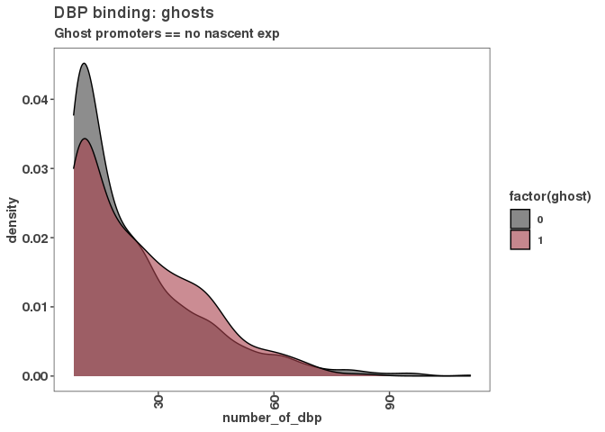

Goal: to determine the chromatin environment of reservoir promoters using histone modification ChIP data. Specifically, Histone H3 (H3) Lysine 27 tri-methylation (H3K27me3) that represents heterochraomtic regions / and H3 lysine 27 acetylation that represents euchromatin.

``` r
# First we will go get the .bed files of significant peaks determined by encode in k562
# K27me3 - https://www.encodeproject.org/files/ENCFF031FSF/@@download/ENCFF031FSF.bed.gz
# K27ac - https://www.encodeproject.org/files/ENCFF038DDS/@@download/ENCFF038DDS.bed.gz


# Retrieve Histone mark and # TODO add unzip

system("cd data;
           wget https://www.encodeproject.org/files/ENCFF031FSF/@@download/ENCFF031FSF.bed.gz",
           intern = FALSE, ignore.stdout = TRUE, ignore.stderr = TRUE)
system("cd data;
           wget https://www.encodeproject.org/files/ENCFF038DDS/@@download/ENCFF038DDS.bed.gz",
           intern = FALSE, ignore.stdout = TRUE, ignore.stderr = TRUE)

system("cd data;
       gunzip *.gz")


# Organzing the histone mark data into a data frame and then granges of start and stop of peaks in .bed files

peak_files <- data.frame("file" = c(as.character("data/ENCFF031FSF.bed"), as.character("data/ENCFF038DDS.bed")),
                         "histone_mark" = c("H3K27me3", "H3K27ac"))
hmark_peaks <- lapply(as.character(peak_files$file), read.table)
names(hmark_peaks) <- as.character(peak_files$histone_mark)
hmark_granges <- lapply(hmark_peaks, function(peaks) {
  GRanges(seqnames = peaks$V1,
          ranges = IRanges(start = peaks$V2,
                           end = peaks$V3))
         })

rtracklayer::export(hmark_granges[[1]], con = paste0("results/",
                                                     names(hmark_granges)[[1]],
                                                     ".bed"))
rtracklayer::export(hmark_granges[[2]], con = paste0("results/",
                                                     names(hmark_granges)[[2]],
                                                     ".bed"))
# To find overlaps with promoters using gRanges we will open up the GTF of promoters from 01_consensus_peaks
promoters <- rtracklayer::import("../01_consensus_peaks/results/lncrna_mrna_promoters.gtf")

# Read our compiled peak_occurrence data frame from 10_reservoir_nascent_txn (with all the variables for each promoter observation). 
peak_occurrence_df <- read.csv("../10_reservoir_nascent_txn/results/peak_occurrence_df_nascent_added.csv")


# K27me3 Promoter overlaps
ov1 <- findOverlaps(promoters, hmark_granges[[1]])
```

    ## Warning in .Seqinfo.mergexy(x, y): Each of the 2 combined objects has sequence levels not in the other:
    ##   - in 'x': chrY, chrM
    ##   - in 'y': chr17_GL000205v2_random, chrUn_KI270744v1
    ##   Make sure to always combine/compare objects based on the same reference
    ##   genome (use suppressWarnings() to suppress this warning).

``` r
overlaps <- unique(ov1@from)
overlapping_genes <- promoters$gene_id[overlaps]
peak_occurrence_df$h3k27me3 <- peak_occurrence_df$gene_id %in% overlapping_genes
table(peak_occurrence_df$h3k27me3)
```

    ## 
    ## FALSE  TRUE 
    ## 27243  9571

``` r
# K27ac Promoter overlaps
ov2 <- findOverlaps(promoters, hmark_granges[[2]])
```

    ## Warning in .Seqinfo.mergexy(x, y): Each of the 2 combined objects has sequence levels not in the other:
    ##   - in 'x': chrY, chrM
    ##   - in 'y': chr14_GL000009v2_random, chr14_GL000194v1_random, chr17_GL000205v2_random, chr1_KI270713v1_random, chr1_KI270714v1_random, chrUn_GL000195v1, chrUn_GL000219v1, chrUn_KI270442v1, chrUn_KI270744v1, chrUn_KI270745v1
    ##   Make sure to always combine/compare objects based on the same reference
    ##   genome (use suppressWarnings() to suppress this warning).

``` r
overlaps <- unique(ov2@from)
overlapping_genes <- promoters$gene_id[overlaps]
peak_occurrence_df$h3k27ac <- peak_occurrence_df$gene_id %in% overlapping_genes
table(peak_occurrence_df$h3k27ac)
```

    ## 
    ## FALSE  TRUE 
    ## 21952 14862

``` r
# Writting out final peak_occurrence_df !
# First have to change histone mark overlaps to numeric from logical
peak_occurrence_df$k27me3 <- as.numeric(peak_occurrence_df$h3k27me3)
peak_occurrence_df$k27ac <- as.numeric(peak_occurrence_df$h3k27ac)

#remove old histone logical call columns
peak_occurrence_df <- peak_occurrence_df %>% dplyr::select(-h3k27me3,
                                                           -h3k27ac)

# Here it is: the final peak_occurrence_df

write.csv(peak_occurrence_df, "results/peak_occurence_df.csv")
```

First plotting the density of nascent on reservoir vs non-reservoir
===================================================================

``` r
# Let's plot nascent transcription relative to the number of DBPs bound.

ggplot(peak_occurrence_df, aes( x = log10(nascentTpm + 1), 
                                fill = as.factor(reservoir))) +
  geom_density(alpha = 0.6) + 
  scale_fill_manual(values = c("#424242","#a8404c")) + 
  ggtitle("Nascent expression: reservoirs")
```


``` r
ggsave("figures/reservoir_vs_nascent.pdf")
```

    ## Saving 7 x 5 in image

``` r
# Testing stats of means 
ggplot(peak_occurrence_df, 
       aes(x = factor(reservoir), 
           y = log10(nascentTpm + 1))) +
  geom_boxplot() +
  stat_compare_means() +
  stat_mean() +
  stat_summary(fun.data = function(x) 
    data.frame(y = 4, label = paste("Mean=", round(mean(x),2))), geom = "text")  +
  ggtitle("Nascent TPM of reservoirs")
```


``` r
ggsave("figures/global_reservoir_vs_nascent.pdf")
```

    ## Saving 7 x 5 in image

Reservoirs and non res have similar distributions of nascent transcriptiono
===========================================================================

Figure 5a DBP-vs-Nascent TPM
============================

``` r
ggplot(peak_occurrence_df, aes(y = log10(nascentTpm + 1), x = number_of_dbp)) +
  geom_smooth(color = "black", method = 'gam', formula = y ~ s(x, bs = "cs")) +
  stat_cor(label.y = 1) +
  ggtitle("DBP binding vs nascent expression")
```


``` r
ggsave("figures/DBPs_vs_nascent.pdf")
```

    ## Saving 7 x 5 in image

Here we found a similar trend as RNA-seq where there is a positive
==================================================================

correlation between number of DBPs and amount of nascent expression. There is also, similar to RNA-seq.

lets see if there are reservoirs that lack nascent txn (ghost)
==============================================================

Define Ghost and Zombies and write to peak occurence df
=======================================================

``` r
ghost <- peak_occurrence_df %>% filter(nascentTpm < 0.001 & reservoir == 1) 

peak_occurrence_df$ghost <- as.numeric(peak_occurrence_df$nascentTpm < 0.001 & 
                                         peak_occurrence_df$reservoir == 1)

ggsave("figures/ghost_vs_nascent.pdf")
```

    ## Saving 7 x 5 in image

Here we find that 355 of 1,362 (26%) of reservoirs have neither mature
======================================================================

RNA-seq expression nor nascent expression despite many DBPs bound. let's look at those two distributions, but first define zombies as nascent expression but not RNA-seq expression from these promoters.

``` r
# Adding zombies to peak occurence df.

zombie <- peak_occurrence_df %>% 
  filter(nascentTpm > 0.001 & reservoir == 1) 

peak_occurrence_df$zombie <- as.numeric(peak_occurrence_df$nascentTpm > 0.001 
                                        & peak_occurrence_df$reservoir == 1)

# write out final peak_occurence_df 

write_csv(peak_occurrence_df, "results/peak_occurence_df.csv")
```

Now we want to explore if the lack of nascent transcripts is due to chromatin
=============================================================================

environment. Specifically K27me3 and K27ac states of these promoters.

``` r
# How k27ac presences compares to nascent TPMs

ggplot(peak_occurrence_df, aes(x = factor(k27ac), y = log10(nascentTpm + .1))) +
  geom_boxplot() +
  stat_compare_means() +
  stat_mean() +
  stat_summary(fun.data = function(x) 
    data.frame(y = 4, label = paste("Mean=", round(mean(x),2))), geom = "text") + 
  ggtitle("H3K27ac status vs. nascent expression",
          subtitle = "mRNA and lncRNA genes")
```


``` r
ggsave("figures/nascent_vs_k27ac_all_promoters.pdf")
```

    ## Saving 7 x 5 in image

``` r
# How k27me3 presence compares to Nascent seq

ggplot(peak_occurrence_df, aes(x = factor(k27me3), y = log10(nascentTpm + .1))) +
  geom_boxplot() +
  stat_compare_means() +
  stat_mean() +
  stat_summary(fun.data = function(x) 
    data.frame(y = 4, label = paste("Mean=", round(mean(x),2))), geom = "text") + 
  ggtitle("H3K27me3 status vs. nascent expression",
          subtitle = "mRNA and lncRNA genes")
```


``` r
ggsave("figures/nascent_vs_k27me3_all_promoters.pdf")
```

    ## Saving 7 x 5 in image

``` r
#K27me3 is negatively associated RNA-seq as expected
```

Now narrowing in on only reservoirs looking at K27ac and k27me3 status
======================================================================

``` r
# Compare means of nascent TPM of k37me3 positive-vs-negative reservoirs 

ggplot(peak_occurrence_df %>% filter(reservoir == 1), 
       aes(x = factor(k27ac), y = log10(nascentTpm + .1))) +
  geom_boxplot() +
  stat_compare_means(label.y = 4) +
  stat_mean() +
  stat_summary(fun.data = function(x) 
    data.frame(y = 3.2, label = paste("Mean=", round(mean(x),2))), geom = "text") + 
  ggtitle("H3K27ac status vs. nascent expression",
          subtitle = "Reservoir promoters")
```


``` r
ggsave("figures/k27ac_reservoir_vs_nascent.pdf")
```

    ## Saving 7 x 5 in image

``` r
# Perhaps as expected K72me3 is negatively correlated with nascentTpm


# Compare means of nascent TPM of k37me3 positive-vs-negative reservoirs 
ggplot(peak_occurrence_df %>% filter(reservoir == 1), 
       aes(x = factor(k27me3), y = log10(nascentTpm + .1))) +
geom_boxplot() +
  stat_compare_means(label.y = 3.5) +
  stat_mean() +
  stat_summary(fun.data = function(x) 
    data.frame(y = 3.2, label = paste("Mean=", round(mean(x),2))), geom = "text") + 
  ggtitle("H3K27me3 status vs. nascent expression",
          subtitle = "Reservoir promoters")
```


``` r
ggsave("figures/k27me3_reservoir_vs_nascent.pdf")
```

    ## Saving 7 x 5 in image

``` r
# Perhaps as expected K72ac is positively correlated with nascentTpm
```

Figure 5b: \# DBP distribution of DBPs between ghost and zombie
===============================================================

``` r
ggplot(peak_occurrence_df %>% filter(reservoir == 1), 
       aes(x = number_of_dbp, fill = factor(ghost))) +
  geom_density(alpha = 0.6) + 
  scale_fill_manual(values = c("#424242","#a8404c")) + 
  ggtitle("DBP binding: ghosts",
          subtitle = "Ghost promoters == no nascent exp")
```



``` r
ggsave("figures/DBP-vs-ghost_zombie.pdf")
```

    ## Saving 7 x 5 in image

``` r
# Comparing the means of distributions since they look similar
ggplot(peak_occurrence_df %>% filter(reservoir == 1),aes(x = factor(ghost),                                                      y = number_of_dbp)) +
  geom_boxplot() +
  stat_compare_means(label.y = 120) +
  stat_summary(fun.data = function(x) 
    data.frame(y = 115, label = paste("Mean=", round(mean(x),2))), geom = "text") + 
  ggtitle("Ghosts (no nascent txn) DBP binding")
```


``` r
# Comparing the means of # DBP on ghost vs zombies

ggplot(peak_occurrence_df %>% filter(reservoir == 1), 
       aes(x = factor(ghost), y = number_of_dbp)) +
geom_boxplot() +
  stat_compare_means() +
  stat_mean() +
  stat_summary(fun.data = function(x) 
    data.frame(y = 4, label = paste("Mean=", mean(x))), geom = "text") 
```


``` r
ggsave("figures/compare_means_DBP-vs-ghost_zombie.pdf")
```

    ## Saving 7 x 5 in image

the distribution of number of bound DBPs is not differnet between ghosts and
============================================================================

zombies (P = .064)

VENN Diagram of reservoir chromatin status
==========================================

``` r
#plotting histone occurrence and reservoirr occurrence

genes.venn <- euler(peak_occurrence_df[,c("reservoir","k27me3", "k27ac")])
plot(genes.venn, quantities = TRUE)
```


``` r
ggsave("figures/venn_chroamtin_ov_resvoirs.pdf")
```

    ## Saving 7 x 5 in image

|                                                                            |
|----------------------------------------------------------------------------|
| \# If you want to randomly sample genes and test in UCSC browser : ENJOY ! |

``` r
# ### I like this random sampeling :) so something is different as the DF I have
# ### is numeric not logical -- maybe the true does find the 1 though?
# 
# # Okay, let's randomly sample some regions
# sampled <- sample(peak_occurrence_df$gene_id[peak_occurrence_df$h3k27ac == TRUE],6)
# # Let's just just the promoter regions for these sampled regions
# names(promoters) <- promoters$gene_id
# prom_sampled <- promoters[sampled]
# # Let's simplify this granges to just the basics
# prom_samples_reg <- GRanges(seqnames = prom_sampled@seqnames,
#                             ranges = prom_sampled@ranges)
# rtracklayer::export(prom_samples_reg, "results/h3k27ac_sampled_regions.bed")
# 
# # Okay, let's randomly sample some H3k27me3 regions
# sampled <- sample(peak_occurrence_df$gene_id[peak_occurrence_df$h3k27me3 == TRUE],6)
# # Let's just just the promoter regions for these sampled regions
# names(promoters) <- promoters$gene_id
# prom_sampled <- promoters[sampled]
# # Let's simplify this granges to just the basics
# prom_samples_reg <- GRanges(seqnames = prom_sampled@seqnames,
#                             ranges = prom_sampled@ranges)
# rtracklayer::export(prom_samples_reg, "results/h3k27me3_sampled_regions.bed")
# 
# # Okay, let's randomly sample some H3k27me3 regions
# sampled <- sample(peak_occurrence_df$gene_id[peak_occurrence_df$h3k27me3 == TRUE &
#                                                peak_occurrence_df$h3k27ac == TRUE],6)
# # Let's just just the promoter regions for these sampled regions
# names(promoters) <- promoters$gene_id
# prom_sampled <- promoters[sampled]
# # Let's simplify this granges to just the basics
# prom_samples_reg <- GRanges(seqnames = prom_sampled@seqnames,
#                             ranges = prom_sampled@ranges)
# rtracklayer::export(prom_samples_reg, "results/both_sampled_regions.bed")
# 
```
